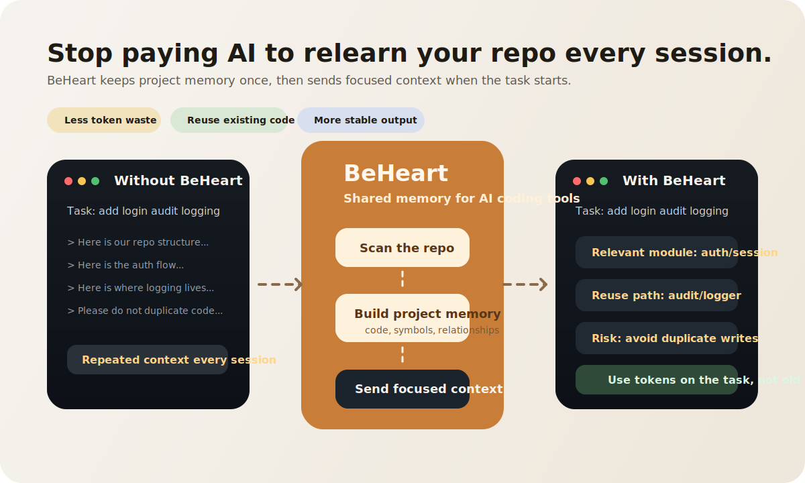
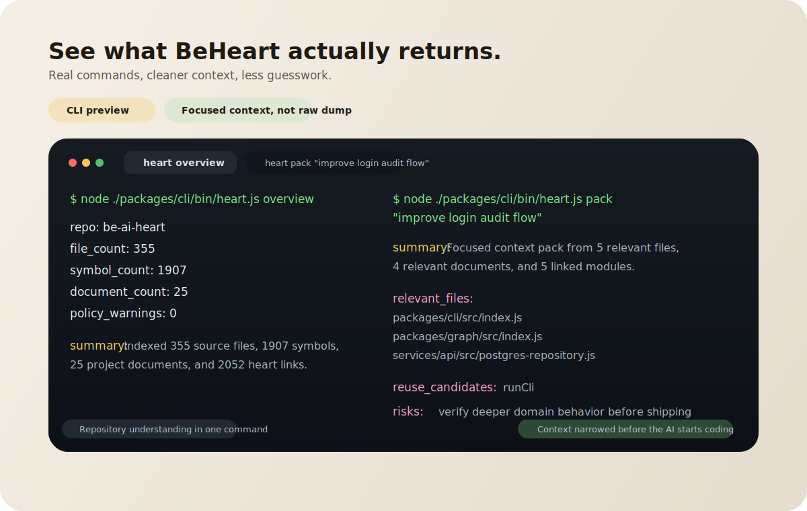

# BeHeart

> Stop paying AI to relearn your repo every session.

BeHeart gives AI coding tools shared memory for your codebase.

It saves the important parts of your project once, then returns the right context when a real task starts.

That means:

- less repeated context
- less token waste
- less duplicate work
- more useful AI output



## Why This Matters

Most teams use AI like this:

1. open a new session
2. explain the repo again
3. pay tokens for old context again
4. hope the AI understands what already exists

That works, but it does not scale well.

BeHeart fixes that by helping AI reuse project knowledge instead of rebuilding it from scratch every time.

## Without BeHeart / With BeHeart

| Without BeHeart | With BeHeart |
| --- | --- |
| AI has to relearn the project | AI reuses project memory |
| Token spend keeps growing on old context | More tokens go to the actual task |
| Existing code is easier to miss | Existing code is easier to reuse |
| Results vary too much between sessions | Results become more consistent |

## What BeHeart Does

BeHeart does four simple things:

1. scans the codebase
2. builds project memory
3. finds the context needed for the task
4. shares that context through CLI or MCP

Think of it like reusable notes for AI.

## What BeHeart Is

BeHeart is not another coding assistant.

It also treats project documents as first-class context inputs so the heart can preserve business intent, requirements, and system design alongside code.

It includes a local `heart connect` workflow for detecting, installing, verifying, and diagnosing external MCP client wiring.

It sits underneath tools like Codex, Cursor, Claude Code, or Copilot and helps them work with better memory.

It helps people and teams use AI in a smarter, more cost-aware way.

## Quick Example

Without BeHeart:

```text
Task: add login audit logging

"Here is our repo structure..."
"Here is the auth flow..."
"Here is where the logging logic lives..."
"Please do not duplicate what already exists..."
```

With BeHeart:

```text
Task: add login audit logging

1. scan once
2. reuse project memory
3. send only the context the task needs
```



## Current MVP

- code graph, context compiler, policy engine, CLI, MCP, and benchmark workflow
- document-aware memory with local-first publishing into website, portal, and admin surfaces
- hosted auth, session, observability, benchmark, and tenant-control APIs under `services/api`
- separated `website`, `portal`, and `admin` Next.js surfaces for public, customer, and internal use
- deterministic local validation with `npm test`

## Quick Start

### Requirements

- Node.js `>= 22`
- npm

### Install

```bash
npm install
```

### Build And Verify

```bash
npm run build
npm test
```

### Try The Core Workflow

```bash
node ./packages/cli/bin/heart.js overview --json
node ./packages/cli/bin/heart.js pack --json "improve login audit flow"
node ./packages/cli/bin/heart.js find symbol loginUser
node ./packages/cli/bin/heart.js deps src/auth/login.ts
```

### Try Additional Workflows

```bash
node ./packages/cli/bin/heart.js doctor --json
node ./packages/cli/bin/heart.js connect detect --json
node ./packages/cli/bin/heart.js connect verify --json --client cursor
node ./packages/cli/bin/heart.js auth provider-session --url https://portal.example.com --id-token <jwt>
node ./packages/cli/bin/heart.js service export --json
```

## Integration

### CLI

Use BeHeart directly from the command line inside the repo.

```bash
node ./packages/cli/bin/heart.js overview --json
node ./packages/cli/bin/heart.js pack --json "add SSO login audit logging"
node ./packages/cli/bin/heart.js docs search "login requirements"
node ./packages/cli/bin/heart.js impact src/billing/service.ts
```

### MCP

If your AI tool supports MCP, it can talk to BeHeart directly.

```bash
npm run mcp:serve
```

This starts the local MCP server so the AI tool can ask BeHeart about your project.

## What Is In This Repo

- `packages/` reusable product logic
- `apps/` product surfaces
- `services/` service-side runtime and APIs
- `docs/` product and technical documents
- `skills/` repo-specific AI operating guidance

## Read More

- [Executive Summary](./docs/00-executive-summary.md)
- [PRD](./docs/02-prd.md)
- [Technical Architecture](./docs/03-technical-architecture.md)
- [CLI and MCP Spec](./docs/04-mcp-cli-spec.md)
- [Roadmap and Operating Model](./docs/08-roadmap-operating-model.md)

## In One Sentence

BeHeart helps AI remember your project, so teams spend less on repeated context and get more useful work from each session.
