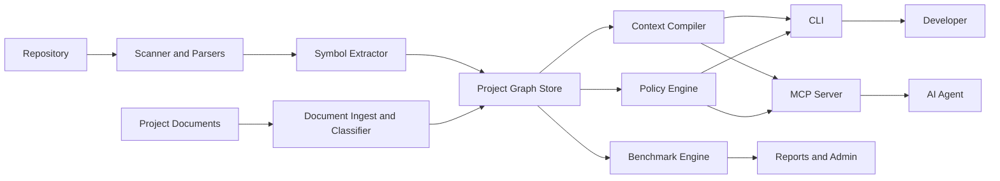
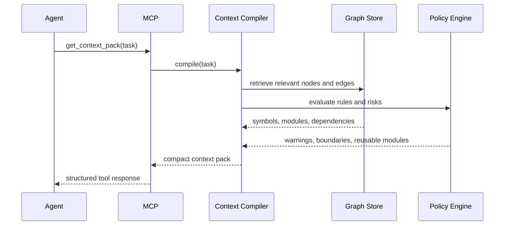

# Technical Architecture

## Architecture Goal

Build a context infrastructure that transforms a repository into a durable, queryable project memory and serves high-signal context to AI agents with low latency and predictable semantics.

## System Overview



## Core Components

### 1. Scanner and Parser Layer

Responsibilities:

- Discover repository structure
- Respect ignore rules
- Detect languages and frameworks
- Parse source into AST and symbol metadata

Recommended implementation:

- Tree-sitter for broad language coverage
- Language-specific enrichers for TypeScript, JavaScript, Python initially

Output:

- Normalized symbol records
- File dependency records
- Parsed route descriptors for HTTP handlers and framework route files
- Structural fingerprints for incremental re-indexing

### 2. Symbol Extractor

Responsibilities:

- Convert AST data into a common schema
- Detect functions, classes, interfaces, methods, exports, tests, routes, migrations
- Enrich nodes with docstrings, comments, annotations, ownership tags, and code signatures

### 3. Project Graph Store

Initial storage recommendation:

- Postgres as the system of record
- `pgvector` for semantic embeddings
- JSONB for parser-specific details

Reason:

- Faster to ship than a dedicated graph database
- Easier SaaS operations
- Can still model nodes and edges cleanly

When to add a graph database:

- Multi-repo dependency traversal becomes heavy
- Complex graph analytics become core
- Query latency or explainability suffers under relational joins

### 3.5. Document Ingest and Classifier

Responsibilities:

- scan configured project-document paths
- classify documents such as business, requirements, technical, and execution artifacts
- extract titles, headings, summaries, and retrieval metadata from `md`, `mdx`, `txt`, `json`, `yaml`, `docx`, and `pdf`
- use layout-aware `pdf` extraction when a text layer exists and, when text is weak plus `ocrmypdf` is available, apply local OCR before falling back to raw-text parsing
- attach lineage, freshness, source type, and sensitivity metadata
- build deterministic local semantic vectors so document retrieval can bridge synonym-heavy queries without a hosted embedding dependency
- prefer latest document versions during retrieval while preserving lineage references for auditability
- redact secret-like content from previews and restricted summaries before sync artifacts are published

Why this matters:

- AI should understand not only what the code does, but why the system exists and what constraints shaped it.
- Product and architecture intent often lives in documents, not source files.

### 4. Context Compiler

Responsibilities:

- Take a task prompt or structured query
- Determine the relevant part of the code graph
- Rank symbols, modules, tests, and policies
- Produce a compact context pack

Ranking inputs:

- Symbol relevance
- Call graph proximity
- Document relevance
- Local semantic similarity for document memory
- Ownership proximity
- Recent change activity
- Policy importance
- Duplicate risk signals

### 5. Policy Engine

Responsibilities:

- Load project rules from repo config
- Evaluate architecture boundaries
- Mark reusable modules and banned patterns
- Surface warnings before generation

Example rules:

- `api` cannot import `ui`
- Deprecated auth helper must not be used
- Payment logic must go through `billing/service.ts`

### 6. MCP Server

Responsibilities:

- Expose structured tools to AI clients
- Authenticate to local or shared graph
- Return concise JSON/tool outputs

### 7. CLI

Responsibilities:

- Local-first developer interface
- Bootstrap, scan, inspect, benchmark, and run MCP
- Support CI usage later

### 8. Benchmark Engine

Responsibilities:

- Run scripted tasks
- Collect token usage and quality metrics
- Compare baseline vs `be-ai-heart`
- Generate human-readable and machine-readable reports

## Data Model

### Core Node Types

- `Repository`
- `Package`
- `Module`
- `File`
- `Symbol`
- `Class`
- `Function`
- `Interface`
- `Test`
- `Decision`
- `Policy`
- `Owner`
- `TaskRun`

### Core Edge Types

- `CONTAINS`
- `IMPORTS`
- `CALLS`
- `IMPLEMENTS`
- `EXTENDS`
- `TESTED_BY`
- `OWNED_BY`
- `RELATES_TO`
- `RECOMMENDED_REUSE`
- `VIOLATES_POLICY`
- `IMPACTS`

## Example Symbol Record

```json
{
  "id": "sym:function:src/auth/login.ts:loginUser",
  "kind": "function",
  "name": "loginUser",
  "path": "src/auth/login.ts",
  "language": "typescript",
  "signature": "loginUser(input: LoginInput): Promise<LoginResult>",
  "exports": true,
  "doc": "Authenticates a user with password and returns session metadata.",
  "owners": ["identity-team"],
  "tags": ["auth", "critical-path"],
  "hash": "sha256:...",
  "embedding_ref": "emb_...",
  "last_seen_commit": "abc123"
}
```

## Context Pack Schema

```json
{
  "task": "Add SSO login audit logging",
  "summary": "Auth domain centered around src/auth and src/audit modules.",
  "relevant_symbols": [],
  "relevant_files": [],
  "reuse_candidates": [],
  "policies": [],
  "risks": [],
  "open_questions": []
}
```

## Query Flow



## Multi-Tenant SaaS Architecture

Suggested services:

- `ingest-service`
- `graph-service`
- `context-service`
- `policy-service`
- `benchmark-service`
- `billing-service`
- `admin-web`
- `marketing-web`

Suggested infra:

- Next.js for web
- API services on Node.js or Go
- Postgres
- Redis queue/cache
- Object storage for snapshots and reports
- OpenTelemetry for traces

## Security Requirements

- Tenant isolation at data and access layer
- Audit logs for graph queries in enterprise mode
- Secrets never embedded into graph artifacts
- Configurable redaction for sensitive directories
- SSO/SAML in enterprise tier
- Optional VPC or on-prem deployment

## Recommended MVP Build Sequence

1. TypeScript parser and symbol graph
2. Local graph storage
3. Context compiler with simple ranking
4. Local CLI
5. Local MCP server
6. Benchmark runner
7. Cloud control plane

## Key Technical Risks

- Too much data ends up in context packs
- Weak symbol extraction reduces trust
- Natural-language retrieval may over-rank semantically similar but architecturally wrong modules
- Incremental indexing can become fragile without good file fingerprinting

## Risk Mitigations

- Keep context pack budget explicit
- Combine symbolic and semantic retrieval
- Add policy weighting into ranking
- Log false-positive and false-negative retrieval cases from design partners
