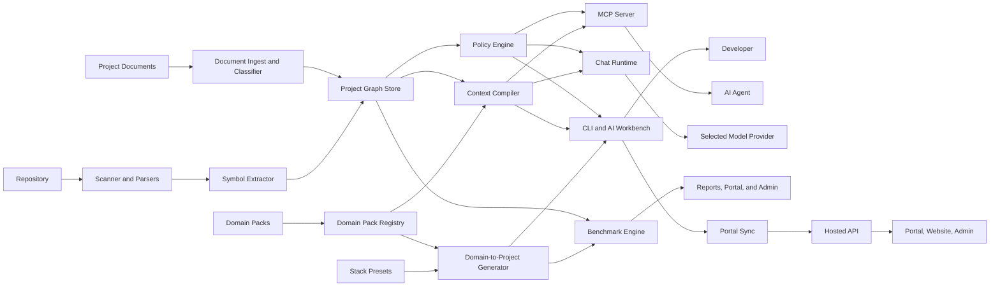
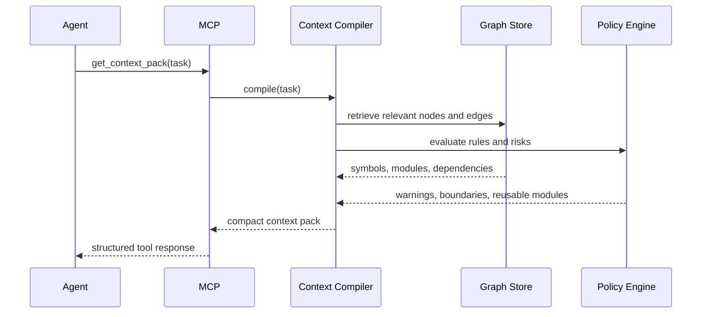

# Technical Architecture

## Architecture Goal

Build a context infrastructure that transforms a repository into a durable, queryable project memory and serves high-signal context to AI agents with low latency and predictable semantics.

## System Overview



## Core Components

### 1. Scanner and Parser Layer

Responsibilities:

- Discover repository structure
- Respect ignore rules
- Apply generated/vendor ignore defaults together with repo-local overrides
- Detect languages and frameworks
- Parse source into AST and symbol metadata

Recommended implementation:

- Tree-sitter for broad language coverage
- Language-specific enrichers for TypeScript, JavaScript, Python initially

Output:

- Normalized symbol records
- File dependency records
- Parsed route descriptors for HTTP handlers and framework route files
- Parser relation evidence for calls and routes with confidence, source, and provenance
- Structural fingerprints for incremental re-indexing
- Scan provenance with config hash, policy hash, cache schema version, effective ignores, and document roots
- Workspace readiness with config status, policy status, generated-noise exclusion status, cache status, parser coverage, document count, blocking errors, and warnings

### 2. Symbol Extractor

Responsibilities:

- Convert AST data into a common schema
- Detect functions, classes, interfaces, methods, exports, tests, routes, migrations
- Enrich nodes with docstrings, comments, annotations, ownership tags, and code signatures

### 3. Project Graph Store

Current local snapshot contract:

- `schema_version: 2`
- `repo` and compatibility `repoName`
- sanitized `root` and compatibility `rootDir`
- `generated_at`
- sanitized `scan_provenance` without absolute local repo roots
- typed `nodes`, typed `edges`, and `summary`

Graph nodes carry `confidence` and `source`. Graph edges carry `confidence`, `source`, and `provenance`; extracted parser edges default to `EXTRACTED`.

Current local storage:

- `.heart/cache/workspace-state.json` for local graph/workspace state
- `.heart/diagrams/` for generated diagram artifacts
- `.heart/imported-documents/` for local imported document memory
- `.heart/benchmarks/` for reports, captures, suites, and evidence bundles
- local service SQLite storage for hosted API development and demo mode

Target shared/hosted storage recommendation:

- Postgres as the system of record
- `pgvector` for semantic embeddings
- JSONB for parser-specific details

Reason:

- Faster to ship than a dedicated graph database
- Easier SaaS operations
- Can still model nodes and edges cleanly

When to add a graph database:

- Multi-repo dependency traversal becomes heavy
- Complex graph analytics become core
- Query latency or explainability suffers under relational joins

### 3.5. Document Ingest and Classifier

Responsibilities:

- scan configured project-document paths
- classify documents such as business, requirements, technical, and execution artifacts
- extract titles, headings, summaries, and retrieval metadata from `md`, `mdx`, `txt`, `json`, `yaml`, `docx`, and `pdf`
- use layout-aware `pdf` extraction when a text layer exists and, when text is weak plus `ocrmypdf` is available, apply local OCR before falling back to raw-text parsing
- attach lineage, freshness, source type, and sensitivity metadata
- build deterministic local semantic vectors so document retrieval can bridge synonym-heavy queries without a hosted embedding dependency
- prefer latest document versions during retrieval while preserving lineage references for auditability
- redact secret-like content from previews and restricted summaries before sync artifacts are published

Why this matters:

- AI should understand not only what the code does, but why the system exists and what constraints shaped it.
- Product and architecture intent often lives in documents, not source files.

### 4. Context Compiler

Responsibilities:

- Take a task prompt or structured query
- Determine the relevant part of the code graph
- Rank symbols, modules, tests, and policies
- Produce a compact context pack

Ranking inputs:

- Symbol relevance
- Call graph proximity
- Document relevance
- Local semantic similarity for document memory
- Ownership proximity
- Recent change activity
- Policy importance
- Duplicate risk signals

### 5. Policy Engine

Responsibilities:

- Load project rules from repo config
- Evaluate architecture boundaries
- Mark reusable modules and banned patterns
- Surface warnings before generation

Example rules:

- `api` cannot import `ui`
- Deprecated auth helper must not be used
- Payment logic must go through `billing/service.ts`

### 6. MCP Server

Responsibilities:

- Expose structured tools to AI clients
- Authenticate to local or shared graph
- Return concise JSON/tool outputs

### 7. CLI

Responsibilities:

- Local-first developer interface
- Bootstrap, scan, inspect, benchmark, and run MCP
- Support CI usage later
- Hosted login starts from `heart login`, opens the portal, receives a state-bound loopback callback, validates the returned credential through `/api/session`, and stores only local CLI credentials with user-only file permissions.

Current CLI IDE workbench package boundaries:

- `packages/cli-workbench`: terminal capability detection, `heart ide` session state, layout rendering, command palette, and interactive command loop.
- `packages/editor-core`: repo-contained file search/open/save/edit primitives and external editor fallback.
- `packages/keymap`: default/vim/emacs/vscode-like keymaps, `.heart/keymap.yaml`, key resolution, and conflict detection.
- `packages/diff-engine`: patch proposal normalization, diff preview, confirmation-gated apply, and rollback snapshots.
- `packages/dev-runner`: package-script discovery, allowlisted task execution, risky-command confirmation, managed process helpers, compact diagnostics parsing from tool output, and diagnostics navigation targets.
- `packages/lsp-adapter`: LSP `textDocument/publishDiagnostics` normalization, timeout-bounded initialize/capability probes, reusable in-process LSP sessions, and didOpen/didChange diagnostics collection for allowlisted server presets; cross-command daemon persistence remains outside the MVP boundary.
- `packages/git-workflow`: git status, diff/staged-diff metadata, review/stage-picker summaries, selectable stage/unstage choices, confirm-gated git-index mutation, and deterministic commit/PR summary drafts.
- `packages/ai-suggestions`: manual suggestion context collection, next-line/block request contracts, accept/reject helpers, and redaction before suggestion provider calls.
- `packages/code-actions`: inline edit and patch proposal contracts that sit above the diff engine.

These packages keep terminal UI separate from file writes, process execution, AI provider calls, and patch safety.

### 7.5 AI Agent Provider Layer

Current AI-agent MVP adds these reusable package boundaries:

- `packages/model-registry`: typed provider metadata, dynamic model discovery, versioned fallback model manifests, versioned pricing catalog overlay, capability mapping, live-validation planning, and secret redaction helpers.
- `packages/ai-gateway`: provider-neutral chat request/response adapter, normalized streaming events, provider error mapping, credential validation, token usage, and cost estimate hooks.
- `packages/chat-runtime`: BeHeart system prompting, chat sessions, context attachments, citations, artifact cards, and provider calls.
- `packages/agent-tools`: allowlisted BeHeart tool definitions and confirmation policy.
- `packages/portal-chat-contracts`: shared chat message, session, streaming event, context attachment, citation, and artifact card contracts.

Provider support is BYOK and model-provider-neutral. OpenAI, Anthropic, and Gemini are the MVP providers; OpenRouter,
Mistral, and Groq are present through the same registry and gateway. Ollama and LM Studio are registered as local
no-key runtimes. Bedrock uses direct SigV4 signing for environment credentials, static AWS profiles, and
`source_profile` assume-role chains with `ListFoundationModels` validation, Converse runtime calls, and
`ConverseStream` event-stream parsing. IAM Identity Center/SSO profiles and `credential_process` are detected but not
executed by the gateway. Model availability must not
be treated as permanent truth: registry discovery is used when a key or local endpoint exists, and fallback lists are
dated with `fallback_manifest_version`.
Cost metadata follows the same rule: provider-returned dynamic pricing wins when available, BeHeart's static overlay is
dated with `catalog_version`, local runtimes report zero provider cost, and unknown prices stay explicit warnings.

Credential handling:

- CLI keys use environment variable fallback or local `~/.beheart/model-credentials.json` with mode `0600`.
- Portal keys require encrypted server-side storage via `BE_AI_HEART_PORTAL_SECRET_KEY`; otherwise the portal must use provider environment variables.
- API responses, CLI output, audit metadata, and UI state expose only masked key presence, never raw key material.

Runtime boundaries:

- `packages/model-registry` owns provider metadata, model discovery, stale fallback manifests, and redaction helpers.
- `packages/ai-gateway` owns provider request normalization, streaming event contracts, error mapping, usage, and cost hooks.
- `packages/chat-runtime` owns system prompting, context attachments, citations, artifact cards, and provider calls.
- `packages/agent-tools` owns allowlisted BeHeart tool definitions and confirmation policy; portal executors stay limited to synced BeHeart artifacts, confirmed generated outputs, and confirmed scoped writes under `docs/generated/`, `docs/specs/generated/`, `docs/templates/generated/`, or `.heart/packs/generated/`.
- `packages/portal-chat-contracts` owns shared chat/session/event contracts for portal and service use.
- Provider APIs are temporally unstable; model availability and costs must be discovered or refreshed rather than treated as permanent docs truth.

### 8. Benchmark Engine

Responsibilities:

- Run scripted tasks
- Collect token usage and quality metrics
- Compare baseline vs `be-ai-heart`
- Generate human-readable and machine-readable reports

### 9. Portal Repository Services

Responsibilities:

- Present tenant-scoped repository health without requiring raw source upload
- Show graph health, diagrams, document memory, policy warnings, benchmark ROI, runtime signals, and context-pack preview from synced artifacts
- Keep context-pack preview local-first: hosted UI may show selected files, documents, citations, token budget, model presets, and command examples, but final pack generation stays in the local CLI or MCP runtime
- Redact restricted document content and absolute local paths before portal/admin rendering

Current context preview contract:

- `context_pack_preview.preview` contains task, token budget, estimated tokens, confidence, files, symbols, documents, citations, risks, and next actions
- `context_pack_preview.model_presets` exposes user-selectable model/token-budget choices for planning
- `context_pack_preview.command_examples` exposes local Heart command grammar for the portal command box
- No hosted preview executes arbitrary repo commands or reads unsynced local files

### 9.5. Domain Pack Registry And Artifact Builder

Responsibilities:

- list source-backed domain packs such as `tolling-management`
- expose pack metadata, layer model, output types, source notes, benchmark scenarios, and security warnings
- merge Core, Regional, Agency, Customer, and accepted customer-doc layers with explicit conflict reporting
- generate demo-safe artifacts with manifests under `.heart/packs/<pack-id>/generated/<output>/...`
- serve the same contracts to CLI, MCP tools, portal API, and portal chat without letting UI own domain logic

Current contracts live in `packages/core/src/domain-packs.js`:

- `listDomainPacks`, `getDomainPack`, `validateDomainPack`
- `listPackLayers`, `listPackArtifacts`, `getPackSourceNotes`, `getPackBenchmarks`, `getPackBuildOptions`
- `loadPackLayer`, `loadAgencyOverlay`, `loadCustomerOverlay`
- `mergePackLayers`, `detectPackLayerConflicts`, `explainEffectivePackRules`, `citePackRuleSource`, `validateOverlayRules`
- `createPackArtifactManifest`, `writePackArtifact`, `listGeneratedPackArtifacts`, `readGeneratedPackArtifact`, `syncGeneratedPackArtifact`, `validateGeneratedPackArtifact`

Security boundaries:

- generated data must be demo-safe and must not include real PII, plates, plate images, trip history, raw payment data, or secrets
- portal chat can only prepare and submit allowlisted pack actions
- generated artifacts must include source citations, warnings, and MVP/generated labels
- toll rates, fee amounts, deadlines, collections, and legal outcomes remain customer-source-only

The current Tolling Management pack supports Core, Texas regional, TxDOT/HCTRA/NTTA-style example overlays, customer
requirements, conflict detection, source citations, and generated outputs such as `sales-demo-kit`, `website`,
`ui-prototype`, `proposal`, `benchmarks`, and `context-pack`. These outputs are demo and planning artifacts unless a
future production runtime story explicitly implements live integrations.

### 9.6. Domain-to-Project Generator

Responsibilities:

- turn a selected domain pack plus stack preset into a generated project foundation
- keep the default UX to domain and stack selection, with only blocking questions before write
- compile selected layers, conflicts, citations, modules, docs, code, tests, fixtures, benchmark scenarios, context, and implementation backlog into a previewable plan
- write only inside the selected output directory after confirmation
- create `.heart/generation-manifest.json` with generated files, story IDs, citations, assumptions, warnings, validation results, and rollback token
- expose the same plan/generate contract to CLI, CLI IDE, MCP, and portal contracts

Current package boundaries:

- `packages/domain-pack-registry`: list, select, load, validate, and create domain pack skeletons.
- `packages/domain-pack-compiler`: merge domain layers, detect conflicts, ask domain questions, and explain effective rules.
- `packages/stack-presets`: typed stack presets, validation, and stack tradeoff explanation.
- `packages/project-generator`: generation modes, smart defaults, previews, confirmed writes, docs/code/test/demo/benchmark artifact generation, validation, and continue-from-story helpers.
- `packages/generation-manifest`: manifest creation, validation, secret-like scan, fake demo-data scan, and redaction helpers.
- `packages/template-engine`: small reusable template rendering primitive for stack-specific generation.
- `packages/portal-generation-contracts`: shared plan and artifact-viewer contracts for future portal screens.

Current MVP:

- domain: `tolling-management`
- stacks: `next-fullstack-postgres`, `react-node-postgres`, `spring-react-postgres`
- modes: `docs-only`, `sales-demo`, `product-starter`, `service-starter`, and `ui-starter`
- surfaces: `heart generate`, `heart ide generate`, and MCP tools `stack_preset_list`, `domain_project_plan`, `domain_project_generate`

Security boundaries:

- generated demo data must be fake and obvious
- secrets, raw payment data, real plates, and real PII are blocked by validation rules where feasible
- payment flows are hosted/tokenized placeholders unless a future explicit integration task approves otherwise
- existing non-empty output directories become blocking questions in the plan
- path traversal is denied before any generated file write

### 10. Planning Change Requests

Responsibilities:

- Preserve latest discussed and agreed product, business requirement, spec, and architecture changes before implementation
- Normalize and validate change-request records with explicit story IDs, acceptance criteria, validation plan, docs required, and security considerations
- Render deterministic Markdown for human review and future issue-tracker or planning-registry persistence
- Redact secret-like values from planning text so process docs do not become a leakage path

Current contract:

- `PLANNING_CHANGE_REQUEST_SCHEMA_VERSION: 1`
- `createPlanningChangeRequestId`
- `normalizePlanningChangeRequest`
- `validatePlanningChangeRequest`
- `renderPlanningChangeRequestMarkdown`

The current implementation is pure domain logic in `packages/core`. Persistence remains a future docs tooling or service adapter so planning records can later sync to issues or a generated registry without coupling core logic to transport.

### 11. Hosted API, Portal, Admin, And Billing Readiness

Current service responsibilities:

- tenant-scoped repository, document, benchmark, domain-pack, model, chat-command, billing posture, session, audit, and observability contracts
- local demo auth only behind `BE_AI_HEART_ENABLE_LOCAL_DEMO_AUTH=1`
- API-key login and CLI sync through hashed/redacted service session records
- LLM proxy telemetry for observed benchmark capture
- SQLite default storage for local/demo use and Postgres repository adapters for hosted evolution

Portal responsibilities:

- show synced repo truth, not raw local source mirrors
- display docs/spec/business requirement status, graph, diagrams, context-pack preview, policies, benchmark evidence, domain packs, models, billing posture, team access, and security state
- map chat input to allowlisted product actions and confirmation states

Admin responsibilities:

- support, customer inventory, intake, billing ops, sessions/audit, benchmark history, observability, revenue posture, and operational health

Billing/payment readiness:

- live subscription/payment processing is not part of current local MVP
- portal/admin may show plan posture, entitlements, seats, invoices, and estimated finance from adapter-friendly contracts
- raw card data, bank data, provider secrets, and customer payment data must not appear in generated artifacts or synced summaries

## Data Model

### Core Node Types

- `Repository`
- `Package`
- `Module`
- `File`
- `Symbol`
- `Class`
- `Function`
- `Interface`
- `Test`
- `Decision`
- `Policy`
- `Owner`
- `TaskRun`

### Core Edge Types

- `CONTAINS`
- `IMPORTS`
- `CALLS`
- `IMPLEMENTS`
- `EXTENDS`
- `TESTED_BY`
- `OWNED_BY`
- `RELATES_TO`
- `RECOMMENDED_REUSE`
- `VIOLATES_POLICY`
- `IMPACTS`

## Example Symbol Record

```json
{
  "id": "sym:function:src/auth/login.ts:loginUser",
  "kind": "function",
  "name": "loginUser",
  "path": "src/auth/login.ts",
  "language": "typescript",
  "signature": "loginUser(input: LoginInput): Promise<LoginResult>",
  "exports": true,
  "doc": "Authenticates a user with password and returns session metadata.",
  "owners": ["identity-team"],
  "tags": ["auth", "critical-path"],
  "hash": "sha256:...",
  "embedding_ref": "emb_...",
  "last_seen_commit": "abc123"
}
```

## Context Pack Schema

```json
{
  "task": "Add SSO login audit logging",
  "summary": "Auth domain centered around src/auth and src/audit modules.",
  "relevant_symbols": [],
  "relevant_files": [],
  "reuse_candidates": [],
  "policies": [],
  "risks": [],
  "open_questions": []
}
```

## Query Flow



## Multi-Tenant SaaS Architecture

Suggested services:

- `services/api` as the current hosted contract service
- future split candidates: `ingest-service`, `graph-service`, `context-service`, `policy-service`, `benchmark-service`, `billing-service`, `admin-web`, `marketing-web`

Suggested infra:

- Next.js for web
- API services on Node.js or Go
- Postgres
- Redis queue/cache
- Object storage for snapshots and reports
- OpenTelemetry for traces

Deployment readiness is staged: local CLI/MCP first, standalone hosted API plus Next.js website/portal/admin for guided
pilots, then private deployment, backup/restore, SSO/RBAC hardening, billing-provider integration, and tenant-isolation
review before broad enterprise rollout.

## Security Requirements

- Tenant isolation at data and access layer
- Audit logs for graph queries in enterprise mode
- Secrets never embedded into graph artifacts
- Configurable redaction for sensitive directories
- SSO/SAML in enterprise tier
- Optional VPC or on-prem deployment

## Recommended MVP Build Sequence

1. TypeScript parser and symbol graph
2. Local graph storage
3. Context compiler with simple ranking
4. Local CLI
5. Local MCP server
6. Benchmark runner
7. Cloud control plane

## Key Technical Risks

- Too much data ends up in context packs
- Weak symbol extraction reduces trust
- Natural-language retrieval may over-rank semantically similar but architecturally wrong modules
- Incremental indexing can become fragile without good file fingerprinting

## Risk Mitigations

- Keep context pack budget explicit
- Combine symbolic and semantic retrieval
- Add policy weighting into ranking
- Log false-positive and false-negative retrieval cases from design partners

## Implemented Portal Contract Slice

The hosted API now has a narrow portal contract layer for the web product surfaces:

- repository sync status: scan status, latest CLI sync, graph health, document freshness, context pack history, benchmark evidence, policy warning counts, and next action
- graph and diagram views: graph summaries, relationship counts, confidence/freshness labels, generated diagrams, and source citations
- docs/spec/business requirement views: published document memory grouped for product docs, user stories, architecture, business requirements, decisions, and benchmark framework
- context packs: list and create repository-scoped hosted context pack records from synced repository service artifacts
- portal chat: submit and fetch command records for allowlisted product actions only
- model settings: list available providers/models and update purpose presets without exposing provider secrets
- admin overview: founder metrics computed from synced artifacts, benchmark reports, intake, audit events, and telemetry
- local demo auth: when `BE_AI_HEART_ENABLE_LOCAL_DEMO_AUTH=1`, the auth provider registry exposes local-only dummy portal/admin links for developer testing; the demo session tokens are ignored when demo auth is disabled

The service layer owns these contracts in `services/api`; portal components call the API but do not own domain logic.
