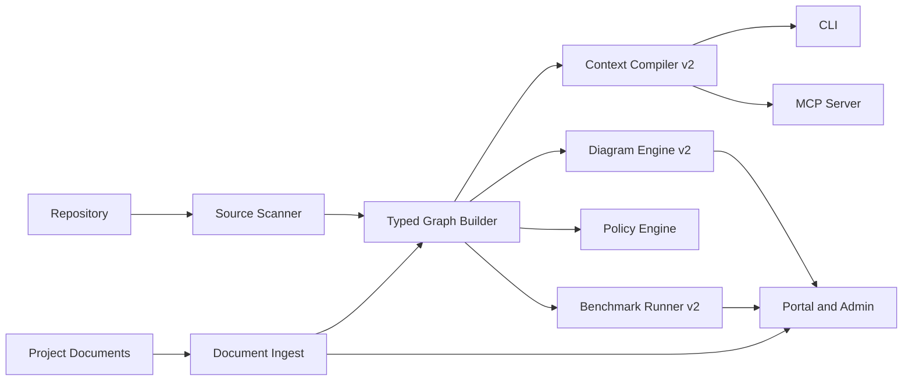

# Implementation Blueprint v2

## Purpose

This document defines the next implementation phase for `be-ai-heart` after the current local-first prototype.

The goal of `v2` is not to add surface area for its own sake. The goal is to make `heart` materially better at the one thing the product must prove:

- durable project memory for AI coding
- lower repeated context loading
- stronger reuse detection
- more trustworthy architecture guidance
- benchmark-backed ROI that can survive customer scrutiny

This blueprint is intentionally narrow. It focuses on the smallest set of changes that move `be-ai-heart` from `repo index plus artifact sync` toward `credible project memory`.

## Why v2 Exists

The current repository already demonstrates several useful capabilities:

- AST-backed source scanning
- local workspace caching
- document scanning and lightweight classification
- context pack generation
- Mermaid diagram generation
- local MCP stdio tools
- portal/admin sync of repository, document, and benchmark artifacts
- tenant-scoped hosted write path

That is enough to prove the concept. It is not yet enough to prove the product wedge at design-partner quality.

The main gaps are:

- graph semantics are too shallow for reliable change reasoning
- retrieval still depends heavily on lexical heuristics
- generated artifacts can pollute scans and diagrams
- diagrams are useful demos but not yet trustworthy customer-facing system views
- document memory works, but governance and linkage depth are still light
- benchmark reporting exists, but the current runner is not yet evidence-rich enough for strong ROI claims

## North Star

At the end of `v2`, a team should be able to run this loop repeatedly on one TypeScript repository:

1. Update code or business/requirements documents.
2. Run `heart scan`.
3. Ask for `heart pack "<task>"`.
4. Feed the returned context pack into an AI agent through CLI or MCP.
5. Review diagrams and benchmark evidence in the portal.
6. See a smaller, more relevant, and more stable context footprint than the baseline workflow.

If that loop still forces the user or the model to rediscover the codebase each time, `v2` has not met its purpose.

## Design Principles

### 1. Contracts before expansion

Do not widen the command surface or hosted surface until the internal data contracts are stable.

### 2. Local-first remains primary

The local repository is still the source of truth for indexing and graph construction. Hosted services exist to mirror, govern, and share artifacts, not to replace the local-first loop too early.

### 3. AI ingestion is not the same as human visualization

Humans should consume diagrams and benchmark summaries.
AI agents should consume compact JSON contracts, citations, and retrieval evidence.
Do not make Mermaid the primary agent input format.

### 4. Trust beats cleverness

If a diagram or retrieval result is heuristic, say so.
If confidence is low, expose that explicitly.
If the system does not know enough, return missing-context warnings instead of pretending certainty.

### 5. Security is part of the product, not a later hardening step

Context leakage, secret exposure, and weak tenant isolation directly undermine the product promise.

## Scope of v2

`v2` includes:

- better index truthfulness
- typed graph evolution
- context compiler `v2`
- diagram engine `v2`
- document memory `v2`
- benchmark runner `v2`

`v2` does not include:

- broad multi-language support
- a dedicated graph database
- fully autonomous learning or self-modifying prompts
- enterprise-grade billing or CRM expansion
- runtime tracing infrastructure

## Current State Summary

The current codebase is best understood as:

- beyond concept-only
- strong enough for internal dogfooding and guided design-partner prep loops
- not yet strong enough to claim broad, sales-grade repeatable project-memory ROI across customer repos

In maturity terms, this is between late `Stage 1` and early `Stage 2`.

## Target Architecture for v2

## Package Ownership

### `packages/core`

Owns:

- config loading
- local cache schema/versioning
- workspace assembly
- repo-level indexing lifecycle

Must not own:

- graph semantics
- diagram generation
- MCP transport logic

### `packages/parser-ts`

Owns:

- TypeScript and JavaScript AST extraction
- symbol extraction
- import extraction
- future call-site extraction for supported patterns

Must not own:

- ranking
- hosted storage
- diagram rendering

### `packages/graph`

Owns:

- graph schema
- graph build pipeline
- graph snapshot and hydration
- query helpers for dependency, impact, and collaboration analysis

Must not depend on:

- UI apps
- portal/admin formatting concerns

### `packages/document-ingest`

Owns:

- document discovery
- document classification
- document metadata extraction
- document content summaries
- future document parsing adapters

### `packages/document-sync`

Owns:

- portal/admin submission ingestion
- local document import lane
- publication of document artifacts to shared surfaces

### `packages/context-compiler`

Owns:

- retrieval and ranking logic
- context pack schema
- relevance/reuse/architecture confidence scoring
- missing-context reporting

### `packages/diagram-generator`

Owns:

- customer-facing static diagrams
- diagram artifact manifests
- repository profile assembly for visual review

Must not become:

- the primary graph query layer
- the agent-facing retrieval surface

### `packages/mcp-server`

Owns:

- stdio MCP transport
- tool registry
- compact tool response contracts

### `packages/benchmark`

Owns:

- scenario loading
- baseline vs assisted run normalization
- evidence-rich benchmark artifacts
- manager and technical report outputs

### `services/api`

Owns:

- tenant-scoped persistence
- session and actor resolution
- hosted read/write contracts
- publication of public artifacts to surfaces

## Core Data Contracts

### Graph Snapshot v2

The graph must evolve from a lightweight file-symbol index into a typed project-memory graph.

Minimum node types:

- `Repository`
- `Package`
- `Module`
- `File`
- `Class`
- `Interface`
- `Function`
- `Method`
- `Test`
- `Document`
- `Decision`
- `Policy`

Minimum edge types:

- `CONTAINS`
- `IMPORTS`
- `CALLS`
- `EXTENDS`
- `IMPLEMENTS`
- `TESTED_BY`
- `DOCUMENTS`
- `CONSTRAINS`
- `VIOLATES_POLICY`
- `IMPACTS`
- `RECOMMENDED_REUSE`

Each node should support:

- `id`
- `type`
- `name`
- `path`
- `language`
- `signature`
- `span`
- `hash`
- `confidence`
- `source`

Each edge should support:

- `id`
- `type`
- `from`
- `to`
- `confidence`
- `provenance`
- `metadata`

### Context Pack v2

The context pack should become the primary agent-facing memory object.

Minimum fields:

- `task`
- `summary`
- `relevant_files`
- `relevant_symbols`
- `relevant_documents`
- `call_paths`
- `tests_to_run`
- `reuse_candidates`
- `policies`
- `risks`
- `missing_context_warnings`
- `confidence`
- `citations`

The pack must support a real `token_budget` input and trim deterministically to it.

### Diagram Artifact v2

Diagram artifacts remain human-facing. They should include:

- `type`
- `title`
- `format`
- `inference_mode`
- `summary`
- `confidence`
- `scope`
- `content`

Each diagram should answer one specific question:

- `symbol`: what was discovered
- `high-level`: how the major domains fit together
- `component`: which service/module boundaries matter
- `class`: what type structure exists
- `sequence`: how a key use case likely flows through the code

### Document Artifact v2

Minimum fields:

- `document_id`
- `path`
- `source`
- `category`
- `title`
- `summary`
- `headings`
- `freshness`
- `sensitivity`
- `version_ref`
- `citations`

## Milestone 1: Index Truthfulness

### Goal

Make scans reflect the real project rather than a polluted or partially configured repo view.

### Build

- Parse `heart.config.yaml` for real instead of using only hardcoded defaults.
- Load ignore paths, document roots, and MCP tool settings from config.
- Load `.heart/policies.yaml` into the policy engine instead of relying only on hardcoded rules.
- Exclude generated and vendor artifacts from indexing by default, including `.next` and similar directories.
- Persist cache metadata with explicit schema version and scan provenance.

### Acceptance Criteria

- Two scans of the same unchanged repo produce stable counts and stable top retrieval results.
- Generated build output no longer pollutes diagrams or top retrieval candidates.
- Document roots configured in repo config are actually respected.
- Policy evaluation reflects repo-local policy definitions.

### Main Risk

If index truthfulness is weak, every later milestone will produce cleaner-looking but still misleading outputs.

## Milestone 2: Typed Graph v2

### Goal

Promote the graph from a file-symbol catalog to a queryable collaboration model.

### Build

- Introduce typed nodes for class, interface, function, method, test, document, and policy.
- Persist `EXTENDS` and `IMPLEMENTS` edges from parser output.
- Add first-pass `CALLS` extraction for supported TypeScript and JavaScript patterns.
- Add `TESTED_BY` links from test naming and import/reference heuristics.
- Add `IMPACTS` derivation helpers for graph queries.

### Acceptance Criteria

- The graph can answer function-to-function and class-to-class relationship queries.
- `impact_analysis` uses more than import edges.
- The graph snapshot is versioned and diffable across scans.
- Class and sequence diagrams can consume typed graph edges instead of ad hoc inference only.

### Main Risk

Trying to support every language or every call-site shape too early will slow delivery without improving the wedge.

## Milestone 3: Context Compiler v2

### Goal

Make `context_pack` the smallest useful memory unit for AI work.

### Build

- Add real `token_budget` handling.
- Rank by graph proximity, document linkage, policy relevance, reuse signals, and likely test impact.
- Add citation objects for documents, symbols, and graph-derived evidence.
- Add stable compact schema for MCP and CLI JSON outputs.
- Add explicit confidence rollups for relevance, reuse, and architecture fit.

### Acceptance Criteria

- Similar tasks produce similar top context results across repeated runs.
- Context packs are materially smaller than raw repo exploration while still preserving key task evidence.
- Reuse candidates point to actual existing code paths with explicit reasons.
- Missing-context warnings appear when the system lacks enough document or graph support.

### Main Risk

If ranking remains mostly lexical, the pack will still look focused while missing the real implementation path.

## Milestone 4: Diagram Engine v2

### Goal

Turn diagrams into trustworthy review artifacts instead of mostly demo visuals.

### Build

- Add a real `component` diagram type.
- Refactor `high-level` to use cleaned domain/component data from the typed graph.
- Refactor `class` to ignore low-confidence or generated code shapes.
- Refactor `sequence` to derive from route, service, handler, and call-chain evidence where available.
- Add diagram confidence and scope metadata.

### Acceptance Criteria

- Portal diagrams are free of generated-code noise in normal operation.
- Each diagram exposes the inference mode clearly.
- A customer can read the component and sequence diagrams without needing code-level repo knowledge first.
- Diagram output helps support review and onboarding, not just product demo narration.

### Main Risk

If diagrams overclaim precision, they will reduce trust faster than having no diagram at all.

## Milestone 5: Document Memory v2

### Goal

Make business and requirements context first-class, governable, and retrieval-safe.

### Build

- Add document adapters for `.pdf` and `.docx`.
- Add freshness tracking and source/version lineage.
- Add sensitivity tags and redaction-safe output rules.
- Strengthen document-to-module and decision-to-implementation linking.
- Ensure portal-submitted document updates flow into the next local scan and context pack with visible citations.

### Acceptance Criteria

- Portal or admin document updates become visible in subsequent context packs after sync.
- Sensitive or ignored content is not dumped raw into default agent outputs.
- Document retrieval can explain why a document was included.
- Document memory remains compact and citation-friendly.

### Main Risk

If document ingestion becomes a raw dump lane, it will increase token waste and governance risk instead of reducing them.

## Milestone 6: Benchmark Runner v2

### Goal

Make ROI claims defensible with run artifacts rather than scenario summaries alone.

### Build

- Add a runner that captures baseline and assisted runs as separate evidence bundles.
- Store raw prompts, tool outputs, resulting patches or output artifacts, and evaluation outputs.
- Keep model, task, repo snapshot, and rubric aligned across runs.
- Generate manager, technical, and raw-evidence views from the same run set.
- Publish benchmark history to portal and admin surfaces with per-workspace trends.

### Acceptance Criteria

- A benchmark claim can be traced back to raw artifacts.
- The same scenario can be rerun on the same repo snapshot with comparable output.
- The manager view and technical appendix are both generated from the same evidence set.
- Benchmark output is strong enough for design-partner conversations without hand-wavy interpretation.

### Main Risk

If the benchmark remains scenario-summary-only, it will look polished but remain commercially weak.

## Delivery Order

Build in this order:

1. Milestone 1: Index Truthfulness
2. Milestone 2: Typed Graph v2
3. Milestone 3: Context Compiler v2
4. Milestone 4: Diagram Engine v2
5. Milestone 5: Document Memory v2
6. Milestone 6: Benchmark Runner v2

This order is intentional:

- retrieval quality depends on clean indexing
- diagrams depend on better graph semantics
- benchmark credibility depends on stable retrieval and contracts

## Suggested Validation Matrix

### Contract tests

- graph snapshot schema
- context pack schema
- MCP tool contracts
- diagram manifest schema
- document artifact schema
- benchmark artifact schema

### Retrieval tests

- same task, same repo, repeated run stability
- document-heavy task
- reuse-heavy task
- cross-module change task
- low-context task that should emit warnings

### Security and governance tests

- ignored/generated paths excluded from indexing
- sensitive document handling and redaction
- tenant-scoped write enforcement
- MCP output remains protocol-clean and compact

### Product demo tests

- local-first happy path on one real repo
- portal document update -> CLI sync -> updated context pack
- benchmark report publication and portal visibility

## Design-Partner Readiness Gate

Do not claim design-partner readiness for this wedge until all of the following are true:

- scans are clean and repeatable
- context packs include both code and document evidence
- function/class/component relationships are queryable at useful depth
- diagrams are reviewable and not polluted by build artifacts
- document updates from customer flows affect retrieval
- benchmark reports contain raw evidence, not just scenario summaries

## Open Decisions to Resolve During v2

- whether `CALLS` extraction should stay heuristic in `parser-ts` first or move later to a richer analysis phase
- how much document sensitivity policy belongs in repo config versus hosted workspace controls
- whether benchmark raw artifacts should stay local-first by default and mirror hosted selectively
- which minimal typed graph storage shape best supports later Postgres-backed shared memory

## v2 Success Statement

`v2` succeeds if `be-ai-heart` can show that one active repository no longer forces the user or the model to start cold.

That means:

- the code graph is cleaner and deeper
- the document memory is governable and useful
- the context pack is compact and defensible
- the diagrams are understandable and honest
- the benchmark report proves that the workflow wastes fewer tokens and less review effort

If those outcomes are not visible together, the product is still a promising prototype rather than a credible project-memory layer.
