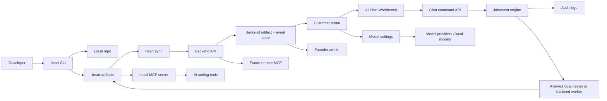

# be-ai-heart Web Product Experience Redesign Plan

Date: 2026-05-03

Status: Planning spec. Do not treat as implemented behavior.

## Purpose

Redesign the full be-ai-heart web experience so it behaves like a real product layer for durable AI project memory, not a polished demo. The web product must make local CLI work, synced artifacts, MCP context, docs/spec governance, benchmark evidence, and founder operations visible and actionable.

Primary product promise:

> be-ai-heart gives AI-assisted software teams durable project memory, lower token cost, less duplicate work, safer workflows, and benchmark-backed evidence.

The redesign should preserve the current local-first architecture. The portal reflects and governs local repo artifacts; it does not pretend the cloud owns source code.

## Required Product Surfaces

- Marketing website
- Customer portal
- Repo/workspace dashboard
- CLI sync visibility
- Graph, diagram, docs, spec, and business requirement views
- Chat command box inside portal
- Model selection inside portal
- Benchmark and ROI dashboard
- Governance and policy UI
- Private founder/admin dashboard for project, finance, retention, and enterprise metrics

## Skills Applied

- `skills/ui-ux/SKILL.md`: product-grade IA, interaction states, accessibility, motion, trust cues.
- `skills/frontend-react/SKILL.md`: route/component boundaries, state ownership, contract-driven UI.
- `skills/backend-nodejs/SKILL.md`: API contracts, side effects, validation, error shapes.
- `skills/core-architecture/SKILL.md`: app/package/service separation and narrow interfaces.
- `skills/security-engineering/SKILL.md`: MCP, CLI, backend, admin, secrets, auth, policy, audit.
- `skills/qa-engineering/SKILL.md`: contract, smoke, state, and regression validation.
- `skills/business-analyst/SKILL.md`: personas, value metrics, acceptance criteria.
- `skills/project-owner/SKILL.md`: sequencing, adoption friction, MVP tradeoffs.

## Source Inputs

Local source reviewed:

- `AGENTS.md`
- `README.md`
- `docs/00-executive-summary.md`
- `docs/01-product-story.md`
- `docs/02-prd.md`
- `docs/03-technical-architecture.md`
- `docs/04-mcp-cli-spec.md`
- `docs/05-enterprise-platform.md`
- `docs/06-benchmark-framework.md`
- `docs/07-go-to-market-pricing.md`
- `docs/08-roadmap-operating-model.md`
- `docs/10-user-stories.md`
- `docs/11-implementation-blueprint-v2.md`
- `apps/website/*`
- `apps/portal/*`
- `apps/admin/*`
- `services/api/*`
- `packages/cli/*`
- `packages/mcp-server/*`
- `packages/document-sync/*`
- `packages/profile-store/*`
- `packages/context-core/*`

External product research used for inspiration only:

- [Stripe Dashboard docs](https://docs.stripe.com/dashboard/basics)
- [Vercel Projects docs](https://vercel.com/docs/projects)
- [Linear Team Pages docs](https://linear.app/docs/default-team-pages)
- [Linear Custom Views docs](https://linear.app/docs/custom-views)
- [GitHub Command Palette docs](https://docs.github.com/en/get-started/accessibility/github-command-palette)
- [GitHub Security Insights docs](https://docs.github.com/en/code-security/how-tos/view-and-interpret-data/analyze-organization-data/viewing-security-insights)
- [Sentry Issue Details docs](https://docs.sentry.io/product/issues/issue-details/)
- [Sentry Dashboards docs](https://docs.sentry.io/product/dashboards/)
- [Supabase Logs docs](https://supabase.com/docs/guides/telemetry/logs)
- [Supabase API Keys docs](https://supabase.com/docs/guides/getting-started/api-keys)
- [Sourcegraph Code Search docs](https://sourcegraph.com/docs/code_search)
- [Sourcegraph Cody Context docs](https://sourcegraph.com/docs/cody/core-concepts/context)
- [PostHog Dashboards docs](https://posthog.com/docs/product-analytics/dashboards)
- [PostHog Retention docs](https://posthog.com/docs/product-analytics/retention)
- [Retool Command Palette article](https://retool.com/blog/command-palette)
- [Retool Trust Guide](https://try.retool.com/resource/trust-guide)
- [Cursor Rules docs](https://docs.cursor.com/en/context)
- [Cursor Models docs](https://docs.cursor.com/models/)
- [Claude Code slash commands docs](https://docs.claude.com/en/docs/claude-code/slash-commands)
- [Claude Code MCP docs](https://code.claude.com/docs/en/mcp)

## Research Synthesis

Do not copy these products. Translate their durable patterns into be-ai-heart's own identity.

| Product | Pattern Worth Reusing | be-ai-heart Translation |
|---|---|---|
| Stripe Dashboard | Clear account resources, API/workbench visibility, keyboard help, masked operational controls | Show workspace resources, sync/API health, MCP status, model secrets masked, and keyboard-discoverable portal commands |
| Vercel | Project dashboards centered on deployments, status, commits, logs, environment settings | Repo dashboards centered on scans, CLI sync events, artifact versions, context packs, policy warnings, and benchmark runs |
| Linear | Fast sidebar, saved views, keyboard-first movement, low-noise status, ownership | Portal IA should support saved repo/doc/benchmark views, quick filters, and focused work modes |
| GitHub | Repo-first navigation, contextual commands, file/repo/org scopes, security insights | Commands must run in explicit workspace/repo/doc scope and show permission boundaries before execution |
| Sentry | Issue detail shows impact, timeline, tags, related traces, linked commits, actions | Repo findings and policy warnings should show evidence, affected files, first/last seen, impact, owner, and resolution action |
| Supabase | Project settings, logs explorer, queryable events, API keys carefully described | CLI/MCP sync needs a logs/events explorer and secrets/model keys must never be exposed in UI |
| Sourcegraph | Code search, context sources, code graph relevance, citations | Graph/chat/docs views need source citations, confidence, freshness, and verified/generated labels |
| PostHog | Dashboards, retention, filters, reusable insights, AI-assisted analysis with evidence | ROI dashboard should separate observed vs estimated evidence and support cohort/retention admin views |
| Retool | Internal admin tools, command palette, audit logs, permissioned actions | Founder admin should be dense, table-first, action-audited, and unflashy |
| Cursor | Rules, scoped project memory, model selection, context windows, `@` references | Portal workbench needs repo/doc/context selectors, model preset controls, token budget, and visible attached context |
| Claude Code | Slash commands, MCP servers, permissions, model/status commands | Portal chat commands should mirror CLI/MCP affordances but route side effects through allowlisted backend jobs |

Design principle from research:

> A trusted developer SaaS UI is not just pretty. It shows scope, state, provenance, cost, permission, and next action on every important screen.

## Current Product/UI Audit

### What Exists

Website:

- A real Next.js marketing app exists in `apps/website`.
- Home, product, benchmark, pricing, security, docs, customers, sign-in, trial, and demo surfaces exist.
- Copy already explains durable memory, local-first CLI, MCP, portal, governance, and benchmark value better than a demo site.
- Lead capture, trial, and demo pages exist.

Portal:

- A real customer portal exists in `apps/portal`.
- `PortalShell` has sidebar, top bar, breadcrumbs, session lookup, role access, access-denied states, skip link, and responsive sidebar behavior.
- Overview shows workspace KPIs, readiness, stale repos, sync freshness, token savings, review cleanup, plan status, and onboarding steps.
- Repository list shows readiness, sync truth, stale/missing docs/missing benchmark/policy warnings.
- Repository detail has tabs for code graph, diagrams, document memory, policy rails, benchmark ROI, and runtime signals.
- Graph explorer supports search, filtering, focus/full modes, selected-node inspection, pan, and zoom.
- Documents workspace supports portal-submitted docs and CLI pull via `heart docs sync-web`.
- Benchmark history and launcher exist, including workspace-scoped observed/estimated benchmark runs.
- Usage analytics, billing, team/access, policies, security audit, and settings pages exist.
- Loading, empty, and error states are present across many client views.
- CSS includes responsive rules, focus states, and reduced-motion handling.

Admin:

- A separate `apps/admin` exists with founder/operator surfaces.
- Admin overview, customers, support, documents, benchmarks, revenue, ops health, sessions/audit, observability, billing ops, and auth pages exist.
- Admin is already separate from customer portal, matching `docs/05-enterprise-platform.md`.
- Admin computes account health, trial posture, benchmark-backed accounts, failed syncs, auth failures, alert posture, and revenue pipeline style data.

Backend/API:

- `services/api` provides a Node HTTP service with CORS, rate limits, sessions, CSRF checks, remote sync, public intake, admin, observability, benchmark runner, and LLM proxy routes.
- Existing customer endpoints include workspaces, repositories, repository detail, documents, document submissions, benchmarks, benchmark runs, usage, members, policies, security, and settings.
- Existing admin endpoints include overview, customers, billing ops, intake, audit events, sessions, observability, alerts, and metrics.
- Remote sync endpoints accept CLI-published profile/docs/benchmark artifacts.
- Benchmark launcher supports argv arrays and avoids raw shell-string execution.

CLI/MCP:

- `heart scan`, `heart overview`, `heart pack`, `heart diagram generate/sync`, `heart docs import/sync-web`, `heart sync profile/docs/benchmark`, `heart connect`, and `heart mcp` exist.
- CLI interactive chat exists locally with commands like `/scan`, `/overview`, `/pack`, `/find`, `/impact`, `/docs`, `/policy`, `/benchmark`, `/connect`, and `/mcp`.
- MCP tools expose project overview, symbol lookup, dependency explanation, context pack, impact analysis, docs search, and policy checks.
- MCP tool registry has an allowlist-oriented shape.

### What Is Partial

- Website is credible but still reads like sections, not the lived product workflow from local repo to synced portal evidence.
- Portal sync status exists but is fragmented across overview, repo list, repo detail, and settings.
- CLI visibility is implied by data freshness, not shown as a first-class sync timeline.
- Graph and diagram views exist but confidence, source citations, and stale scan warnings are not prominent enough.
- Docs/specs are synced, but document status, version, freshness, decision lifecycle, linked code areas, and change proposals are not first-class.
- Benchmark launcher is useful, but model/provider fields are plain text and not tied to reusable model settings.
- Benchmark reports can show savings without enough visible evidence mode separation in older artifacts.
- Policies UI exists, but policy editing, exception lifecycle, allowlisted action approvals, and repo-specific guardrail workflows need stronger productization.
- Admin has strong early operations metrics, but financial, retention, activation, conversion, enterprise pipeline, and product usage metrics are not complete.
- Portal role/access model exists, but IA does not yet expose all product areas users expect.

### What Is Missing

- Portal AI Chat Workbench.
- Chat command submit/status APIs.
- First-class model selector/settings with provider, model, presets, masked keys, costs, token budgets, and local model state.
- Context pack page with history, generation, preview, citations, token budget, and availability across CLI/portal/MCP.
- Dedicated CLI/MCP Connect page with setup commands, connection state, last heartbeat, local runner capability, and troubleshooting.
- Dedicated graph and diagram routes outside the crowded repo detail tab model.
- Dedicated docs/spec/business requirements workspace with governance workflow.
- Job/event model for scans, syncs, context pack creation, doc proposals, policy checks, benchmark runs, and chat commands.
- Safety confirmation model for destructive or local-runner actions.
- Founder admin metrics for MRR, ARR, churn, retention cohorts, activation rate, trial-to-active conversion, design partner pipeline, enterprise leads, support issues, risky tenants/repos, API/job health, and security events as a unified command center.
- API contracts for several planned portal surfaces.

### What Is Misleading

- ROI cards can look like validated savings even when backing artifacts are estimated or older demo data.
- Some document previews expose large raw content snippets; this can conflict with least-data and token-saving goals.
- "Run Benchmark" can imply immediate proof even when local repo path, scenarios, baseline, assisted commands, and evidence bundle requirements are not ready.
- Repo profile availability can differ from docs/benchmark availability, so portal must not imply a repo is fully memory-ready from one synced artifact.
- Graph and diagrams can look certain when some relationships are inferred, generated, or stale.

### What Should Be Removed Or Reframed

- Remove repeated generic trust banners that do not show concrete current state.
- Reframe marketing CTAs from broad demo language to concrete first-run workflow: install CLI, scan repo, sync profile, view evidence, generate context pack.
- Hide raw document body previews by default; show summaries, citations, affected files, and redaction state first.
- Avoid aggregate ROI claims unless the card labels observed evidence, estimated evidence, or designed-to-measure.
- Avoid text-only provider/model fields where users expect governed settings and disabled states.

### What Should Be Rebuilt

- Portal IA around workspaces, repositories, sync, context packs, docs/specs, graph/diagrams, benchmarks, policies, chat, models, team, settings.
- Repo detail as a control room with latest scan/sync, readiness, graph health, docs freshness, context pack history, benchmark evidence, policy warnings, diagrams, and next action.
- First-class chat workbench using the local CLI command grammar as the mental model, backed by safe backend jobs.
- Model settings and model selector as shared UI and API contract.
- Docs/spec/business requirements area as product memory, not a document list.
- Benchmark dashboard as evidence management, not just metric cards.
- Founder admin dashboard as a utilitarian operating console.

## Product Architecture For Web + CLI Sync

### Architecture Goal

The CLI remains the trusted local repo scanner and artifact producer. The backend stores synced artifacts, job state, account state, policy state, and audit logs. The portal visualizes evidence, requests allowed jobs, and prepares context. MCP exposes compact, governed context to AI clients.

### End-To-End Data Flow



### Data Ownership

| Layer | Owns | Must Not Own |
|---|---|---|
| Local repo | Source code, local git, docs files, local agent instructions | Hosted customer secrets |
| `.heart` | Scan snapshots, graph, context packs, diagrams, imported docs, benchmark evidence, local state | Unredacted cloud-only secrets or raw provider keys |
| CLI | Scanning, local artifact generation, local docs import/export, benchmark execution, MCP startup, sync publish | Tenant billing/account authority |
| MCP server | Read-only or explicitly allowed context tools for AI clients | Arbitrary shell execution |
| Backend API | Synced artifact copies, workspace/repo records, job status, audit logs, model settings metadata, portal/admin contracts | Direct unchecked repo mutation |
| Portal | Visualization, safe command requests, settings, governance workflows | Secret exposure or raw local shell access |
| Admin | Founder operations, finance, retention, risk, tenant health | Customer source content unless explicitly permitted and redacted |
| Model provider settings | Provider status, masked keys, model catalogs, cost/budget policy | Plaintext secret display |

### Sync Lifecycle

1. User runs `heart init` in a local repo.
2. User runs `heart scan`.
3. CLI writes `.heart` graph/profile/doc indexes.
4. User runs `heart diagram generate` and optional benchmark commands.
5. User runs `heart sync profile --url <api> --session <token>`.
6. CLI publishes profile, docs, diagrams, benchmark evidence, and runner metadata.
7. Backend validates schema, tenant, repo slug, content size, artifact version, and redaction flags.
8. Backend records a sync event and updates repo profile pointers.
9. Portal shows last sync, scan freshness, graph health, docs freshness, diagrams, context packs, benchmarks, and policy state.
10. Portal can request safe actions:
    - Read-only: explain architecture, search docs, show graph.
    - Artifact creation: generate context pack, propose doc update, run policy check.
    - Local-runner actions: scan repo, run benchmark, sync docs. Requires connected local runner and confirmation.
    - Destructive or external actions: denied by default unless explicitly allowlisted, confirmed, and audited.
11. CLI and portal both reflect latest artifact version and event state.

### Job/Event Model

Every long-running or side-effecting operation should emit:

- `job_id`
- `workspace_id`
- `repo_id`
- `requested_by`
- `source`: `cli`, `portal`, `mcp`, `admin`, `system`
- `type`: `scan`, `sync`, `context_pack`, `docs_sync`, `diagram_generate`, `benchmark`, `policy_check`, `chat_command`, `model_test`
- `status`: `queued`, `waiting_for_local_runner`, `running`, `needs_confirmation`, `succeeded`, `failed`, `cancelled`, `expired`
- `input_summary`
- `artifact_refs`
- `started_at`
- `finished_at`
- `error_code`
- `error_message_safe`
- `audit_event_ids`

Portal must show job status consistently across repo detail, chat result cards, sync pages, and admin ops.

### Safety Model

Default: portal chat and UI actions are read-only.

Allowed with standard confirmation:

- Generate context pack.
- Run policy check.
- Submit doc change proposal.
- Trigger benchmark using stored safe argv templates.
- Request local CLI scan through connected local runner.

Requires elevated confirmation and audit:

- Update accepted docs/spec state.
- Update policy pack.
- Rotate model provider key.
- Run benchmark commands that differ from approved templates.
- Share/export benchmark evidence.

Denied by default:

- Arbitrary shell commands.
- Raw file writes to customer repo from portal.
- Deleting local files.
- Publishing secrets or raw source bundles.
- Model calls using unconfigured provider keys.

## Portal Information Architecture

### Navigation Model

Primary portal nav:

- Home
- Workspaces
- Repositories
- Context Packs
- Graph
- Diagrams
- Docs / Specs / Business Requirements
- Benchmarks / ROI
- Policies / Governance
- MCP / CLI Connect
- AI Chat Workbench
- Models
- Team
- Settings
- Billing

Future-gated:

- Billing can remain visible but disabled for non-implemented plans.
- Enterprise governance subfeatures can show "available in enterprise pilot" only if no UI action is wired.

### Route Sketch

| Route | Purpose |
|---|---|
| `/` | Home: workspace readiness, newest repo changes, sync health, next actions |
| `/workspaces` | Workspace list, plan, members, connected repos, readiness |
| `/repositories` | Repo inventory with scan/sync/doc/graph/benchmark/policy filters |
| `/repositories/:slug` | Repo overview control room |
| `/repositories/:slug/sync` | CLI sync timeline, local runner status, artifact versions |
| `/repositories/:slug/context-packs` | Context pack history, create flow, previews |
| `/repositories/:slug/graph` | Graph explorer, dependency graph, impact analysis |
| `/repositories/:slug/diagrams` | Generated diagrams, Mermaid/source/citations |
| `/repositories/:slug/docs` | Docs/specs/business requirements linked to repo |
| `/repositories/:slug/benchmarks` | Repo benchmark evidence and ROI |
| `/repositories/:slug/policies` | Repo policy warnings, exceptions, approvals |
| `/context-packs` | Cross-repo context pack history |
| `/documents` | Workspace docs/spec/business requirements index |
| `/benchmarks` | Workspace benchmark/ROI dashboard |
| `/policies` | Workspace governance policy center |
| `/connect` | CLI/MCP setup, tokens, local runner, heartbeat, troubleshooting |
| `/workbench` | Portal chat command workbench |
| `/models` | Model/provider settings and purpose presets |
| `/team` | Members, roles, invitations, access |
| `/settings` | Workspace settings, data retention, integrations |
| `/billing` | Plan, invoices, usage, future gated |

### Home Page

Home should answer:

- What is healthy?
- What is stale?
- What changed since the last sync?
- Which repo should I act on next?
- Is be-ai-heart saving tokens/time with evidence?

Panels:

- Workspace readiness score with component breakdown.
- Latest CLI sync events.
- Repos needing action.
- Latest generated context packs.
- Benchmark evidence status.
- Policy/security warnings.
- Docs/spec stale warnings.
- Onboarding checklist:
  - Connect auth.
  - Install CLI.
  - Run first scan.
  - Sync first repo.
  - Generate first context pack.
  - Run first benchmark.

### Repository Detail Page

Repo overview must include:

- Scan status.
- Last CLI sync.
- Local runner connection state.
- Graph health.
- Docs/spec freshness.
- Context pack history.
- Benchmark evidence.
- Policy warnings.
- Generated diagrams.
- Next recommended action.

Recommended layout:

- Header:
  - Repo name, workspace, default branch, latest commit if known.
  - Status badges: `Synced`, `Stale`, `Needs docs`, `Policy warnings`, `Benchmark backed`.
  - Primary action: `Open command box`.
  - Secondary actions: `Generate pack`, `View graph`, `Run policy check`.
- Readiness strip:
  - Scan freshness.
  - Sync freshness.
  - Graph confidence.
  - Docs freshness.
  - Benchmark evidence.
  - Policy posture.
- Main grid:
  - Left: next action and sync timeline.
  - Middle: graph/docs/benchmark summaries.
  - Right: policy warnings, context pack history, CLI/MCP connection.
- Tabs:
  - Overview
  - Sync
  - Context Packs
  - Graph
  - Diagrams
  - Docs / Specs / BRD
  - Benchmarks / ROI
  - Policies
  - Activity

## Portal Chat Workbench

### Purpose

The portal chat box is not a generic chatbot. It is a command workbench for repo memory, docs, graph, benchmarks, and governance. It should feel closer to CLI plus command palette than a support chat widget.

### Supported Commands

Natural language and slash-style commands should both map to structured intents:

- `scan repo`
- `generate context pack for "billing migration"`
- `show graph for auth module`
- `explain architecture`
- `search docs for billing spec`
- `compare latest benchmark`
- `update story status`
- `create implementation plan`
- `show policy violations`
- `summarize stale docs`
- `what changed since last sync?`
- `prepare context for fixing login bug`

### Workbench Controls

Always visible around the input:

- Workspace selector.
- Repo selector.
- Model selector.
- Task mode selector:
  - Planning
  - Code context
  - Docs/spec sync
  - Benchmark eval
  - Admin analysis
- Context budget control:
  - Compact
  - Standard
  - Deep
  - Custom token cap
- Safety mode:
  - Read-only
  - Allow artifact creation
  - Allow local runner with confirmation
- Attached context tray:
  - Files
  - Docs
  - Graph nodes
  - Context packs
  - Benchmark reports
  - Policy pack

### Response Format

Workbench responses should support:

- Streaming text when backend supports it.
- Command result cards.
- Cited files/docs.
- Graph/diagram preview cards.
- Benchmark comparison cards.
- Policy warning cards.
- Context pack preview cards.
- Job status cards.
- Next action buttons.

### Safety Confirmation

Before any side-effect:

- Show action name.
- Show scope: workspace, repo, branch/path if known.
- Show what will be read.
- Show what will be written or synced.
- Show whether local runner is required.
- Show estimated model cost when model call is required.
- Require explicit confirmation.
- Record audit log.

Unsafe shell rule:

> Chat must never directly run arbitrary shell commands. It may request allowlisted backend jobs or local-runner capabilities. Every local-runner action must be scoped, confirmed, and audited.

### Command Intent Contract

```ts
type ChatCommandIntent =
  | "scan_repo"
  | "generate_context_pack"
  | "show_graph"
  | "explain_architecture"
  | "search_docs"
  | "compare_benchmark"
  | "update_story_status"
  | "create_implementation_plan"
  | "show_policy_violations"
  | "summarize_stale_docs";

type ChatCommandRequest = {
  workspace_id: string;
  repo_id?: string;
  intent: ChatCommandIntent;
  input: string;
  mode: "planning" | "code_context" | "docs_spec_sync" | "benchmark_eval" | "admin_analysis";
  model_preset_id?: string;
  provider_model_id?: string;
  context_budget: {
    preset: "compact" | "standard" | "deep" | "custom";
    max_input_tokens?: number;
    max_output_tokens?: number;
  };
  safety_level: "read_only" | "artifact_create" | "local_runner_confirmed";
  attachments?: Array<{
    type: "file" | "doc" | "graph_node" | "context_pack" | "benchmark_report" | "policy_pack";
    id: string;
  }>;
};
```

## Model Selection UX

### Product Goals

- Make model choice visible where cost and quality matter.
- Keep secrets hidden.
- Support local-first teams that use local models.
- Let admins set defaults by purpose.
- Prevent model actions when provider setup is incomplete.

### Model Settings Page

Sections:

- Provider connections:
  - OpenAI-compatible
  - Anthropic-compatible
  - Google-compatible
  - Local model endpoint
  - Future enterprise gateway
- Purpose presets:
  - Planning
  - Code context
  - Docs/spec sync
  - Benchmark eval
  - Admin analysis
- Cost controls:
  - Input/output price reference.
  - Monthly budget by workspace.
  - Per-command warning threshold.
  - Context pack token cap.
- Security:
  - Masked key display only.
  - Rotate key.
  - Test connection.
  - Last used.
  - Created by.
  - Audit history.

### Disabled States

Show specific disabled reasons:

- Provider key missing.
- User lacks permission.
- Workspace budget exceeded.
- Model disabled by policy.
- Local endpoint offline.
- Context window too small for selected task.

### Model Selector Component

Fields:

- Provider.
- Model.
- Purpose preset.
- Context window.
- Estimated cost for current task.
- Token budget.
- Privacy indicator:
  - Hosted provider.
  - Enterprise gateway.
  - Local model.

## Docs / Specs / Business Requirement Sync UX

### Purpose

Docs are product memory, not static files. The portal should help teams see whether product intent, implementation, and context packs still agree.

### Document Types

- PRD.
- Technical architecture.
- User stories.
- Decisions.
- Business requirements.
- Implementation blueprint.
- Benchmark framework.
- Security/governance rules.
- Release notes and changelog planning.

### Required Views

- Document index:
  - Type.
  - Status.
  - Owner.
  - Source.
  - Version.
  - Last accepted change.
  - Last scan affected.
  - Freshness.
  - Linked repos.
  - Linked code areas.
  - Included in context packs.
- Document detail:
  - Summary.
  - Source path or portal submission.
  - Redaction status.
  - Freshness and stale reason.
  - Linked graph nodes.
  - Linked stories.
  - Linked benchmark evidence.
  - Change proposals.
  - Accepted/rejected decisions.
  - Citation usage in AI outputs.
- Change proposal queue:
  - Proposed by CLI, portal, chat, or admin.
  - Diff summary.
  - Affected context packs.
  - Accept/reject.
  - Requires local sync if it changes repo-owned docs.

### Freshness Warnings

Warn when:

- Related files changed after the doc was last scanned.
- Graph nodes cited by doc no longer exist.
- User stories reference missing modules.
- Benchmark framework changed after the last benchmark run.
- Docs were submitted in portal but not pulled into local repo.
- Context packs include stale doc versions.

### Context Pack Integration

Docs/spec page must show:

- Whether the document is eligible for context packs.
- Last context pack using this doc.
- Current token footprint.
- Redaction policy.
- Citation id.

## Graph And Diagram UX

### Graph Views

- Repository graph.
- Dependency graph.
- Module relationship graph.
- Impact analysis graph.
- Symbol-level graph where available.
- Policy risk overlay.
- Docs/spec link overlay.
- Benchmark coverage overlay.

### Diagram Views

- Generated Mermaid diagrams.
- Component diagrams.
- Class diagrams.
- Sequence diagrams.
- Dependency diagrams.
- Architecture overview diagrams.
- Business process diagrams where docs support them.

### Trust Cues

Every graph or diagram view must show:

- Scan timestamp.
- Source artifact version.
- Verified vs generated.
- Confidence.
- Inference mode:
  - AST verified.
  - Static import.
  - Config-derived.
  - Doc-derived.
  - LLM inferred.
- Source files.
- Source docs.
- Stale warning.
- Missing parser limitations.

### Avoid Fake Certainty

Do not render inferred relationships as equally certain as AST-derived relationships. Use line style, labels, and badges:

- Solid edge: verified.
- Dashed edge: inferred.
- Dotted edge: doc-derived.
- Warning badge: stale.
- Info badge: partial parser support.

## Benchmark / ROI Dashboard

### Product Goal

Make be-ai-heart's value measurable without overclaiming. The dashboard should support executive proof, engineering inspection, and sales/design-partner follow-up.

### Metrics

- Token savings.
- Cost savings.
- Time savings.
- Duplicate work reduction.
- Context retention.
- Architecture compliance.
- Review cleanup reduction.
- Policy violation reduction.
- Context pack reuse.
- Benchmark scenario pass rate.
- Baseline vs assisted comparison.

### Evidence Labels

Every metric must be labeled:

- `Observed`: measured during controlled baseline/assisted run.
- `Estimated`: derived from assumptions or usage proxy.
- `Designed to measure`: UI contract exists, no validated evidence yet.
- `Unknown`: artifact lacks evidence metadata.

### Evidence Bundle View

Show:

- Scenario.
- Baseline command.
- Assisted command.
- Model/provider.
- Context pack id.
- Started/finished time.
- Token counts.
- Cost calculation.
- Output artifact refs.
- Policy checks.
- Reviewer notes.
- Limitations.
- Repro steps.

### Dashboard Layout

- Top: evidence coverage and latest validated run.
- Middle: benchmark comparisons by repo/scenario.
- Bottom: evidence bundles, assumptions, and exports.
- Side rail: next benchmark to run and missing evidence warnings.

### Copy Rules

- Use "designed to measure" when no validated result exists.
- Use "estimated" for projected savings.
- Use "observed" only when evidence bundle supports it.
- Never imply customer-wide ROI from one demo benchmark.

## Governance / Policy UI

### Policy Center

Workspace-level:

- Active policy packs.
- MCP tool permissions.
- Chat action permissions.
- Data retention.
- Secret redaction.
- Allowed providers/models.
- Context pack export rules.
- Benchmark command templates.
- Exceptions.
- Audit logs.

Repo-level:

- Violations.
- Warnings.
- Waivers.
- Affected files/docs.
- First/last seen.
- Severity.
- Owner.
- Resolution recommendation.

### Exception Workflow

- Request exception.
- Scope exception to workspace/repo/path/action.
- Require reason.
- Expiration date.
- Approver.
- Audit event.
- Visible in admin risk dashboard.

## Marketing Website Redesign

### Audience

- Small company CTO.
- Software engineer.
- Tech lead.
- Platform team.
- Enterprise buyer.
- Design partner.
- Investor.

### Tone

Natural American English. Friendly, clear, warm, professional, confident. No hype. No robotic enterprise jargon.

### Main Message

be-ai-heart is durable project memory for AI-assisted software teams. It keeps repo structure, docs, specs, context packs, policy rules, and benchmark evidence in sync so AI tools spend fewer tokens rediscovering what the team already knows.

### Required Pages

| Page | Purpose | Key Content |
|---|---|---|
| Home | Explain problem and product in one scroll | Durable memory, lower token cost, fewer repeats, safer AI work, evidence-backed value |
| Product | Show actual product workflow | Workspace, repo sync, docs, graph, context packs, benchmark, governance |
| How It Works | Local repo to portal to MCP | CLI scan, `.heart`, sync, portal, MCP, context packs |
| CLI and MCP | Developer setup and agent workflow | Commands, MCP tools, local-first, safety boundaries |
| Benchmark ROI | Measurement story | Baseline vs assisted, evidence bundles, observed vs estimated |
| Security/Governance | Trust story | Local-first, redaction, least privilege, policy, audit, model secrets |
| Pricing/Design Partner | Start small | Free/local, Team, Enterprise path, pilot offer |
| Docs | Product docs hub | Install, CLI, MCP, portal, benchmark, governance |
| Contact/Demo | Conversion | Design partner intake, demo, pilot scope |

### Home Page Sections

- Hero:
  - Headline: "Durable project memory for AI-assisted software teams."
  - Support: "Scan your repo locally, sync trusted artifacts, generate compact context packs, and measure whether AI work is actually getting cheaper and safer."
  - CTAs: `Start with the CLI`, `Book a design partner demo`.
- Problem:
  - AI coding tools forget project context.
  - Teams repay token cost and review cost every session.
  - Docs drift from code.
  - Governance is weak.
- Product workflow:
  - CLI scans repo.
  - `.heart` stores local memory.
  - Portal shows synced truth.
  - MCP gives AI tools compact context.
  - Benchmarks prove savings.
- Proof:
  - Evidence-based benchmark framing.
  - Avoid numeric claims unless backed by current evidence.
- Local-first:
  - Source stays local unless synced intentionally.
  - Portal stores artifacts and summaries.
- Governance:
  - Policies, audit, model controls, secrets masking.
- CTA:
  - Design partner pilot.

### Website Design Direction

- Use real product screenshots or artifact previews, not abstract AI decoration.
- Show CLI, portal, graph, docs, benchmark, and admin as one system.
- Keep color restrained but not monochrome.
- Avoid oversized empty hero compositions.
- Use dense product sections for technical buyers.
- Every claim should connect to a visible artifact or measurement path.

## Private Founder/Admin Dashboard

### Admin Goal

Give the founder/operator one place to understand product usage, customer health, evidence production, revenue, retention, enterprise pipeline, and operational risk.

Admin should be utilitarian, dense, and calm.

### Admin Navigation

- Overview.
- Customers.
- Product Usage.
- Revenue.
- Retention.
- Design Partners.
- Enterprise Pipeline.
- Benchmarks.
- Docs/Memory.
- Sync Jobs.
- Support.
- Security/Audit.
- API Health.
- Billing Ops.

### Required Metrics

- Total users.
- Active workspaces.
- Active repos.
- Scans per day/week.
- Context packs generated.
- MCP connections.
- Benchmark runs.
- Token savings reported.
- Estimated cost savings.
- MRR.
- ARR.
- Churn.
- Retention.
- Activation rate.
- Trial-to-active conversion.
- Design partner pipeline.
- Enterprise leads.
- Support issues.
- Failed sync jobs.
- Risky tenants/repos.
- API/job health.
- Audit/security events.

### Founder Overview Layout

- Top KPI strip:
  - MRR.
  - ARR.
  - Active workspaces.
  - Activated accounts.
  - Retention.
  - Failed syncs.
  - Security events.
- Product usage:
  - Scans.
  - Context packs.
  - MCP connections.
  - Benchmarks.
  - Docs synced.
- Revenue/pipeline:
  - Trials.
  - Design partners.
  - Enterprise leads.
  - Expansion-ready accounts.
- Risk:
  - Failed jobs.
  - Stale high-value accounts.
  - Policy exceptions.
  - Auth failures.
  - API error rate.
- Work queues:
  - Support issues.
  - Follow-ups.
  - Accounts needing benchmark proof.

## Backend/API Contract Plan

| Feature | Endpoint/Function | Exists? | Input | Output | Auth | Notes |
|---|---|---|---|---|---|---|
| List workspaces | `GET /api/workspaces` | Yes | Query filters | Workspace summaries, readiness, sync freshness | Session, workspace role | Extend with local runner and activation state |
| List repos | `GET /api/repositories` | Yes | Workspace, status filters | Repo summaries | Session, workspace role | Add graph/docs/benchmark/policy status facets |
| Get repo profile | `GET /api/repositories/:slug` | Yes/partial | Repo slug | Repo detail service tabs | Session, workspace role | Keep backward-compatible; add overview contract version |
| Get sync status | `GET /api/repositories/:slug/sync` | Missing/partial | Repo slug | Sync events, artifact versions, local runner state | Session, repo access | Some data exists inside workspace/repo summaries |
| List sync jobs | `GET /api/jobs?repo_id=&type=sync` | Missing | Filters | Job list | Session | Shared job/event model |
| Get graph summary | `GET /api/repositories/:slug/graph/summary` | Partial | Repo slug, scan id | Nodes, edges, health, confidence | Session | Current repo detail includes graph |
| Get graph detail | `GET /api/repositories/:slug/graph` | Partial | Node/edge filters | Graph payload, citations, confidence | Session | Support impact/dependency modes |
| Get impact analysis | `POST /api/repositories/:slug/graph/impact` | Missing | Seed nodes/files | Impact graph, affected docs/tests/policies | Session | Read-only, can call graph service |
| Get diagrams | `GET /api/repositories/:slug/diagrams` | Partial | Repo slug, type | Diagram list, Mermaid/source/citations | Session | Current profile has diagrams |
| Get docs/specs | `GET /api/documents` | Yes/partial | Workspace/repo/type/status | Document list | Session | Needs version/freshness/linkage fields |
| Get repo docs | `GET /api/repositories/:slug/documents` | Partial | Repo slug | Repo-linked docs/specs/BRDs | Session | Current repo detail has document memory |
| Submit doc proposal | `POST /api/documents/proposals` | Missing | Doc id, summary, proposed diff, repo scope | Proposal id/status | Session, editor role | No direct repo write without local sync |
| Accept/reject doc proposal | `POST /api/documents/proposals/:id/decision` | Missing | Decision, reason | Decision record, job if sync needed | Session, approver role | Audit required |
| Get context packs | `GET /api/repositories/:slug/context-packs` | Missing | Repo slug, filters | Pack history, metadata, citations | Session | May read synced `.heart` pack artifacts |
| Create context pack | `POST /api/repositories/:slug/context-packs` | Missing | Goal, budget, attachments, model preset | Job id or pack preview | Session, repo access | Artifact creation; audit |
| Get context pack detail | `GET /api/context-packs/:packId` | Missing | Pack id | Pack summary, citations, tokens, artifact refs | Session | Hide raw sensitive content by default |
| Get benchmark reports | `GET /api/benchmarks`, `GET /api/benchmarks/:reportId` | Yes | Workspace/repo/report id | Reports/history/detail | Session | Add evidence label normalization |
| Trigger benchmark | `POST /api/benchmarks/runs` | Yes | Scenario, repo, argv, provider/model/pricing | Launch id/status | Session, confirmed role | Strengthen allowlist/templates |
| Get benchmark status | `GET /api/benchmarks/runs/:launchId` | Yes | Launch id | Run status/events | Session | Already used by launcher |
| Get policy warnings | `GET /api/repositories/:slug/policies` | Partial | Repo slug | Warnings, severities, exceptions | Session | Current policies and repo detail partial |
| List policy packs | `GET /api/policies` | Yes/partial | Workspace | Policy center data | Session | Add edit/exception contracts |
| Update policy pack | `PUT /api/policies/:packId` | Missing | Policy config | Updated pack | Admin/security role | Audit, validation |
| Request policy exception | `POST /api/policies/exceptions` | Missing | Scope, reason, expiry | Exception request | Session | Approval workflow |
| Chat command submit | `POST /api/chat/commands` | Missing | `ChatCommandRequest` | Command id, status, stream url if any | Session, scoped role | Core workbench API |
| Chat command status | `GET /api/chat/commands/:commandId` | Missing | Command id | Status, events, result cards | Session | Works without streaming |
| Chat command stream | `GET /api/chat/commands/:commandId/stream` | Missing | Command id | SSE events | Session | Optional streaming |
| List models | `GET /api/models` | Missing | Workspace | Providers, models, disabled reasons, costs | Session | No secrets |
| Get model settings | `GET /api/model-settings` | Missing | Workspace | Presets, provider status, masked keys | Admin role for settings | Mask only |
| Update model settings | `PUT /api/model-settings` | Missing | Provider/preset/key update | Updated masked config | Admin role, CSRF | Secret storage server-side |
| Test model provider | `POST /api/model-settings/test` | Missing | Provider id, endpoint | Test status | Admin role | No key echoed |
| Founder admin metrics | `GET /api/admin/overview` | Yes/partial | Date range | Overview metrics | Founder/admin session | Extend or add `/api/admin/founder/metrics` |
| Financial metrics | `GET /api/admin/billing-ops` | Partial | Date range | Billing ops | Founder/admin | Add MRR/ARR/churn/source |
| Retention metrics | `GET /api/admin/retention` | Missing | Cohort range | Retention cohorts, activation | Founder/admin | PostHog-style cohort table |
| Enterprise pipeline | `GET /api/admin/pipeline` | Partial via revenue/intake | Filters | Leads, design partners, stages | Founder/admin | Separate design partner and enterprise |
| Support issues | `GET /api/admin/support` | Yes/partial | Filters | Support queue | Founder/admin | Link to risky tenants/jobs |
| API/job health | `GET /api/admin/ops-health` | Yes/partial | Range | Job/API status | Founder/admin | Include sync/job failure heatmap |
| Audit logs | `GET /api/audit/events`, `GET /api/admin/audit/events` | Yes | Filters | Audit event list | Session/admin | Add chat/model/policy/job event types |

## UI Component System

### Core Layout

- `AppShell`
  - Owns sidebar, top nav, workspace switcher, breadcrumbs, role state, responsive behavior.
- `Sidebar`
  - Grouped nav, active route, collapsed mode, counts/badges.
- `TopNav`
  - Search/command entry, workspace/repo selectors, model quick status, user menu.

### Status And Evidence

- `RepoStatusBadge`
  - `Ready`, `Stale`, `Needs docs`, `Policy warning`, `Benchmark backed`, `No profile`.
- `SyncStatusCard`
  - Last scan, last sync, local runner, artifact versions, next sync command.
- `MetricCard`
  - Label, value, trend, evidence label, source.
- `EvidenceBadge`
  - `Observed`, `Estimated`, `Designed to measure`, `Unknown`.
- `ConfidenceBadge`
  - Numeric or categorical confidence plus source mode.

### Workbench

- `CommandBox`
  - Input, slash suggestions, repo/model/mode/budget controls, attached context.
- `ModelSelector`
  - Provider/model/preset/cost/budget/disabled state.
- `ConfirmActionDialog`
  - Scope, reads, writes, cost, runner, audit, confirm.
- `CommandResultCard`
  - Job/result state with citations and next actions.

### Product Artifacts

- `ContextPackPreview`
  - Goal, token budget, included docs/files/graph nodes, citations, safety state.
- `DiagramViewer`
  - Mermaid/source toggle, confidence, stale warning, citations.
- `GraphViewer`
  - Search, filters, source modes, selected node inspector, impact mode.
- `DocsFreshnessPanel`
  - Status, stale reason, linked code/docs/story/pack.
- `BenchmarkComparison`
  - Baseline vs assisted, observed/estimated, evidence bundle links.
- `PolicyWarningList`
  - Severity, scope, source, exception state, owner.

### States

- `EmptyState`
  - Specific next command and expected result.
- `LoadingSkeleton`
  - Stable dimensions; no layout shift.
- `ErrorState`
  - Safe error, retry, troubleshooting, request id.

### Animation Rules

- Subtle, fast transitions only.
- Use motion to clarify:
  - Job status changes.
  - Panel open/close.
  - Graph focus.
  - Command result arrival.
- Respect `prefers-reduced-motion`.
- Do not use random decorative motion.

## Implementation Plan

### Story 1: Web Audit And IA

Acceptance criteria:

- New portal IA documented and approved.
- Existing routes mapped to keep, rebuild, merge, or remove.
- Website, portal, and admin responsibilities remain separate.
- No route promises behavior that lacks data or contract.

Files likely touched:

- `docs/24-web-product-experience-redesign-plan.md`
- `docs/05-enterprise-platform.md`
- `apps/portal/src/manifest.js`
- `packages/shared-schema/src/enterprise.js`

Backend functions:

- None required.

Frontend components:

- None required beyond nav planning.

Data contracts:

- Route manifest contract.

Security notes:

- Do not expose admin routes in customer portal.
- Keep founder/admin behind separate role gate.

Tests:

- Snapshot or unit test for route manifest access rules if present.

Definition of done:

- IA is explicit, scoped, and maps required product surfaces.

### Story 2: Backend API Contracts

Acceptance criteria:

- Contract types exist for sync status, graph, diagrams, docs, context packs, chat commands, model settings, policy exceptions, and admin metrics.
- API returns stable error shapes.
- Contract tests cover auth, missing data, empty states, and access denial.

Files likely touched:

- `services/api/src/http.js`
- `services/api/src/contracts/*`
- `packages/shared-schema/src/*`
- `tests/api-contracts.test.js`

Backend functions:

- Add contract serializers.
- Add route stubs only where UI needs stable mockable shape.

Frontend components:

- API client types only.

Data contracts:

- `SyncStatus`
- `GraphSummary`
- `DiagramSummary`
- `DocumentMemorySummary`
- `ContextPackSummary`
- `ChatCommandRequest`
- `ChatCommandStatus`
- `ModelSettings`
- `AdminFounderMetrics`

Security notes:

- No raw secrets.
- Tenant scoping on every route.
- CSRF for state-changing routes.
- RBAC for admin/model/policy updates.

Tests:

- Contract tests for 200/401/403/404/422.
- Schema validation for unsafe input.

Definition of done:

- Frontend can build against typed contracts without fake local shape guesses.

### Story 3: Portal App Shell

Acceptance criteria:

- Sidebar includes all required sections.
- Workspaces/repositories/search/command entry are globally accessible.
- Current role and disabled routes are clear.
- Mobile sidebar works without covering content incoherently.

Files likely touched:

- `apps/portal/src/components/PortalShell.jsx`
- `apps/portal/src/manifest.js`
- `apps/portal/src/app/globals.css`
- `packages/shared-schema/src/enterprise.js`

Backend functions:

- Existing session/workspaces endpoints.

Frontend components:

- `AppShell`
- `Sidebar`
- `TopNav`
- `RepoStatusBadge`

Data contracts:

- Session.
- Navigation manifest.
- Workspace summary.

Security notes:

- Never render admin-only links for customer roles.
- Disabled billing/model/admin routes must not bypass API authorization.

Tests:

- Route access tests.
- Responsive shell smoke test.
- Keyboard focus/skip-link checks.

Definition of done:

- Portal feels like a product workspace, not disconnected pages.

### Story 4: Repo Sync Dashboard

Acceptance criteria:

- Repo overview shows scan status, last CLI sync, artifact versions, local runner state, stale warnings, and next recommended action.
- Sync timeline shows profile/docs/diagram/benchmark/context pack events.
- Empty state gives exact CLI command to run next.

Files likely touched:

- `apps/portal/src/app/repositories/[slug]/page.jsx`
- `apps/portal/src/app/repositories/[slug]/sync/page.jsx`
- `apps/portal/src/components/PortalRepositoryProfileClient.jsx`
- `apps/portal/src/components/RepoSyncDashboard.jsx`
- `services/api/src/repository-services.js`

Backend functions:

- `getRepositorySyncStatus`
- `listRepositoryJobs`

Frontend components:

- `SyncStatusCard`
- `RepoStatusBadge`
- `LoadingSkeleton`
- `ErrorState`

Data contracts:

- `RepositorySyncStatus`
- `ArtifactVersion`
- `JobEvent`

Security notes:

- Redact local absolute paths unless user has repo admin role.
- Show local runner capability without exposing machine details.

Tests:

- Empty/no profile.
- Stale profile.
- Mixed docs/benchmark but missing profile.
- Failed sync job.

Definition of done:

- A user can tell exactly whether the portal matches their local repo state.

### Story 5: Context Pack UI

Acceptance criteria:

- Context pack history exists at workspace and repo levels.
- User can create a context pack from goal, docs, graph nodes, and token budget.
- Pack preview shows citations, token footprint, excluded items, and evidence/confidence labels.
- Generated pack is available to backend and visible in portal; CLI availability is shown if supported.

Files likely touched:

- `apps/portal/src/app/context-packs/page.jsx`
- `apps/portal/src/app/repositories/[slug]/context-packs/page.jsx`
- `apps/portal/src/components/ContextPackPreview.jsx`
- `services/api/src/context-packs.js`
- `packages/context-core/*`

Backend functions:

- `listContextPacks`
- `createContextPack`
- `getContextPack`

Frontend components:

- `ContextPackPreview`
- `CommandBox` integration later
- `EvidenceBadge`

Data contracts:

- `ContextPackSummary`
- `ContextPackCreateRequest`
- `ContextPackDetail`

Security notes:

- Do not show raw sensitive content by default.
- Enforce token caps and redaction policy.
- Audit pack creation/export.

Tests:

- Pack creation contract.
- Token budget overflow.
- Missing docs.
- Redaction flag.

Definition of done:

- Context packs become a visible, reusable product artifact.

### Story 6: Docs/Spec/Biz Requirements UI

Acceptance criteria:

- Docs area shows PRD, architecture, user stories, decisions, business requirements, implementation blueprint, benchmark framework, and latest agreed changes.
- Each doc shows status, version/freshness, linked code, linked stories, latest scan effects, context pack inclusion, and citation id.
- Change proposals can be created, accepted, rejected, and audited.

Files likely touched:

- `apps/portal/src/app/documents/page.jsx`
- `apps/portal/src/app/repositories/[slug]/docs/page.jsx`
- `apps/portal/src/components/PortalDocumentsWorkspaceClient.jsx`
- `apps/portal/src/components/DocsFreshnessPanel.jsx`
- `services/api/src/customer-portal.js`
- `packages/document-sync/src/index.js`

Backend functions:

- `listDocuments`
- `getDocumentDetail`
- `createDocumentProposal`
- `decideDocumentProposal`

Frontend components:

- `DocsFreshnessPanel`
- `EvidenceBadge`
- `ConfirmActionDialog`

Data contracts:

- `DocumentMemorySummary`
- `DocumentFreshness`
- `DocumentProposal`
- `DecisionRecord`

Security notes:

- Redact restricted content.
- Do not write repo docs from portal unless local sync path is explicit.
- Preserve accepted/rejected decision audit.

Tests:

- Portal-submitted docs not yet pulled locally.
- Stale docs.
- Proposal acceptance permission.
- Redacted preview.

Definition of done:

- Product docs become governed memory, not just a searchable list.

### Story 7: Graph/Diagram UI

Acceptance criteria:

- Graph view supports repo graph, dependency graph, module relationships, and impact analysis.
- Diagram view supports generated Mermaid diagrams and source/citation display.
- Confidence, generated vs verified, inference mode, stale warnings, and source files are visible.

Files likely touched:

- `apps/portal/src/app/repositories/[slug]/graph/page.jsx`
- `apps/portal/src/app/repositories/[slug]/diagrams/page.jsx`
- `apps/portal/src/components/PortalCodeGraphExplorer.jsx`
- `apps/portal/src/components/DiagramViewer.jsx`
- `services/api/src/repository-services.js`

Backend functions:

- `getGraphSummary`
- `getGraphDetail`
- `getImpactAnalysis`
- `getDiagrams`

Frontend components:

- `GraphViewer`
- `DiagramViewer`
- `ConfidenceBadge`
- `EvidenceBadge`

Data contracts:

- `GraphNode`
- `GraphEdge`
- `GraphCitation`
- `DiagramArtifact`

Security notes:

- Redact absolute paths in citations for non-admin roles.
- Label LLM-inferred edges.

Tests:

- Empty graph.
- Inferred edge display.
- Stale scan warning.
- Diagram parse/render failure.

Definition of done:

- Users can inspect architecture without being misled by generated confidence.

### Story 8: Benchmark ROI UI

Acceptance criteria:

- Dashboard separates observed, estimated, designed-to-measure, and unknown metrics.
- Evidence bundle detail exists for each report.
- Baseline vs assisted comparison is inspectable.
- Dashboard shows missing evidence warnings.

Files likely touched:

- `apps/portal/src/app/benchmarks/page.jsx`
- `apps/portal/src/app/benchmarks/[reportId]/page.jsx`
- `apps/portal/src/components/PortalBenchmarkHistoryClient.jsx`
- `apps/portal/src/components/BenchmarkComparison.jsx`
- `services/api/src/benchmark-launcher.js`

Backend functions:

- Existing benchmark routes.
- Add evidence normalization.

Frontend components:

- `BenchmarkComparison`
- `EvidenceBadge`
- `MetricCard`

Data contracts:

- `BenchmarkReport`
- `EvidenceBundle`
- `RoiMetric`

Security notes:

- Hide command details if they include sensitive args.
- Audit evidence exports.

Tests:

- Older report with missing evidence metadata.
- Observed vs estimated labels.
- Failed benchmark run.
- Export permission.

Definition of done:

- ROI claims are understandable and defensible.

### Story 9: Portal Chat Workbench

Acceptance criteria:

- Workbench supports command input, repo selector, model selector, task mode, context budget, safety mode, and attachments.
- Read-only commands work without confirmation.
- Side-effecting commands require confirmation and create jobs.
- Result cards show citations, job status, and next actions.

Files likely touched:

- `apps/portal/src/app/workbench/page.jsx`
- `apps/portal/src/components/CommandBox.jsx`
- `apps/portal/src/components/CommandResultCard.jsx`
- `apps/portal/src/components/ConfirmActionDialog.jsx`
- `services/api/src/chat-commands.js`
- `services/api/src/http.js`

Backend functions:

- `submitChatCommand`
- `getChatCommandStatus`
- `streamChatCommand`
- `classifyCommandSafety`

Frontend components:

- `CommandBox`
- `ModelSelector`
- `ConfirmActionDialog`
- `CommandResultCard`

Data contracts:

- `ChatCommandRequest`
- `ChatCommandStatus`
- `CommandResultCard`
- `SafetyConfirmation`

Security notes:

- No arbitrary shell.
- Allowlist commands.
- Confirm side effects.
- Audit everything.
- Enforce model/provider permissions.

Tests:

- Read-only docs search.
- Generate context pack confirmation.
- Denied shell-like request.
- Missing model provider.
- Stream fallback to polling.

Definition of done:

- Portal has a useful command workbench without weakening CLI/MCP safety.

### Story 10: Model Selector/Settings

Acceptance criteria:

- Models page lists providers, models, masked keys, local model state, purpose presets, costs, and budgets.
- Model selector is reusable in workbench and benchmark launcher.
- Disabled states are specific.
- Secrets never appear in client JSON.

Files likely touched:

- `apps/portal/src/app/models/page.jsx`
- `apps/portal/src/components/ModelSelector.jsx`
- `apps/portal/src/components/ModelSettingsClient.jsx`
- `services/api/src/model-settings.js`
- `services/api/src/provider-config.js`

Backend functions:

- `listModels`
- `getModelSettings`
- `updateModelSettings`
- `testModelProvider`

Frontend components:

- `ModelSelector`
- `MetricCard`
- `ErrorState`

Data contracts:

- `ProviderStatus`
- `ModelOption`
- `ModelPurposePreset`
- `BudgetPolicy`

Security notes:

- Store secrets server-side only.
- Mask values.
- Audit create/update/rotate/test.
- Reject provider override injection from untrusted clients.

Tests:

- Missing key disabled state.
- Masked key response.
- Rotation flow.
- Unauthorized user denied.

Definition of done:

- Users can choose models safely and understand cost before running AI actions.

### Story 11: Marketing Website

Acceptance criteria:

- Website includes Home, Product, How it works, CLI and MCP, Benchmark ROI, Security/Governance, Pricing/Design partner, Docs, Contact/Demo.
- Home explains what be-ai-heart is, who it is for, why now, how it reduces cost, how it improves trust, how CLI/MCP works, local-first posture, and enterprise path.
- Product screenshots/artifact previews show real workflow.
- Claims are evidence-aware.

Files likely touched:

- `apps/website/src/app/page.jsx`
- `apps/website/src/app/product/page.jsx`
- `apps/website/src/app/how-it-works/page.jsx`
- `apps/website/src/app/cli-mcp/page.jsx`
- `apps/website/src/app/benchmark/page.jsx`
- `apps/website/src/app/security/page.jsx`
- `apps/website/src/components/*`

Backend functions:

- Existing public intake.

Frontend components:

- Website shell/nav.
- Artifact preview components.
- CTA components.

Data contracts:

- Lead capture payload.

Security notes:

- No fake customer data.
- No unsupported compliance claims.

Tests:

- Build.
- Responsive screenshots.
- Link smoke.
- Lead capture validation.

Definition of done:

- Website sells the actual product workflow, not a generic AI platform.

### Story 12: Founder Admin Dashboard

Acceptance criteria:

- Admin shows total users, active workspaces/repos, scans, context packs, MCP connections, benchmarks, savings, MRR, ARR, churn, retention, activation, trial conversion, pipeline, leads, support issues, failed jobs, risky tenants/repos, API health, and audit/security events.
- Metrics show source and freshness.
- Admin remains separate from customer portal.

Files likely touched:

- `apps/admin/src/app/page.jsx`
- `apps/admin/src/app/revenue/page.jsx`
- `apps/admin/src/app/retention/page.jsx`
- `apps/admin/src/app/product-usage/page.jsx`
- `apps/admin/src/components/*`
- `services/api/src/admin-control-plane.js`

Backend functions:

- `getFounderMetrics`
- `getFinancialMetrics`
- `getRetentionMetrics`
- `getProductUsageMetrics`
- `getRiskyTenants`

Frontend components:

- `MetricCard`
- Tables.
- Filters.
- Risk queue.

Data contracts:

- `FounderMetrics`
- `RetentionCohort`
- `RevenueSnapshot`
- `TenantRisk`

Security notes:

- Founder/admin RBAC.
- Avoid showing raw customer source/docs content.
- Audit admin exports.

Tests:

- Admin role required.
- Empty finance data.
- Retention cohort calculation.
- Failed sync job table.

Definition of done:

- Founder can operate product, sales, finance, and risk from admin.

### Story 13: Polish, Accessibility, Animation

Acceptance criteria:

- UI has consistent spacing, typography, colors, icons, focus states, loading states, empty states, and error states.
- Motion is subtle and respects reduced motion.
- Responsive layouts do not overlap at mobile, tablet, or desktop.
- Tables remain usable on narrow screens.

Files likely touched:

- `apps/portal/src/app/globals.css`
- `apps/admin/src/app/globals.css`
- `apps/website/src/app/globals.css`
- Shared components.

Backend functions:

- None.

Frontend components:

- All new product components.

Data contracts:

- None.

Security notes:

- Error states must not reveal secrets, tokens, local paths, or stack traces.

Tests:

- Accessibility checks.
- Keyboard navigation.
- Reduced-motion check.
- Responsive screenshot pass.

Definition of done:

- Product feels stable, readable, and trustworthy across viewports.

### Story 14: Tests And Docs

Acceptance criteria:

- Frontend builds pass.
- API contract tests pass.
- Portal smoke tests cover core flows.
- Docs explain CLI-to-portal sync, context pack lifecycle, benchmark evidence labels, model settings, and chat command safety.

Files likely touched:

- `README.md`
- `docs/04-mcp-cli-spec.md`
- `docs/05-enterprise-platform.md`
- `docs/06-benchmark-framework.md`
- `docs/10-user-stories.md`
- `tests/*`

Backend functions:

- Contract test helpers.

Frontend components:

- Smoke test fixtures.

Data contracts:

- All new contracts.

Security notes:

- Document safe command allowlist.
- Document secrets handling.
- Document admin access requirements.

Tests:

- `npm run build`
- `npm run test`
- App-specific builds.
- API route contract tests.
- Browser smoke tests.

Definition of done:

- Another agent can validate the shipped work without hidden context.

## Validation Plan

### Build And Type Validation

- Run root build.
- Run website build.
- Run portal build.
- Run admin build.
- Run package tests.
- Run API tests.
- Run type checks where configured.

### API Contract Validation

Cover:

- Authenticated success.
- Unauthenticated request.
- Wrong workspace/repo access.
- Missing artifact.
- Stale artifact.
- Invalid input.
- Oversized request.
- CSRF on state-changing route.
- RBAC for model/admin/policy updates.

### Frontend Smoke Tests

Cover:

- Marketing website home/product/how-it-works/CLI/security/pricing/docs/contact.
- Portal home.
- Workspace list.
- Repository list.
- Repo detail.
- Repo sync page.
- Context pack history/create preview.
- Docs/spec detail and proposal state.
- Graph and diagram views.
- Benchmark dashboard/report detail.
- Policy center.
- AI Chat Workbench read-only command.
- AI Chat Workbench side-effect command confirmation.
- Models page missing key/connected key states.
- Admin overview/revenue/retention/risk.

### Responsive Checks

Viewports:

- 390px mobile.
- 768px tablet.
- 1280px desktop.
- 1440px wide desktop.

Validate:

- No text overlap.
- Sidebar behavior.
- Tables scroll or reflow.
- Graph/diagram canvas remains usable.
- Command box controls fit.
- Modals fit.

### Accessibility Checks

- Keyboard navigation.
- Visible focus.
- Skip links.
- Form labels.
- Dialog focus trap.
- Color contrast.
- Reduced motion.
- Screen-reader labels for icon buttons.

### Loading/Empty/Error States

Every new page must have:

- Loading state.
- Empty state with exact next action.
- Error state with retry and safe request id.
- Access denied state.
- Stale data state.

### CLI Sync Validation

Manual flow:

1. Run `heart scan` locally.
2. Run `heart diagram generate`.
3. Run `heart sync profile --url <api> --session <token>`.
4. Confirm portal repo sync page shows new artifact version.
5. Confirm graph and diagrams show the same scan timestamp.
6. Run `heart pack "<goal>"`.
7. Create or review the portal context pack preview from synced artifacts.
8. Confirm portal context pack page shows local-first command examples.
9. Submit a doc in portal.
10. Run `heart docs sync-web`.
11. Confirm doc imported locally and later visible in portal after sync.
12. Run benchmark.
13. Confirm benchmark evidence appears with correct evidence label.

### Cross-Surface Validation

- CLI-generated context pack viewable in portal.
- Portal-generated context pack available to backend and CLI if supported.
- Docs/spec changes reflected in context pack citations.
- Benchmark evidence visible in portal and admin.
- Policy warnings visible in repo detail, policy center, chat results, and admin risk.
- Model setting disabled state affects workbench and benchmark launcher.

### Security Validation

- No raw provider keys in client responses.
- No raw session tokens in UI.
- No arbitrary shell from chat.
- Local runner actions require confirmation.
- Admin metrics require founder/admin role.
- Portal user cannot access other tenant repos.
- Redaction flags visible on docs/context packs.
- Audit logs recorded for model, chat, policy, context pack, benchmark, and admin actions.

## Sequencing Recommendation

Build in this order:

1. Contracts and IA.
2. Repo sync dashboard.
3. Context packs.
4. Docs/spec governance.
5. Graph/diagram trust labels.
6. Benchmark evidence labels.
7. Model settings.
8. Chat workbench.
9. Website workflow redesign.
10. Founder admin metrics.
11. Polish and tests.

Reason:

- Repo sync and context packs are the core product proof.
- Docs/graph/benchmark become stronger once artifact contracts are explicit.
- Chat is safest after context pack, model, job, and policy contracts exist.
- Marketing should reflect actual product surfaces, not planned ones.

## Open Decisions

- Whether portal-created context packs are stored only in backend or also synced back into `.heart`.
- Whether local runner is required for portal-triggered scan/benchmark in MVP or deferred.
- Whether model provider keys are workspace-scoped, user-scoped, or both.
- Whether docs accepted in portal should write back to repo via CLI pull request workflow or remain portal-side proposals.
- Whether graph impact analysis should be deterministic only in MVP or allow LLM-inferred impact with clear labels.
- Whether admin finance metrics come from manual CSV/intake first or billing provider integration.

## Definition Of Done For The Redesign

The redesign is done only when:

- Website explains the actual local-first workflow.
- Portal shows synced repo truth with context packs, docs, graph, diagrams, benchmark evidence, policies, chat, and model controls.
- CLI sync state is visible and understandable.
- Chat can run safe product commands with citations and confirmations.
- Model selection is governed and secrets are masked.
- Docs/spec/business requirements are first-class memory with freshness and decisions.
- Graph/diagram views show confidence and provenance.
- ROI dashboard separates observed, estimated, designed-to-measure, and unknown.
- Admin shows founder/operator metrics across usage, finance, retention, pipeline, risk, and health.
- API contracts are explicit and tested.
- Accessibility, responsive behavior, loading/empty/error states, and security checks pass.
