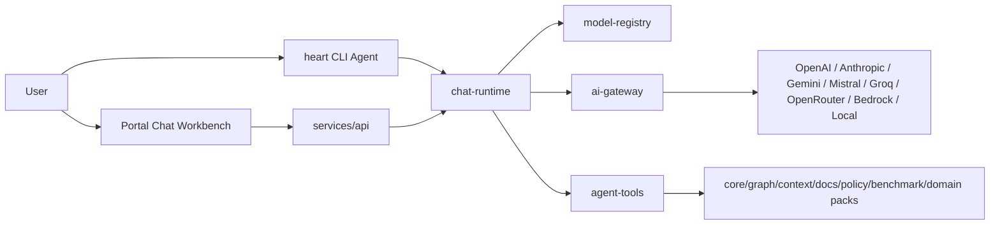

# beheart AI Agent CLI and Portal Chat Plan

Research date: 2026-05-03

Repo baseline: current product already has local CLI/MCP, context packs, document memory, graph/diagram artifacts, benchmark evidence, portal command records, model settings, CLI credential storage, domain-pack generation, portal chat contracts, and an OpenAI-compatible benchmark proxy. This plan tracks expansion of those surfaces into a provider-neutral AI agent chat product without turning the portal into a raw shell or weakening local-first trust boundaries.

Implementation progress as of the current vertical slice:

- Done: PCF/CPS activation slice connects website trial CTA, portal onboarding copy, `heart sync setup`, hosted starter context packs, model setup guidance, and workbench context-pack attachment.
- Done: `POST /api/chat/sessions/:sessionId/messages/stream` streams SSE events, checks portal session/workspace scope before streaming, persists the completed chat session, and returns context attachment metadata without exposing provider secrets.
- Done: `AI-MODEL-1` through `AI-MODEL-5` for registry, discovery, local/portal credential handling, provider tests, and default model selection.
- Done: `AI-GATEWAY-1` through `AI-GATEWAY-5` for normalized requests, native streaming events, error/retry classification, token usage, cost hooks, and tool-call delta events.
- Done: local-provider registry/chat support for Ollama and LM Studio, including no-key discovery and zero provider-cost metadata.
- Done: versioned pricing catalog overlay, `heart models pricing`, `heart models validate`, and safe live-validation manifests for real-key/local-runtime checks.
- Done: Bedrock direct SigV4 support for environment credentials, static AWS profiles, and `source_profile` assume-role chains, including `ListFoundationModels` validation, signed Converse runtime requests, and `ConverseStream` event parsing.
- Done: portal read-only tool executors for docs search, graph query, diagram lookup, policy validation, repo summary, domain-pack listing, and implementation-plan starters.
- Done: portal confirmed executors for generated domain-pack and sales-demo-kit artifacts scoped to `.heart/packs/generated`.
- Done: confirmed scoped BeHeart artifact file-edit tools for generated docs/spec/template output directories and `.heart/packs/generated/`; arbitrary source-file edits remain blocked.
- Partial: `AI-CLI-1` through `AI-CLI-7`, `AI-PORTAL-1` through `AI-PORTAL-8`, `AI-TOOLS-1` through `AI-TOOLS-6`, and `AI-SEC-1` through `AI-SEC-5` remain production-hardening surfaces.
- Added tests: provider registry, gateway native streaming, local-provider chat, CLI model key contracts, `heart sync setup`, portal encrypted key/chat session flow, portal SSE stream scope, context-pack attachment metadata, risky tool confirmation, portal docs search, and confirmed sales-demo artifact generation.
- Deferred: Bedrock IAM Identity Center/SSO profile auth, `credential_process`, enterprise SSO model admin, full provider-wide pricing governance, and autonomous file-edit workflows beyond confirmed scoped BeHeart artifacts.

Official provider sources reviewed:

- OpenAI Responses API: https://platform.openai.com/docs/api-reference/responses
- OpenAI Models API: https://platform.openai.com/docs/api-reference/models
- OpenAI pricing: https://platform.openai.com/docs/pricing/
- Anthropic Claude model overview: https://docs.anthropic.com/en/docs/about-claude/models/all-models
- Anthropic pricing: https://docs.anthropic.com/en/docs/about-claude/pricing
- Anthropic Messages API examples: https://docs.anthropic.com/en/api/messages-examples
- Anthropic streaming: https://docs.anthropic.com/en/api/messages-streaming
- Anthropic Models API list: https://docs.anthropic.com/en/api/models-list
- Google Gemini model guide: https://ai.google.dev/gemini-api/docs/models
- Google Gemini pricing: https://ai.google.dev/gemini-api/docs/pricing
- Google Gemini Models API: https://ai.google.dev/api/models
- Google Gemini Generate Content API: https://ai.google.dev/api/generate-content
- Mistral model docs: https://docs.mistral.ai/models/
- Mistral pricing: https://docs.mistral.ai/deployment/ai-studio/pricing
- Mistral Models API: https://docs.mistral.ai/api/endpoint/models/
- Mistral Chat API: https://docs.mistral.ai/api/endpoint/chat/
- Groq supported models and Models API: https://console.groq.com/docs/models
- Groq API reference: https://console.groq.com/docs/api-reference
- OpenRouter model guide: https://openrouter.ai/docs/guides/overview/models
- OpenRouter Chat API: https://openrouter.ai/docs/api-reference/chat-completion
- AWS Bedrock models at a glance: https://docs.aws.amazon.com/bedrock/latest/userguide/model-cards.html
- AWS Bedrock pricing: https://aws.amazon.com/bedrock/pricing/
- AWS Bedrock ListFoundationModels: https://docs.aws.amazon.com/bedrock/latest/APIReference/API_ListFoundationModels.html
- AWS Bedrock Converse API: https://docs.aws.amazon.com/bedrock/latest/APIReference/API_runtime_Converse.html
- Ollama API: https://github.com/ollama/ollama/blob/main/docs/api.md
- LM Studio OpenAI compatibility: https://lmstudio.ai/docs/developer/openai-compat

## 1. Product Vision

beheart AI Agent should become the daily workbench for software teams that want AI assistance grounded in durable project memory, not another generic chatbot.

The product should make these workflows feel natural:

- Developers open `heart`, see repo memory health, choose a provider/model, attach context, and chat against current repo truth.
- Teams use the portal to inspect the same chat decisions, citations, context sources, benchmark evidence, generated artifacts, and safety confirmations.
- Managers and design partners see why a response was grounded: context pack, graph, docs/specs, decisions, domain pack, benchmark artifact, policy warning, or generated sales demo kit.
- Security and platform owners see what actions ran, what provider received data, which key scope was used, and whether output came from source-backed evidence or generated hypothesis.

Positioning:

- Not a generic chatbot.
- AI workbench connected to repo memory, docs, specs, graph, MCP tools, domain packs, benchmark evidence, and sales demo artifacts.
- CLI-first for developers.
- Portal-first for teams, managers, customer success, and demos.
- Model-provider-neutral.
- Local-first where possible.
- Secure BYOK support with explicit provider data exposure warnings.

The north star: when a user asks "build a context pack for auth refactor" or "compare benchmark evidence for tolling demo", beheart should not ask the model to rediscover the repo. It should compile durable memory, cite it, choose only allowlisted actions, and show cost/risk before execution.

## 2. Practicality Assessment

| Dimension | Score | Why |
|---|---:|---|
| User value | 5 | Turns existing context packs, graph, docs, benchmarks, and domain packs into one usable agent surface. |
| Developer adoption | 5 | `heart` as Claude Code-style CLI workbench reduces setup friction and keeps local-first flow. |
| Product differentiation | 5 | Durable repo memory, ROI benchmarks, policy warnings, and sales demo artifacts make this unlike generic chat. |
| Implementation complexity | 4 | Provider adapters, streaming, tool orchestration, key storage, and portal contracts are non-trivial but can be vertical-sliced. |
| Security risk | 5 | BYOK, prompt/context exposure, tool calls, logs, and portal-side actions are sensitive. |
| Model-provider risk | 4 | APIs and model lists change often; dynamic discovery plus metadata overlays reduces churn. |
| CLI usefulness | 5 | Best place for local repo scan, MCP, secrets, and developer chat loop. |
| Portal usefulness | 4 | Strong for team visibility, settings, citations, artifacts, and demos; must avoid pretending it can access unsynced local files. |
| Enterprise readiness | 4 | Strong governance story if audit, RBAC, provider exposure warnings, and key isolation are built early. |
| MVP speed | 3 | Fastest path is CLI OpenAI/Anthropic/Gemini chat plus portal chat relay; full provider breadth should be staged. |

Why this matters:

- Existing beheart value is powerful but fragmented across commands and portal pages.
- A chat surface makes repo memory discoverable without forcing users to memorize every command.
- Provider-neutral BYOK lets teams use preferred models while beheart owns context, safety, citations, and ROI.
- The CLI can become the practical daily entry point, not only a setup utility.

MVP:

- OpenAI, Anthropic, and Gemini adapters.
- Dynamic model discovery where available.
- Versioned static fallback metadata.
- CLI key setup, model select, and `heart chat`.
- Portal model selector and AI Chat Workbench.
- Streaming response in CLI and portal SSE for the MVP workbench.
- Context pack and domain pack attachments.
- Allowlisted beheart tools with confirmation.
- Basic usage/cost display and audit logs.

Deferred:

- Full Bedrock support unless an enterprise pilot asks.
- Full multi-agent orchestration.
- Voice, image/video generation, fine-tuning.
- Enterprise SSO-backed model admin beyond existing portal role model.
- Complex billing for model usage.
- Autonomous file edits without approval.
- Arbitrary shell tools.

What makes beheart different from Claude/Cursor/generic chat:

- It owns memory, citations, and governance across tools.
- It shows exactly which context pack, graph edge, doc, benchmark report, policy, or domain artifact shaped an answer.
- It runs beheart product actions through allowlisted contracts, not raw shell.
- It links model spend to benchmark ROI evidence.
- It can generate sales demo kits and domain-specific artifacts from repo memory, not just answer questions.

Risks to control:

- API key leakage through CLI config, logs, browser state, or model payloads.
- Prompt/context leakage to external providers.
- Tool-call injection that turns chat into unsafe execution.
- Stale portal artifacts being treated as current repo truth.
- Model list drift causing broken model selection.
- Cost surprises from large context packs or long histories.

## 3. Target User Experience

### CLI Experience

When user runs:

```bash
heart
```

in interactive TTY:

- Open a polished AI agent workbench.
- Show repo identity and safe local path.
- Show repo memory, config, policy, docs/spec, graph, MCP, benchmark, and domain pack state.
- Show selected provider/model and active purpose preset.
- Show current context source: repo, context pack, domain pack, docs/specs, graph, benchmark, sales demo kit.
- Show token budget and rough cost estimate.
- Show suggested next actions.
- Accept natural language and slash commands.
- Stream assistant output with beheart citations.
- Render tool-call progress cards.
- Stay open until user types `exit`, `quit`, `/exit`, or `/quit`.

Current fit:

- `detectInteractiveTerminal`, `startHeartSession`, `renderWelcomePanel`, slash command parsing, natural aliases, and non-TTY compatibility already exist in `packages/cli/src/interactive.js`.
- Current `heart chat` opens the existing interactive workbench in a TTY and runs a provider-backed one-shot chat request when a prompt is supplied.
- Plan should evolve current workbench rather than create a separate shell.

Required interactive slash commands:

```text
/model
/providers
/keys
/chat
/scan
/pack
/docs
/graph
/packs
/build
/benchmark
/mcp
/settings
/exit
```

Existing commands to preserve:

```text
/help
/init
/doctor
/scan
/overview
/pack
/find
/impact
/docs
/policy
/benchmark
/connect
/mcp
/clear
/exit
```

Natural language examples:

- "use Claude Sonnet"
- "use OpenAI GPT for planning"
- "build a context pack for auth refactor"
- "scan this repo"
- "show graph for billing"
- "build tolling sales demo kit"
- "generate proposal starter"
- "compare benchmark"
- "search docs for latest accepted decision"

### Portal Experience

The portal should present team-safe chat, not a browser shell.

Required web portal elements:

- AI Chat Workbench.
- Model selector.
- Provider/API key settings.
- Repo selector.
- Context source selector.
- Domain pack selector.
- Task mode selector.
- Token budget.
- Cost estimate.
- Generated artifact cards.
- Citations.
- Next action buttons.
- Chat history.
- Team-safe permissions.

Current fit:

- `apps/portal/app/workbench/page.jsx` and `PortalWorkbenchClient` already implement a scoped command box.
- `apps/portal/app/models/page.jsx` and `PortalModelsClient` already expose masked provider/model settings.
- `services/api/src/portal-contracts.js` already classifies allowlisted command intents and rejects raw shell-like input.
- Next step is to add real chat sessions, provider execution, streaming events, and artifact/citation contracts behind the same safety model.

## 4. Provider and Model Strategy

Design a provider registry that never assumes a hardcoded "latest popular model" is durable.

Provider registry principles:

- Each provider has a `ProviderDefinition` with auth, base URL, discovery method, chat method, streaming method, capability extraction, error mapping, and cost metadata strategy.
- Model list is dynamic when provider supports it.
- Static fallback lists are allowed only as versioned metadata with `source_url`, `retrieved_at`, `stale_after`, and `fallback: true`.
- Capability overlays are separate from dynamic model discovery because many model-list APIs return identifiers but not full feature/cost metadata.
- User-selected model stores `provider_id`, `model_id`, and optional `model_revision`, never display name only.
- UI should label "live discovery", "cached discovery", or "fallback metadata".
- Background refresh should update dynamic model cache without changing selected defaults unless the selected model disappears or becomes disabled.

Provider table:

| Provider | Auth method | API base URL | Model list method | Chat/completion method | Streaming | Tools/functions | Vision/multimodal | Embeddings | Cost metadata | Rate-limit/retry | Security notes |
|---|---|---|---|---|---|---|---|---|---|---|---|
| OpenAI | `Authorization: Bearer <OPENAI_API_KEY>` | `https://api.openai.com/v1` | `GET /v1/models`; response includes model ids and ownership metadata, not full cost/capability matrix | Prefer `POST /v1/responses`; keep Chat Completions only for compatibility | Responses supports `stream: true` SSE | Responses supports function calls, built-in tools, and MCP tools | Responses supports text/image/file inputs depending model | `POST /v1/embeddings` | Use official pricing/static overlay; Models API does not expose prices | Retry 429/500/502/503/504 with provider headers and jitter | Default `store: false` when possible for sensitive repo context; include hashed safety/user identifiers only |
| Anthropic | `x-api-key`, `anthropic-version` header | `https://api.anthropic.com` | `GET /v1/models`; docs state more recent models listed first | `POST /v1/messages` | `stream: true` SSE with message/content delta events | Messages API supports tool use; tool input may stream as partial JSON | Current Claude models support text/image input per official model overview | Anthropic embeddings docs exist; keep adapter optional until MVP needs embeddings | Use official pricing/static overlay; model list gives ids/display names | Retry 429/500/529 and overload SSE events with jitter | Send full conversation because Messages API is stateless; warn user about provider exposure |
| Google Gemini | API key or Google auth depending SDK/backend | `https://generativelanguage.googleapis.com/v1beta` | `GET /v1beta/models`; includes supported actions and token metadata | `POST /v1beta/{model=models/*}:generateContent` | `POST ...:streamGenerateContent` | `tools[]` supports Function and codeExecution | Model/action metadata varies; GenerateContent supports images/audio/video/PDF when model supports | `models.embedContent`/embeddings APIs | Use Google pricing/static overlay; model API exposes capabilities, not full prices | Retry 429/500/503 with Google error details | Avoid file upload for sensitive local source in MVP; prefer text snippets/citations |
| Mistral | `Authorization: Bearer <MISTRAL_API_KEY>` | `https://api.mistral.ai/v1` | `GET /v1/models`; returns capabilities like chat, function_calling, vision, max_context_length | `POST /v1/chat/completions` | `stream: true`, data-only SSE until `[DONE]` | `tools`, `tool_choice`, `parallel_tool_calls` | Model endpoint exposes vision capability | Embeddings endpoint available | Use official pricing/static overlay | Retry 429/5xx; respect response headers | Use model capabilities from live list when available |
| Groq | `Authorization: Bearer <GROQ_API_KEY>` | `https://api.groq.com/openai/v1` | `GET /openai/v1/models`; supported models page also lists active model ids/prices/context | `POST /openai/v1/chat/completions`; Responses beta exists but treat as secondary | OpenAI-compatible streaming | Chat API supports tools/function definitions for compatible models | OCR/image support is model-specific; dynamic capability needs overlay | Not primary for MVP embeddings | Supported models page lists prices/rate limits; model endpoint may need overlay | Retry 429/5xx; Groq is latency-sensitive, expose rate-limit errors clearly | Good low-latency option; do not assume every Groq model supports tools |
| OpenRouter | `Authorization: Bearer <OPENROUTER_API_KEY>` plus optional app headers | `https://openrouter.ai/api/v1` | `GET /api/v1/models`; supports filters and returns context, architecture, pricing, supported parameters | `POST /api/v1/chat/completions` | `stream: true` | `tools`, `tool_choice`, `parallel_tool_calls` when model `supported_parameters` includes them | Architecture metadata includes input/output modalities | Embeddings via API for supported models | Models API returns pricing per token/request/unit | Retry provider/router errors; map 402 credit errors separately | Provider routing may send data to third-party providers; UI must show routing/provider exposure warning |
| AWS Bedrock | AWS SigV4/IAM or assumed role; region-scoped | Region-specific Bedrock Runtime endpoint | `ListFoundationModels` with filters by provider, modality, inference type; returns streaming support and modalities | Prefer Converse API `POST /model/{modelId}/converse`; provider-specific InvokeModel only when needed | `ConverseStream` | Converse supports `toolConfig`; Bedrock guardrails available | Model cards/ListFoundationModels expose modalities | Embedding models via InvokeModel depending model | Use AWS pricing/static overlay; no simple per-token API in model list | Retry AWS throttling/5xx with SDK backoff | Enterprise-grade option; needs IAM least privilege, regional availability, and explicit activation |
| Ollama optional | No auth by default local-only | `http://localhost:11434` | `GET /api/tags`; `POST /api/show` for model details | `POST /api/chat` | Streaming JSON objects by default; disable with `stream:false` | `/api/chat` supports `tools` for compatible models | Images for multimodal local models | `POST /api/embed` | Local cost is zero provider cost; show local compute note | No cloud retry; handle connection refused and model unloaded | Never expose LAN endpoints in portal; CLI-only by default |
| LM Studio optional | No auth by default local-only | `http://localhost:1234/v1` | OpenAI-compatible `GET /v1/models` | OpenAI-compatible `POST /v1/chat/completions` and `POST /v1/responses` | OpenAI-compatible streaming depending server/model | Tool support documented; verify with model/server capability | Chat Completions text/images; model-dependent | `/v1/embeddings` | Local cost is zero provider cost; show local compute note | Connection refused/model-not-loaded handling | CLI-only by default; portal can show local runtime status only when connected runner reports it |

Model discovery design:

```text
ProviderDiscoveryResult
  provider_id
  discovered_at
  source = live | cache | fallback
  ttl_seconds
  models[]
  errors[]
```

Capability merge order:

1. Provider live model metadata.
2. Provider live capability fields when exposed.
3. beheart `model-capability-overlays/*.json`.
4. Versioned fallback provider manifest.
5. Conservative defaults: text only, no tools, no vision, unknown cost.

Selected model policy:

- Selection stores exact provider/model id.
- UI displays friendly label from live or fallback metadata.
- If live discovery removes selected model, show `disabled_stale_model` and require user choice.
- If model capability changes, preserve selection but downgrade unavailable features.
- If cost metadata is missing, show "cost unknown" and require explicit confirmation for deep context.

## 5. API Key and Secret Management

BYOK requirements:

- Never hardcode keys.
- Never log keys.
- Never expose full key in UI.
- Mask keys in CLI and portal.
- Support test connection.
- Support delete/revoke.
- Support provider-level enable/disable.
- Support workspace/user-scoped keys.
- Support local-only key storage for CLI.
- Support encrypted server-side storage for portal.
- Support environment variable fallback.
- Support OS keychain if practical.
- Support cloud secret manager later.

CLI storage options:

| Option | MVP? | Notes |
|---|---:|---|
| Environment variables | Yes | `OPENAI_API_KEY`, `ANTHROPIC_API_KEY`, `GEMINI_API_KEY`, etc. Highest compatibility, no write needed. |
| Local encrypted config | Yes | Extend current `~/.beheart/credentials.json` pattern or create `~/.beheart/model-credentials.json`; encrypt using OS keystore-derived key where possible. |
| OS keychain | P1 | Use macOS Keychain, Windows Credential Manager, Secret Service/libsecret when available. Fall back to encrypted file with warning. |
| Repo config | No | `heart.config.yaml` may reference provider ids, never raw keys. |

Portal storage options:

| Option | MVP? | Notes |
|---|---:|---|
| Environment variables/server secrets | Yes | Current model settings already detect server env keys. Good for hosted pilot/admin-managed setup. |
| Encrypted DB field | Yes for user-managed portal BYOK | Encrypt per workspace/provider with envelope key; store key hash, masked prefix/suffix, last tested state. |
| Secret manager | P1 | AWS Secrets Manager, GCP Secret Manager, Vault, or platform equivalent behind adapter. |
| Browser local storage | Never | Browser sees only masked state and one-time input during form submission over TLS. |

Credential contract:

```json
{
  "credential_id": "cred_workspace_openai_01",
  "provider_id": "openai",
  "scope": "workspace",
  "owner_user_id": "usr_123",
  "workspace_slug": "acme-core",
  "key_source": "encrypted_db",
  "masked_key": "sk-...9xYz",
  "key_fingerprint": "sha256:...",
  "enabled": true,
  "last_tested_at": "2026-05-03T12:00:00.000Z",
  "last_test_status": "passed",
  "created_at": "2026-05-03T11:30:00.000Z",
  "updated_at": "2026-05-03T12:00:00.000Z"
}
```

Threat model:

| Threat | Attack path | Controls |
|---|---|---|
| Leaked API key | Logs, crash output, browser payloads, repo config, shell history | Redaction middleware, no raw key responses after create, `--api-key-stdin`, masked UI, secret scanners in tests |
| Prompt logging | Provider payload logged by beheart/API/proxy | Log hashes, token counts, model/provider, but not raw prompts by default; debug logs require opt-in and local-only warning |
| Provider data exposure | Repo snippets/docs sent to external model | Provider exposure banner, per-request context preview, local-only/local provider option, `store:false` where supported |
| Team member access | User with low privilege sees workspace key or restricted docs | RBAC by workspace/user scope, never reveal raw keys, document sensitivity filters, audit reads/writes |
| Server logs | Error traces include headers or payload | Header/body scrubber, structured error classes, safe serialization |
| Browser exposure | Key in React state or localStorage | Submit key directly to API over HTTPS; clear input after response; no full key in API result |
| SSRF/tool-call abuse | Model asks beheart tool to fetch arbitrary URLs or call internal service | Tool allowlist, URL allowlist for future web fetch, no arbitrary HTTP tool in MVP |
| Arbitrary shell execution | Portal chat or model tool call runs shell | Forbidden from portal; CLI only runs allowlisted `heart` actions; risky actions confirm |
| Cross-tenant context leak | Portal session accesses another workspace chat/history/key | Existing portal actor/workspace scope checks plus contract tests for all chat/model endpoints |
| Cost runaway | Deep context or infinite tool loops | Token budget, max tool calls, max turns, provider spend warnings, cancel run |

## 6. Core Architecture

Use packages for reusable domain logic. Do not put provider, runtime, or tool orchestration logic inside portal components. Existing `services/api` owns hosted contracts; `packages/cli` owns local UX; `packages/mcp-server` owns MCP transport.

Suggested new packages:

```text
packages/model-registry
packages/ai-gateway
packages/chat-runtime
packages/agent-tools
packages/cli-agent
packages/portal-chat-contracts
```

Implementation note: the current repo is dependency-light ESM JavaScript. The product rules prefer TypeScript/Node for MVP. If the repo has not yet migrated package sources to TypeScript, these packages can start as ESM JavaScript with strict schema validators and JSDoc, then migrate to TypeScript once the package toolchain is ready. Do not block the MVP on a repo-wide TS migration.

### model-registry

Responsibilities:

- Provider metadata.
- Model metadata.
- Dynamic model discovery.
- Model capability mapping.
- Versioned fallback manifests.
- Provider/model deprecation state.
- Capability overlays for models where APIs expose incomplete metadata.

Likely files:

- `packages/model-registry/src/index.js`
- `packages/model-registry/src/providers/*.js`
- `packages/model-registry/src/fallbacks/*.json`
- `packages/model-registry/src/capability-overlays/*.json`

### ai-gateway

Responsibilities:

- Unified request/response adapter.
- Streaming event normalization.
- Retries and cancellation.
- Cost tracking.
- Provider error normalization.
- Tool-call compatibility.
- Credential validation without logging secrets.

Likely files:

- `packages/ai-gateway/src/index.js`
- `packages/ai-gateway/src/providers/openai.js`
- `packages/ai-gateway/src/providers/anthropic.js`
- `packages/ai-gateway/src/providers/gemini.js`
- `packages/ai-gateway/src/providers/openai-compatible.js`
- `packages/ai-gateway/src/errors.js`
- `packages/ai-gateway/src/streaming.js`

### chat-runtime

Responsibilities:

- Message state.
- Context injection.
- Tool orchestration.
- Citations.
- Artifact generation.
- Token budget planning.
- Safety warnings.
- Chat history persistence adapter.
- Provider exposure notices.

Likely files:

- `packages/chat-runtime/src/index.js`
- `packages/chat-runtime/src/context-planner.js`
- `packages/chat-runtime/src/tool-orchestrator.js`
- `packages/chat-runtime/src/session-store.js`
- `packages/chat-runtime/src/prompt-builder.js`

### agent-tools

Responsibilities:

- Allowlisted beheart actions.
- Scan repo.
- Create context pack.
- Search docs.
- Query graph.
- Build domain pack artifact.
- Build sales demo kit artifact.
- Run benchmark.
- Validate policy.
- Summarize repo.
- Create implementation plan.

Likely files:

- `packages/agent-tools/src/index.js`
- `packages/agent-tools/src/definitions.js`
- `packages/agent-tools/src/execute-local.js`
- `packages/agent-tools/src/execute-portal.js`
- `packages/agent-tools/src/safety.js`

### cli-agent

Responsibilities:

- Terminal UI.
- Command parser.
- Chat session.
- Model selector.
- Local config/key handling.
- Streaming assistant response.
- Tool progress rendering.

Current alternative: evolve `packages/cli/src/interactive.js` first. Create `packages/cli-agent` only when this logic becomes large enough to reuse outside `packages/cli`.

### portal-chat-contracts

Responsibilities:

- Shared schemas for chat messages, model config, tool calls, generated artifacts.
- Streaming event schema.
- Portal API request/response validators.
- Audit event payload schemas.

Current alternative: extend `packages/shared-schema` if adding a new package is too much. Prefer `portal-chat-contracts` if CLI, API, and portal all need the same chat schemas.

Core flow:



## 7. Unified Chat Contract

Core schemas:

### Provider

```json
{
  "provider_id": "openai",
  "label": "OpenAI",
  "kind": "hosted",
  "auth_type": "api_key",
  "base_url": "https://api.openai.com/v1",
  "model_discovery": {
    "mode": "live",
    "endpoint": "/models",
    "ttl_seconds": 86400
  },
  "capabilities": ["responses", "chat", "streaming", "tools", "vision", "embeddings"],
  "enabled": true,
  "configured": true,
  "source_url": "https://platform.openai.com/docs/api-reference/models"
}
```

### Model

```json
{
  "provider_id": "openai",
  "model_id": "gpt-4.1",
  "display_name": "GPT 4.1",
  "source": "live",
  "capabilities": {
    "text": true,
    "streaming": true,
    "tools": true,
    "vision": true,
    "embeddings": false,
    "json_schema": true,
    "reasoning": false
  },
  "context_window_tokens": null,
  "max_output_tokens": null,
  "cost": {
    "source": "fallback_overlay",
    "input_per_1m_usd": null,
    "cached_input_per_1m_usd": null,
    "output_per_1m_usd": null
  },
  "status": "available",
  "retrieved_at": "2026-05-03T12:00:00.000Z"
}
```

### ModelCapability

```json
{
  "model_id": "anthropic/claude-sonnet",
  "text": true,
  "streaming": true,
  "tool_calling": true,
  "parallel_tool_calling": true,
  "vision": true,
  "files": false,
  "embeddings": false,
  "structured_output": true,
  "reasoning_controls": true,
  "source": "provider_docs_overlay",
  "confidence": "medium"
}
```

### UserModelCredential

```json
{
  "credential_id": "cred_123",
  "provider_id": "anthropic",
  "scope": "user",
  "workspace_slug": "acme-core",
  "masked_key": "sk-ant...A1b2",
  "key_source": "os_keychain",
  "enabled": true,
  "last_test_status": "passed"
}
```

### ChatSession

```json
{
  "session_id": "chat_123",
  "surface": "cli",
  "workspace_slug": "local",
  "repo_slug": "be-ai-heart",
  "provider_id": "openai",
  "model_id": "gpt-4.1",
  "mode": "code_context",
  "context_budget": {
    "preset": "standard",
    "max_input_tokens": 8000,
    "max_output_tokens": 2000
  },
  "created_at": "2026-05-03T12:00:00.000Z",
  "updated_at": "2026-05-03T12:05:00.000Z"
}
```

### ChatMessage

```json
{
  "message_id": "msg_123",
  "session_id": "chat_123",
  "role": "assistant",
  "content": [
    {
      "type": "text",
      "text": "The auth refactor should start with the existing login service and audit policy."
    }
  ],
  "citations": [
    {
      "citation_id": "cit_1",
      "type": "file",
      "label": "Auth service",
      "ref": "packages/core/src/config.js",
      "confidence": "high"
    }
  ],
  "token_usage": {
    "input_tokens": 4200,
    "output_tokens": 780,
    "total_tokens": 4980
  },
  "created_at": "2026-05-03T12:05:00.000Z"
}
```

### ChatRequest

```json
{
  "session_id": "chat_123",
  "input": "build a context pack for auth refactor",
  "provider_id": "anthropic",
  "model_id": "claude-sonnet",
  "mode": "code_context",
  "context_attachments": [
    {
      "type": "repo_graph",
      "ref": "local:graph:current"
    },
    {
      "type": "context_pack",
      "ref": "ctx_latest_auth"
    }
  ],
  "allowed_tools": ["create_context_pack", "search_docs", "query_graph"],
  "stream": true
}
```

### ChatResponse

```json
{
  "run_id": "run_123",
  "session_id": "chat_123",
  "message": {
    "role": "assistant",
    "content": [{ "type": "text", "text": "Context pack created." }]
  },
  "tool_results": [],
  "artifacts": [],
  "citations": [],
  "cost_estimate": {
    "currency": "USD",
    "estimated": true,
    "input_cost_usd": 0.01,
    "output_cost_usd": 0.02,
    "total_cost_usd": 0.03
  }
}
```

### StreamingEvent

```json
{
  "event_id": "evt_123",
  "run_id": "run_123",
  "type": "assistant_delta",
  "sequence": 12,
  "delta": {
    "text": "Use the existing context compiler..."
  },
  "created_at": "2026-05-03T12:05:02.000Z"
}
```

Allowed event types:

- `run_started`
- `context_planned`
- `provider_request_started`
- `assistant_delta`
- `tool_call_started`
- `tool_call_delta`
- `tool_call_completed`
- `artifact_created`
- `citation_added`
- `usage_updated`
- `safety_warning`
- `run_completed`
- `run_failed`
- `run_cancelled`

### ToolCall

```json
{
  "tool_call_id": "tool_123",
  "tool_id": "create_context_pack",
  "display_name": "Create context pack",
  "status": "needs_confirmation",
  "risk_level": "medium",
  "input": {
    "task": "auth refactor",
    "token_budget": 1600
  }
}
```

### ToolResult

```json
{
  "tool_call_id": "tool_123",
  "status": "completed",
  "output": {
    "pack_id": "ctx_456",
    "estimated_tokens": 1450,
    "citation_count": 8
  },
  "citations": []
}
```

### ContextAttachment

```json
{
  "attachment_id": "att_123",
  "type": "domain_pack",
  "label": "Tolling management",
  "ref": "packs/tolling-management",
  "source": "local_repo",
  "estimated_tokens": 1800,
  "sensitivity": "internal",
  "freshness": "current"
}
```

### Citation

```json
{
  "citation_id": "cit_123",
  "type": "document",
  "label": "PRD",
  "ref": "docs/02-prd.md",
  "quote": "",
  "summary": "MVP requires context compiler, CLI, MCP, policy, benchmarks.",
  "confidence": "high",
  "source_backed": true
}
```

### ArtifactCard

```json
{
  "artifact_id": "art_123",
  "type": "sales_demo_kit",
  "title": "Tolling sales demo kit",
  "status": "generated",
  "path": "packs/tolling-management/sales-demo-kit/README.md",
  "summary": "Proposal starter, demo script, ROI proof, and risk notes.",
  "actions": [
    { "action_id": "open_artifact", "label": "Open artifact", "href": "/repositories/be-ai-heart/context-packs" }
  ]
}
```

### CostEstimate

```json
{
  "provider_id": "openrouter",
  "model_id": "anthropic/claude-sonnet",
  "currency": "USD",
  "estimated": true,
  "input_tokens": 8000,
  "output_tokens": 2000,
  "input_cost_usd": 0.024,
  "output_cost_usd": 0.03,
  "total_cost_usd": 0.054,
  "cost_source": "provider_model_api"
}
```

### TokenUsage

```json
{
  "provider_id": "openai",
  "model_id": "gpt-4.1",
  "input_tokens": 4200,
  "cached_input_tokens": 1200,
  "output_tokens": 780,
  "reasoning_tokens": 0,
  "total_tokens": 4980,
  "usage_available": true
}
```

### SafetyWarning

```json
{
  "warning_id": "warn_123",
  "level": "confirmation_required",
  "category": "provider_data_exposure",
  "message": "This request will send 12 source-backed snippets to Anthropic.",
  "requires_confirmation": true,
  "confirm_label": "Send context to provider"
}
```

## 8. Tool and Action Safety

Chat can run only allowlisted beheart actions.

Allowed actions:

- `scan_repo`
- `create_context_pack`
- `search_docs_specs`
- `query_graph`
- `show_diagrams`
- `validate_policy`
- `list_domain_packs`
- `build_domain_pack_artifact`
- `generate_sales_demo_kit_artifacts`
- `run_benchmark_scenario`
- `summarize_repo`
- `create_implementation_plan`

Risky actions requiring confirmation:

- Write files.
- Generate artifacts into repo.
- Run benchmark.
- Sync to portal.
- Update docs/specs.
- Modify config.
- Send restricted context to hosted model provider.
- Use a model where cost metadata is unknown and context budget is above standard.

Forbidden:

- Arbitrary shell execution from portal chat.
- Secret exposure.
- Direct payment operations.
- Unreviewed destructive file actions.
- Hidden background sync without user-visible state.
- Direct browser access to local filesystem.
- Model-controlled provider key changes.
- Model-controlled credential export.

Tool execution policy:

```text
read_only: can run immediately
artifact_create: confirmation required
local_side_effect: CLI only, confirmation required
hosted_side_effect: portal permission plus confirmation required
dangerous: forbidden
```

Tool definition example:

```json
{
  "tool_id": "create_context_pack",
  "display_name": "Create context pack",
  "risk_level": "artifact_create",
  "surfaces": ["cli", "portal"],
  "requires_confirmation": true,
  "input_schema": {
    "type": "object",
    "required": ["task"],
    "properties": {
      "task": { "type": "string", "maxLength": 500 },
      "token_budget": { "type": "integer", "minimum": 400, "maximum": 32000 }
    },
    "additionalProperties": false
  }
}
```

Portal-specific safety:

- Portal may execute read-only operations against synced artifacts.
- Portal may create hosted context pack records from synced artifacts.
- Portal may request a connected local runner for scans/benchmarks only when runner capability is explicit and user confirms.
- Portal must show stale artifact warnings when latest sync is old or missing.
- Portal must not invoke arbitrary repo commands.

CLI-specific safety:

- CLI may run local beheart actions because it is already in a trusted checkout.
- CLI still confirms writes, syncs, benchmark runs, and provider data exposure.
- CLI must keep MCP stdio output protocol-clean; no agent UI decoration in MCP mode.

## 9. CLI AI Agent UX Plan

Design principle: inspired by Claude Code's calm, useful terminal loop, but owned by beheart's identity: repo memory, context packs, graph, policies, benchmarks, and model neutrality.

Welcome panel:

```text
+-- BeHeart Agent v0.1 ----------------------------------------------+
| Repo             be-ai-heart                                       |
| Path             ~/Desktop/Workspace/Coder/be-ai-heart             |
| Memory           ready; scan 12m ago                               |
| Model            Anthropic / Claude Sonnet                         |
| Context          repo + docs/specs + graph                         |
| Pack             none attached                                     |
| Domain pack      tolling-management available                      |
| Benchmark        6 reports; latest observed                        |
| Tools            scan, pack, docs, graph, benchmark, policy        |
| Cost             standard budget; estimate before send             |
| Suggested next   /pack "current task" | /model | /benchmark        |
+--------------------------------------------------------------------+
heart>
```

Must include:

- Welcome panel.
- Selected provider/model.
- Repo memory status.
- Current context pack.
- Available tools.
- Recent activity.
- Slash command menu.
- Streaming assistant response.
- Tool-call progress cards.
- Artifact result cards.
- Clean errors.
- Exit behavior.

CLI commands:

```bash
heart
heart chat
heart models list
heart models providers
heart models add-key
heart models test
heart models select
heart models remove-key
heart agent run
heart agent settings
heart chat --model <provider/model>
heart chat --context repo
heart chat --pack tolling-management
```

Interactive commands:

```text
/model
/provider
/providers
/keys
/context
/tools
/pack
/packs
/artifact
/clear
/help
/settings
/exit
```

Command behavior:

- `heart` opens agent mode in interactive TTY.
- `heart chat` opens agent mode and can accept `--model`, `--context`, `--pack`.
- `heart models list --json` returns clean registry data.
- `heart models add-key --provider openai --api-key-stdin` stores local credential.
- `heart models test --provider anthropic` validates credential through provider adapter.
- `heart models select openai/gpt-4.1` persists default model.
- `heart agent run` launches an explicit command through the BeHeart benchmark proxy for observed capture; it is not a generic prompt-only chat command.

Compatibility:

- `heart --help` still works.
- `heart <command>` still works.
- `--json` must be clean.
- Non-TTY must not hang.
- MCP stdio must not receive UI decoration.
- Existing workbench slash commands remain supported.
- Exit code contract remains: `0` success, `2` invalid usage, `3` target not found where applicable.

Rendering plan:

- Use current ASCII panel style first; later add optional color and box drawing only if TTY supports it.
- Keep output readable in plain terminals.
- Render streaming chunks below the prompt with a stable assistant prefix.
- Render tool calls as compact progress blocks:

```text
tool:create_context_pack
status: needs confirmation
task: auth refactor
tokens: 1600
confirm? y/N
```

Error style:

```text
Provider key missing: anthropic
Next: /keys add anthropic
```

First-run path:

1. User runs `heart`.
2. Workbench says no model key configured.
3. User types `/keys`.
4. CLI asks provider, reads key via hidden prompt or stdin.
5. CLI tests connection.
6. CLI discovers models.
7. CLI asks default model/preset.
8. User can chat.

## 10. Portal Chat UX Plan

Required screens/components:

- `ChatWorkbench`
- `ModelSelector`
- `ProviderKeySettings`
- `ContextSourcePicker`
- `RepoPicker`
- `DomainPackPicker`
- `ToolPermissionPanel`
- `TokenBudgetControl`
- `CostEstimateBadge`
- `ChatMessageList`
- `StreamingMessage`
- `ToolCallCard`
- `CitationPanel`
- `ArtifactCard`
- `NextActionButtons`
- `ChatHistorySidebar`
- `SafetyConfirmationDialog`

Current components to evolve:

- `PortalWorkbenchClient` -> split into `ChatWorkbench`, `ChatComposer`, `ContextSourcePicker`, `CommandResult`.
- `PortalModelsClient` -> split into `ProviderList`, `ProviderKeySettings`, `ModelPresetTable`, `ModelSelector`.
- `PortalStateBlock` remains shared empty/loading/error state.
- `PortalCodeGraphExplorer`, `PortalBenchmarkVisuals`, document tables, and context pack cards become linked artifact/citation renderers.

UI style:

- Polished developer tool.
- Friendly American English.
- Not a generic AI chatbot.
- Smooth but subtle animation.
- Keyboard-friendly.
- Accessible.
- Responsive.
- Excellent empty/loading/error/success states.
- No marketing hero inside portal workbench.

Workbench layout:

```text
+----------------------------------------------------------------+
| Chat History | AI Chat Workbench                               |
|              | Repo: be-ai-heart   Model: OpenAI / GPT         |
| Sessions     | Context: graph + docs + context packs           |
|              | Budget: Standard   Cost: estimated $0.04        |
|              |------------------------------------------------|
|              | Message list with citations and tool cards      |
|              |------------------------------------------------|
|              | Context chips | Tool permissions | Composer     |
+----------------------------------------------------------------+
```

Provider settings flow:

- List providers with configured/missing/masked key state.
- Add key dialog posts raw key once to backend.
- Backend returns masked state only.
- Test connection button calls `testProviderKey`.
- Delete key button requires confirmation.
- Provider disabled state is explicit.
- Workspace/user scope is visible.

Empty states:

- No providers: show "Connect a model provider to start AI chat" with provider settings action.
- No repo: show "Sync a repository profile from CLI".
- No context: show "Attach repo memory, docs, graph, or a context pack".
- Stale repo: show "Portal uses synced artifacts; run `heart scan && heart sync setup` locally".

Loading states:

- Model discovery: "Refreshing provider model list".
- Chat stream: assistant message skeleton with provider/model label.
- Tool execution: progress card with status and elapsed time.

Error states:

- Missing key.
- Provider auth failed.
- Model disabled/stale.
- Rate limited.
- Cost unknown for deep context.
- Tool denied.
- Artifact stale.

Accessibility:

- Full keyboard path through model selector, context picker, composer, and confirmation dialog.
- Live region for streaming message progress.
- Buttons have action verbs.
- Color is not sole status indicator.
- Dialog focus trap.

## 11. Context-Aware Differentiation

beheart chat should automatically understand:

- Repo graph.
- Docs/specs/business requirements.
- Latest accepted decisions.
- Context packs.
- Domain packs.
- Generated artifacts.
- Benchmark evidence.
- Policy warnings.
- MCP tool outputs.
- Sales demo kit artifacts.

User should see:

- What context was used.
- Where citations came from.
- Token/cost estimate.
- Confidence/warnings.
- Next actions.
- Whether output is source-backed or generated hypothesis.

Context planner:

```text
user intent
  -> classify mode: planning | code_context | docs_spec_sync | benchmark_eval | sales_demo | governance
  -> retrieve available context sources
  -> rank by relevance, freshness, sensitivity, token budget
  -> create model prompt with compact evidence
  -> include citations and missing-context warnings
  -> expose plan to user before provider call when context is sensitive/deep
```

Source-backed labels:

| Label | Meaning |
|---|---|
| Source-backed | Answer cites graph/doc/context/benchmark evidence. |
| Partially source-backed | Some claims cite evidence; others are inferred. |
| Generated hypothesis | Useful reasoning but no direct project evidence. |
| Stale evidence | Citation exists but artifact is stale. |
| Restricted context omitted | Sensitive/restricted context was not sent to provider. |

Differentiating chat examples:

- "Use latest accepted decision" resolves docs/decisions before model generation.
- "Build tolling sales demo kit" attaches `packs/tolling-management`, benchmark evidence, and prior sales demo artifacts.
- "Compare benchmark" uses benchmark reports and labels observed vs estimated values.
- "Show graph for billing" uses graph artifact and cites relationship confidence.
- "Generate proposal starter" uses domain pack plus sales demo kit templates and policy/cost warnings.

## 12. Backend/API Plan

| Feature | Endpoint/Function | Input | Output | Auth | Notes |
|---|---|---|---|---|---|
| listProviders | `GET /api/model-providers` / `listProviders` | workspace/user scope | providers with masked configured state | portal `settingsRead`; CLI local | Replace current generic `/api/models` provider stub over time. |
| listModels | `GET /api/models?provider_id=` / `listModels` | provider id, source mode | model list, capabilities, cache state | `settingsRead` or CLI local key | Dynamic when provider supports it. |
| refreshProviderModels | `POST /api/model-providers/:id/models/refresh` | provider id | refreshed discovery result | `settingsWrite` | Uses stored credential; audit event. |
| addProviderKey | `POST /api/model-provider-keys` / `addProviderKey` | provider id, scope, raw key once | masked credential | `settingsWrite` | Raw key never returned. |
| testProviderKey | `POST /api/model-provider-keys/:id/test` | credential id or provider id | pass/fail, model count, normalized error | `settingsWrite` | Calls cheap list-model or retrieve endpoint. |
| deleteProviderKey | `DELETE /api/model-provider-keys/:id` | credential id | deleted state | `settingsWrite` | Audit event. |
| selectDefaultModel | `POST /api/model-selection` | provider id, model id, preset | saved selection | `settingsWrite` | Workspace/user scoped. |
| getModelCapabilities | `GET /api/models/:provider/:model/capabilities` | provider/model | capability metadata | `settingsRead` | Merged live + overlay. |
| createChatSession | `POST /api/chat/sessions` | repo, mode, model, context | chat session | `repositoriesRead` | Portal history. CLI local store equivalent. |
| sendChatMessage | `POST /api/chat/sessions/:id/messages` | message, attachments, allowed tools | run id or response | `repositoriesRead` | Non-stream fallback. |
| streamChatResponse | `GET /api/chat/runs/:id/events` or `POST` SSE | run id | streaming events | session scope | Use SSE first; WebSocket later. |
| cancelChatRun | `POST /api/chat/runs/:id/cancel` | run id | cancelled | same actor/session | Abort provider request and tool loop. |
| listChatSessions | `GET /api/chat/sessions` | workspace/repo filters | sessions | `repositoriesRead` | RBAC and retention. |
| getChatSession | `GET /api/chat/sessions/:id` | id | messages, artifacts | `repositoriesRead` | Hide sessions outside workspace. |
| deleteChatSession | `DELETE /api/chat/sessions/:id` | id | deletion state | owner/admin | Audit event. |
| executeAgentTool | `POST /api/chat/tool-calls/:id/execute` | tool id, input, confirmation token | tool result | permission by tool | Only allowlisted actions. |
| listAllowedTools | `GET /api/chat/tools` | surface/repo | tool definitions | `repositoriesRead` | Mirrors CLI/MCP safe tools. |
| estimateChatCost | `POST /api/chat/cost-estimate` | provider/model/token budget/context | estimate | `repositoriesRead` | Unknown cost returns warning. |
| getTokenUsage | `GET /api/chat/runs/:id/usage` | run id | provider usage | session scope | Uses normalized TokenUsage. |
| attachContextPack | `POST /api/chat/sessions/:id/context-packs` | pack id/task | attachment | `repositoriesRead` | Current hosted context pack records reused. |
| attachDomainPack | `POST /api/chat/sessions/:id/domain-packs` | domain pack id | attachment | `repositoriesRead` | Domain pack registry. |
| attachRepoGraph | `POST /api/chat/sessions/:id/repo-graph` | repo slug/mode | graph attachment | `repositoriesRead` | Stale warning. |
| attachDocs | `POST /api/chat/sessions/:id/docs` | docs query/category | doc attachments | `documentsRead` | Sensitivity filters. |
| createArtifactFromChat | `POST /api/chat/sessions/:id/artifacts` | artifact type, content/inputs | artifact card | permission by type | Writes require confirmation. |
| auditChatAction | `writeAuditEvent` | action metadata | audit event | service internal | For model settings, tool execution, provider sends. |

Existing endpoints to extend or preserve:

- `POST /api/chat/commands`: current command-record MVP; keep as compatibility wrapper.
- `GET /api/chat/commands/:id`: current command record detail.
- `GET /api/models`: current model settings/provider response used by portal model settings and workbench selectors.
- `POST /api/chat/sessions/:sessionId/messages/stream`: current portal SSE route for streamed assistant deltas, usage, completion payload, and context attachment metadata. It uses the same auth/session scope as the non-stream message endpoint and forbids raw shell execution.
- `GET/POST /api/model-settings`: current preset settings with raw secret rejection.
- `/proxy/openai/runs/:runId/v1/*`: current benchmark OpenAI-compatible proxy; reuse telemetry concepts, not user chat path directly.

## 13. CLI Function Inventory

| Function | Package/File | Exists? | Purpose | Inputs | Outputs | Tests |
|---|---|---|---|---|---|---|
| detectInteractiveTerminal | `packages/cli/src/interactive.js` | Yes | Decide whether `heart` should open workbench | io/env | boolean | Existing CLI interactive tests likely cover. |
| startHeartAgentSession | New wrapper in `packages/cli-agent` or rename/extend `startHeartSession` | Partial | Start AI-enabled session | io, flags, runCommand, model config | exit code | Add CLI agent smoke tests. |
| loadCliModelConfig | New `packages/cli/src/model-config.js` | No | Load selected provider/model and local key metadata | config path/env | model config | Unit tests with temp home. |
| saveCliModelConfig | New `packages/cli/src/model-config.js` | No | Persist selected model/presets | model config | saved metadata | Unit tests with permission checks. |
| listCliProviders | New `packages/cli/src/model-commands.js` via `model-registry` | No | Show providers and configured state | flags/env | provider list | JSON/human output tests. |
| addCliProviderKey | New `packages/cli/src/model-commands.js` | No | Store local BYOK credential | provider, key/stdin | masked credential | Redaction/key file tests. |
| testCliProviderKey | New `packages/cli/src/model-commands.js` via `ai-gateway` | No | Validate provider key | provider/credential | test result | Mock provider tests. |
| selectCliModel | New `packages/cli/src/model-commands.js` | No | Set default model | provider/model/preset | saved selection | CLI contract test. |
| renderAgentWelcome | `renderWelcomePanel` exists | Partial | Show repo/model/context status | session state | terminal string | Snapshot/string tests. |
| renderModelPicker | New CLI renderer | No | Interactive provider/model selection | provider/model list | selection | Pure render/parser tests. |
| parseAgentCommand | `parseInteractiveInput`, `resolveSlashCommand`, `resolveNaturalCommand` exist | Partial | Parse slash/natural commands | raw input | command AST | Expand command parser tests. |
| runChatLoop | `startHeartSession` loop exists | Partial | Loop over user messages, slash commands, model responses | session state/io | exit code | Smoke with fake provider. |
| streamAssistantResponse | New CLI stream adapter | No | Render normalized streaming events | AsyncIterable events | terminal output | Fake stream tests. |
| renderToolCallProgress | New CLI renderer | No | Show tool calls and confirmations | ToolCall events | terminal output | Snapshot tests. |
| renderArtifactCard | New CLI renderer | No | Show generated artifacts | ArtifactCard | terminal output | Snapshot tests. |
| confirmRiskyAction | New CLI confirmation helper | No | Confirm writes/provider sends/runs | SafetyWarning/ToolCall | boolean | TTY/non-TTY tests. |
| exitAgentSession | `handleExitCommand` exists | Partial | Exit cleanly | input/session | code 0 | Existing and expanded tests. |

## 14. Provider Adapter Function Inventory

| Function | Package/File | Exists? | Purpose | Notes |
|---|---|---|---|---|
| createProviderClient | `packages/ai-gateway/src/index.js` | Yes | Instantiate provider client from credential/base URL | Do not log secrets. |
| listProviderModels | `packages/model-registry/src/index.js` | Yes | Dynamic model discovery with cache/fallback | OpenAI, Anthropic, Gemini, Mistral, Groq, OpenRouter, Ollama, LM Studio; Bedrock fallback metadata. |
| normalizeModelCapabilities | `packages/model-registry/src/index.js` | Yes | Merge live metadata and fallback inference | Conservative defaults. |
| sendModelRequest | `packages/ai-gateway/src/index.js` | Yes | Non-streaming unified chat call | Normalizes OpenAI, Anthropic, Gemini, OpenAI-compatible, and Ollama responses. |
| streamModelResponse | `packages/ai-gateway/src/index.js` | Yes | Provider stream -> `StreamingEvent` | Handles OpenAI/Anthropic SSE, OpenAI-compatible SSE, Gemini SSE, Ollama JSON chunks, and Bedrock `ConverseStream` AWS event-stream frames. |
| mapProviderError | `packages/ai-gateway/src/index.js` | Yes | Normalize provider auth/rate/context errors | User-readable messages. |
| estimateProviderCost | `packages/ai-gateway/src/index.js` | Yes | Estimate from model metadata/token plan | Unknown cost warning when provider pricing is absent. |
| trackTokenUsage | `packages/ai-gateway/src/index.js` | Yes | Normalize usage/cost after response | Used by chat runtime and portal. |
| validateProviderCredential | `packages/ai-gateway/src/index.js` | Yes | Test key or local endpoint via model discovery | Bedrock signs `ListFoundationModels` with AWS environment credentials, static AWS profiles, or source-profile assume-role chains; SSO profiles are detected/deferred. |
| redactProviderSecrets | `packages/model-registry/src/index.js` | Yes | Redact headers/body/errors | Shared by registry, gateway, and portal tools. |

## 15. Implementation Stories

### Epic 1: Model Provider Foundation

#### AI-MODEL-1: Provider Registry

- Priority: P0
- User story: As a beheart user, I can see supported providers and their configuration state without exposing secrets.
- Acceptance criteria: providers list includes OpenAI, Anthropic, Gemini, Mistral, Groq, OpenRouter, Bedrock, Ollama, LM Studio; each has auth/base/discovery/chat metadata; CLI and portal use same registry.
- Files likely touched: `packages/model-registry/src/index.js`, `packages/shared-schema/src/index.js`, `services/api/src/portal-contracts.js`, `packages/cli/src/index.js`.
- Functions/APIs: `listProviders`, `getProviderDefinition`, `normalizeProviderState`.
- UI components: `ProviderList`, CLI `/providers`.
- Tests: registry unit tests, JSON contract tests.
- Security notes: no raw key fields in provider output.
- Definition of done: provider metadata is schema-validated and used by both CLI and portal.

#### AI-MODEL-2: Model Discovery

- Priority: P0
- User story: As a user, I can refresh model lists dynamically instead of relying on stale hardcoded names.
- Acceptance criteria: live discovery implemented for OpenAI, Anthropic, Gemini; fallback manifests for all providers; source/cache/fallback labels visible.
- Files likely touched: `packages/model-registry/src/providers/*.js`, `services/api/src/http.js`, `packages/cli/src/index.js`.
- Functions/APIs: `listProviderModels`, `refreshProviderModels`, `normalizeModelCapabilities`.
- UI components: `ModelSelector`, CLI `heart models list`.
- Tests: mocked provider responses, fallback when provider unavailable.
- Security notes: discovery uses credential but logs only provider/model counts.
- Definition of done: stale/failed discovery does not break selected existing model.

#### AI-MODEL-3: Credential Storage/Security

- Priority: P0
- User story: As a user, I can add API keys safely for CLI and portal.
- Acceptance criteria: CLI supports env and local encrypted/keychain path; portal supports env and encrypted DB/server secret path; UI returns masked key only.
- Files likely touched: `packages/cli/src/credentials.js`, `packages/cli/src/model-credentials.js`, `services/api/src/portal-contracts.js`, `services/api/src/storage.js`.
- Functions/APIs: `addProviderKey`, `deleteProviderKey`, `redactProviderSecrets`.
- UI components: `ProviderKeySettings`.
- Tests: no key leaks in output/logs, file permission tests, API raw secret rejection.
- Security notes: raw secret accepted only on create/test, never persisted unencrypted server-side.
- Definition of done: secret redaction tests fail if key appears in stdout, JSON response, audit, or logs.

#### AI-MODEL-4: Provider Test Connection

- Priority: P0
- User story: As a user, I know whether a provider key works before starting chat.
- Acceptance criteria: test connection returns passed/failed, normalized error, discovered model count where possible.
- Files likely touched: `packages/ai-gateway/src/credentials.js`, `packages/model-registry/src/index.js`, `services/api/src/http.js`, `packages/cli/src/index.js`.
- Functions/APIs: `testProviderKey`, `validateProviderCredential`, `mapProviderError`.
- UI components: provider test button, CLI `heart models test`.
- Tests: mock 401, 403, 429, network timeout.
- Security notes: errors scrub auth headers.
- Definition of done: invalid key gives actionable message without exposing key.

#### AI-MODEL-5: Default Model Selection

- Priority: P0
- User story: As a user, I can set a default model for planning, code context, docs/spec sync, benchmark eval, and demos.
- Acceptance criteria: selected models persist by preset; disabled/stale model state blocks chat with clear next action.
- Files likely touched: `services/api/src/portal-contracts.js`, `packages/cli/src/model-config.js`, `apps/portal/components/PortalProductWorkflowsClient.jsx`.
- Functions/APIs: `selectDefaultModel`, `loadCliModelConfig`, `saveCliModelConfig`.
- UI components: `ModelSelector`, `ModelPresetTable`, CLI `/model`.
- Tests: persistence tests, stale model fallback tests.
- Security notes: model selection stores no secrets.
- Definition of done: CLI and portal show same configured preset semantics.

### Epic 2: AI Gateway

#### AI-GATEWAY-1: Unified Chat Request/Response Adapter

- Priority: P0
- User story: As a user, chat works across supported providers through one beheart contract.
- Acceptance criteria: OpenAI Responses, Anthropic Messages, Gemini GenerateContent supported; normalized `ChatResponse` returned.
- Files likely touched: `packages/ai-gateway/src/index.js`, `packages/ai-gateway/src/providers/*.js`, `packages/portal-chat-contracts/src/index.js`.
- Functions/APIs: `sendModelRequest`, `createProviderClient`.
- UI components: none directly.
- Tests: provider fixtures for request/response normalization.
- Security notes: provider payload preview/redaction layer.
- Definition of done: same `ChatRequest` can run through three MVP providers.

#### AI-GATEWAY-2: Streaming Support

- Priority: P0
- User story: As a user, assistant responses stream in the CLI and portal.
- Acceptance criteria: normalized `StreamingEvent` supports OpenAI SSE, Anthropic SSE, Gemini stream, and OpenAI-compatible streams.
- Files likely touched: `packages/ai-gateway/src/streaming.js`, `packages/cli/src/interactive.js`, `services/api/src/http.js`.
- Functions/APIs: `streamModelResponse`, `streamChatResponse`.
- UI components: `StreamingMessage`.
- Tests: stream parser tests with fixtures, unknown event tolerance.
- Security notes: stream errors scrub payloads.
- Definition of done: CLI can stream from fake provider and at least one real provider in manual test.

#### AI-GATEWAY-3: Error Normalization/Retry Policy

- Priority: P0
- User story: As a user, provider failures are readable and actionable.
- Acceptance criteria: auth, rate limit, context length, model not found, payment/credit, network timeout mapped to stable errors.
- Files likely touched: `packages/ai-gateway/src/errors.js`.
- Functions/APIs: `mapProviderError`, retry wrapper.
- UI components: `ChatErrorState`, CLI error renderer.
- Tests: provider error fixtures.
- Security notes: error details redacted.
- Definition of done: errors include `code`, `category`, `retryable`, `next_action`.

#### AI-GATEWAY-4: Token/Cost Tracking

- Priority: P0
- User story: As a user, I can see token usage and rough cost for chat runs.
- Acceptance criteria: provider usage normalized; estimates shown before send when metadata exists; actual usage shown after response when provider returns it.
- Files likely touched: `packages/ai-gateway/src/usage.js`, `packages/ai-gateway/src/cost.js`, `services/api/src/storage.js`.
- Functions/APIs: `trackTokenUsage`, `estimateProviderCost`, `getTokenUsage`.
- UI components: `CostEstimateBadge`, token usage row.
- Tests: usage extraction fixtures, unknown cost path.
- Security notes: cost telemetry must not include prompt text by default.
- Definition of done: benchmark proxy usage logic is not duplicated blindly; shared utility preferred.

#### AI-GATEWAY-5: Tool-Call Compatibility Layer

- Priority: P1
- User story: As a user, beheart tools work across providers with different tool-call formats.
- Acceptance criteria: OpenAI function calls, Anthropic tool_use, Gemini function calls, Mistral/OpenAI-compatible tools normalize to `ToolCall`.
- Files likely touched: `packages/ai-gateway/src/tools.js`, `packages/chat-runtime/src/tool-orchestrator.js`.
- Functions/APIs: provider tool mappers.
- UI components: `ToolCallCard`.
- Tests: tool-call fixture normalization.
- Security notes: tool calls validated against allowlist before execution.
- Definition of done: unsupported model/tool combination is blocked before send.

### Epic 3: CLI Agent

#### AI-CLI-1: `heart chat` Command

- Priority: P0
- User story: As a developer, I can run `heart chat` and talk to AI with repo context.
- Acceptance criteria: interactive TTY opens chat; non-TTY shows usage; `--model`, `--context`, `--pack` parsed; existing compatibility preserved.
- Files likely touched: `packages/cli/src/index.js`, `packages/cli/src/interactive.js`.
- Functions/APIs: `handleChat`, `runChatLoop`.
- UI components: terminal workbench.
- Tests: CLI contract tests for TTY/non-TTY/JSON.
- Security notes: no provider key in output.
- Definition of done: `heart chat --help` documents usage.

#### AI-CLI-2: Default `heart` Interactive Agent Mode

- Priority: P0
- User story: As a developer, running `heart` opens the beheart AI workbench.
- Acceptance criteria: welcome panel includes model/context; old workbench status preserved; no decoration in `--json`/MCP/non-TTY.
- Files likely touched: `packages/cli/src/interactive.js`.
- Functions/APIs: `renderAgentWelcome`, `loadSessionState`.
- UI components: terminal welcome panel.
- Tests: render snapshot, non-TTY behavior.
- Security notes: safe path shortening preserved.
- Definition of done: first-run path handles missing keys and missing scan.

#### AI-CLI-3: Model Selector

- Priority: P0
- User story: As a developer, I can choose provider/model from the CLI.
- Acceptance criteria: `/model` opens picker; `heart models select` works; selected model shown in welcome.
- Files likely touched: `packages/cli/src/model-commands.js`, `packages/cli/src/interactive.js`.
- Functions/APIs: `renderModelPicker`, `selectCliModel`.
- UI components: CLI picker.
- Tests: parser/render tests.
- Security notes: selection does not expose key.
- Definition of done: invalid model gives next action to refresh/list.

#### AI-CLI-4: Slash Commands

- Priority: P0
- User story: As a developer, I can use slash commands and natural language.
- Acceptance criteria: required new slash commands added; old commands still work; command AST supports chat/tool commands.
- Files likely touched: `packages/cli/src/interactive.js`.
- Functions/APIs: `parseAgentCommand`, `resolveNaturalCommand`.
- UI components: slash command menu.
- Tests: command parser table tests.
- Security notes: slash commands with side effects route through confirmation.
- Definition of done: ambiguous natural command asks concise clarification or shows options.

#### AI-CLI-5: Context/Tool Attachments

- Priority: P0
- User story: As a developer, I can attach repo, docs, graph, context pack, domain pack, benchmark evidence.
- Acceptance criteria: `/context`, `/pack`, `/packs`, `/benchmark` manage attachments; chat request shows context preview.
- Files likely touched: `packages/chat-runtime/src/context-planner.js`, `packages/cli/src/interactive.js`.
- Functions/APIs: `attachContextPack`, `attachDomainPack`, `attachRepoGraph`, `attachDocs`.
- UI components: CLI context list.
- Tests: context planner fixtures.
- Security notes: sensitive docs omitted/redacted by default.
- Definition of done: context preview is visible before external provider send.

#### AI-CLI-6: Artifact Rendering

- Priority: P1
- User story: As a developer, generated artifacts are easy to inspect from terminal.
- Acceptance criteria: artifact cards render for context packs, domain packs, sales demo kits, benchmark reports.
- Files likely touched: `packages/cli/src/interactive.js`, `packages/agent-tools/src/index.js`.
- Functions/APIs: `renderArtifactCard`, `createArtifactFromChat`.
- UI components: terminal artifact card.
- Tests: render tests.
- Security notes: artifact paths relative/safe; no absolute sensitive roots in shared output.
- Definition of done: artifacts show path, source, status, next actions.

#### AI-CLI-7: Non-TTY/JSON Compatibility

- Priority: P0
- User story: As an automation user, `heart --json` and non-TTY commands remain script-safe.
- Acceptance criteria: no chat UI in non-TTY; `heart agent run --json` returns structured output; MCP stdio clean.
- Files likely touched: `packages/cli/src/index.js`, `packages/mcp-server/src/stdio.js`.
- Functions/APIs: `detectInteractiveTerminal`, `writeOutput`.
- UI components: none.
- Tests: CLI package tests and MCP stdio tests.
- Security notes: JSON output redacts secrets too.
- Definition of done: existing CLI/MCP tests pass with new command surface.

### Epic 4: Portal Chat

#### AI-PORTAL-1: Chat Workbench Layout

- Priority: P0
- User story: As a portal user, I can open an AI Chat Workbench with repo/model/context controls.
- Acceptance criteria: layout includes history, message list, composer, selectors, state panels.
- Files likely touched: `apps/portal/app/workbench/page.jsx`, `apps/portal/components/PortalProductWorkflowsClient.jsx`.
- Functions/APIs: `createChatSession`, `listChatSessions`.
- UI components: `ChatWorkbench`, `ChatHistorySidebar`.
- Tests: web surface test, component smoke.
- Security notes: portal actor scope filters repos/sessions.
- Definition of done: current command-box behavior can still be reached or migrated.

#### AI-PORTAL-2: Provider/API Key Settings

- Priority: P0
- User story: As an org admin, I can configure provider keys securely.
- Acceptance criteria: add/test/delete/mask provider keys; workspace/user scope shown; raw key never returned.
- Files likely touched: `apps/portal/components/PortalProductWorkflowsClient.jsx`, `services/api/src/http.js`, `services/api/src/portal-contracts.js`.
- Functions/APIs: `addProviderKey`, `testProviderKey`, `deleteProviderKey`.
- UI components: `ProviderKeySettings`.
- Tests: no raw key response test, RBAC test.
- Security notes: `settingsWrite` required; audit events.
- Definition of done: provider settings page can configure MVP providers.

#### AI-PORTAL-3: Model Selector

- Priority: P0
- User story: As a portal user, I can choose provider/model/preset for chat.
- Acceptance criteria: selector shows live/cache/fallback state, capability badges, disabled reasons.
- Files likely touched: `apps/portal/components/PortalProductWorkflowsClient.jsx`.
- Functions/APIs: `listModels`, `selectDefaultModel`.
- UI components: `ModelSelector`.
- Tests: component state tests if framework exists; contract tests.
- Security notes: no key access needed for regular users if org admin configured provider.
- Definition of done: disabled models cannot be used.

#### AI-PORTAL-4: Streaming Message UI

- Priority: P1
- User story: As a user, I can see the assistant response stream in the portal.
- Acceptance criteria: SSE stream rendered; cancellation works; usage updates appear.
- Files likely touched: `apps/portal/src/api-client.js`, chat components, `services/api/src/http.js`.
- Functions/APIs: `streamChatResponse`, `cancelChatRun`.
- UI components: `StreamingMessage`, `CancelRunButton`.
- Tests: mock SSE test or manual smoke.
- Security notes: stream route checks session/workspace scope.
- Definition of done: stream failure leaves recoverable message.

#### AI-PORTAL-5: Tool-Call Cards

- Priority: P0
- User story: As a user, I can inspect and confirm tool calls.
- Acceptance criteria: read-only tools auto-run; risky tools show confirmation; denied tools show reason.
- Files likely touched: portal chat components, `packages/agent-tools`.
- Functions/APIs: `executeAgentTool`, `listAllowedTools`.
- UI components: `ToolCallCard`, `SafetyConfirmationDialog`.
- Tests: confirmation/denial contract tests.
- Security notes: permission checked server-side.
- Definition of done: model cannot execute a tool not in allowlist.

#### AI-PORTAL-6: Context/Citation Panel

- Priority: P0
- User story: As a user, I can see what evidence the answer used.
- Acceptance criteria: citations grouped by graph/docs/context/benchmark/domain pack; stale/restricted labels shown.
- Files likely touched: portal components and chat contracts.
- Functions/APIs: `attachDocs`, `attachRepoGraph`, `attachContextPack`.
- UI components: `CitationPanel`, `ContextSourcePicker`.
- Tests: citation schema tests.
- Security notes: restricted citations can show label/ref without raw content.
- Definition of done: every source-backed claim can link to artifact/source ref.

#### AI-PORTAL-7: Generated Artifact Cards

- Priority: P1
- User story: As a user, I can open generated context packs, domain packs, benchmark reports, and sales demo kits.
- Acceptance criteria: artifact cards show status, path/href, source, next actions.
- Files likely touched: portal components, `services/api/src/portal-contracts.js`.
- Functions/APIs: `createArtifactFromChat`.
- UI components: `ArtifactCard`.
- Tests: artifact contract tests.
- Security notes: writes require confirmation and permissions.
- Definition of done: artifacts integrate with existing repo-specific pages.

#### AI-PORTAL-8: Chat History

- Priority: P1
- User story: As a team, we can revisit previous chat sessions and decisions.
- Acceptance criteria: session list, detail view, deletion, retention labels.
- Files likely touched: `services/api/src/storage.js`, portal chat components.
- Functions/APIs: `listChatSessions`, `getChatSession`, `deleteChatSession`.
- UI components: `ChatHistorySidebar`.
- Tests: tenant isolation tests.
- Security notes: role-based access; no raw provider keys or restricted omitted content.
- Definition of done: sessions are scoped to workspace and retention policy.

### Epic 5: beheart Context Tools

#### AI-TOOLS-1: Context Pack Attachment

- Priority: P0
- User story: As a user, I can attach or create context packs in chat.
- Acceptance criteria: current `compileContextPack` output attaches with citations and token estimate.
- Files likely touched: `packages/agent-tools`, `packages/context-compiler`, CLI/portal.
- Functions/APIs: `attachContextPack`, `create_context_pack`.
- UI components: context pack chip/card.
- Tests: context pack fixture tests.
- Security notes: document sensitivity honored.
- Definition of done: attached pack appears in prompt/context preview.

#### AI-TOOLS-2: Repo Graph Attachment

- Priority: P0
- User story: As a user, I can ask chat about graph relationships.
- Acceptance criteria: graph summaries, impact, deps, and focused views available as compact context.
- Files likely touched: `packages/agent-tools`, `packages/graph`.
- Functions/APIs: `query_graph`, `attachRepoGraph`.
- UI components: graph citation cards.
- Tests: graph query fixtures.
- Security notes: portal uses synced graph only.
- Definition of done: graph answer cites nodes/edges/confidence.

#### AI-TOOLS-3: Docs/Spec Search Attachment

- Priority: P0
- User story: As a user, chat can find latest accepted decisions and specs.
- Acceptance criteria: docs/spec search returns citations, freshness, sensitivity.
- Files likely touched: `packages/agent-tools`, `packages/document-ingest`.
- Functions/APIs: `search_docs_specs`, `attachDocs`.
- UI components: docs citation cards.
- Tests: doc search fixture tests.
- Security notes: restricted docs redacted.
- Definition of done: user sees source-backed docs references.

#### AI-TOOLS-4: Domain Pack Actions

- Priority: P0
- User story: As a user, I can use domain packs inside chat.
- Acceptance criteria: list domain packs, attach pack, generate domain artifacts.
- Files likely touched: `packages/agent-tools`, `packs/*`, `services/api/src/portal-contracts.js`.
- Functions/APIs: `list_domain_packs`, `build_domain_pack_artifact`.
- UI components: `DomainPackPicker`.
- Tests: domain pack manifest tests.
- Security notes: generated artifacts require confirmation.
- Definition of done: tolling-management pack can be selected and used.

#### AI-TOOLS-5: Benchmark Actions

- Priority: P1
- User story: As a user, chat can compare benchmark evidence and run scenarios.
- Acceptance criteria: benchmark summary read-only; running scenario requires confirmation; observed vs estimated separated.
- Files likely touched: `packages/benchmark`, `packages/agent-tools`, portal benchmark components.
- Functions/APIs: `run_benchmark_scenario`, `compare_benchmark`.
- UI components: benchmark artifact cards.
- Tests: benchmark scenario contract tests.
- Security notes: no absolute local roots in shared output.
- Definition of done: benchmark answers cite reports and evidence quality.

#### AI-TOOLS-6: Safety Confirmation System

- Priority: P0
- User story: As a user, risky actions pause for explicit confirmation.
- Acceptance criteria: confirmation tokens are single-use; portal/CLI both enforce server/runtime-side; denied actions cannot run.
- Files likely touched: `packages/agent-tools/src/safety.js`, `packages/chat-runtime`.
- Functions/APIs: `confirmRiskyAction`, `executeAgentTool`.
- UI components: `SafetyConfirmationDialog`, CLI confirm prompt.
- Tests: tool bypass attempts.
- Security notes: core security control.
- Definition of done: model tool call cannot self-confirm.

### Epic 6: Security and Governance

#### AI-SEC-1: Secret Redaction

- Priority: P0
- User story: As a security owner, provider keys never leak through outputs.
- Acceptance criteria: redaction applies to logs, CLI, portal, audit metadata, errors.
- Files likely touched: `packages/ai-gateway/src/redaction.js`, CLI/API error paths.
- Functions/APIs: `redactProviderSecrets`.
- UI components: masked key display.
- Tests: key leak regression tests.
- Security notes: mandatory.
- Definition of done: tests scan outputs for injected fake secrets.

#### AI-SEC-2: Audit Logs

- Priority: P0
- User story: As an org admin, I can audit chat actions and provider sends.
- Acceptance criteria: audit events for key changes, model changes, provider sends, tool calls, confirmations, denials.
- Files likely touched: `services/api/src/http.js`, `services/api/src/storage.js`.
- Functions/APIs: `auditChatAction`.
- UI components: security/audit view updates.
- Tests: audit event tests.
- Security notes: audit events exclude raw prompts by default.
- Definition of done: portal audit shows chat action summaries.

#### AI-SEC-3: Allowlisted Tool Execution

- Priority: P0
- User story: As a platform owner, chat only runs safe beheart tools.
- Acceptance criteria: unknown tools rejected; disabled tools hidden; portal shell-like input denied.
- Files likely touched: `packages/agent-tools`, `services/api/src/portal-contracts.js`, `packages/mcp-server/src/tools.js`.
- Functions/APIs: `listAllowedTools`, `executeAgentTool`.
- UI components: `ToolPermissionPanel`.
- Tests: malicious tool-call tests.
- Security notes: allowlist over blocklist.
- Definition of done: all tools have schema, risk level, surface, permission.

#### AI-SEC-4: Workspace/User Permissions

- Priority: P0
- User story: As an org admin, model keys and chats respect workspace/user scope.
- Acceptance criteria: portal endpoints enforce current `PORTAL_PERMISSIONS`; sessions cannot cross workspaces.
- Files likely touched: `services/api/src/http.js`, shared enterprise schema.
- Functions/APIs: auth middleware checks.
- UI components: team-safe permission labels.
- Tests: 403/404 isolation tests.
- Security notes: avoid enumeration.
- Definition of done: unauthorized chat/session/key is hidden as not found where appropriate.

#### AI-SEC-5: Provider Data Exposure Warning

- Priority: P0
- User story: As a user, I know what context is sent to which provider.
- Acceptance criteria: pre-send warning for hosted providers with context summary, token estimate, restricted omissions, provider data policy link.
- Files likely touched: `packages/chat-runtime/src/context-planner.js`, CLI/portal renderers.
- Functions/APIs: `buildProviderExposureWarning`.
- UI components: `SafetyWarning`, `CostEstimateBadge`.
- Tests: warning generation tests.
- Security notes: supports local-first promise.
- Definition of done: external provider send is never invisible.

### Epic 7: QA and Docs

#### AI-QA-1: Provider Adapter Tests

- Priority: P0
- User story: Maintainers can update providers safely.
- Acceptance criteria: fixtures cover model list, chat response, streaming, errors for MVP providers.
- Files likely touched: `tests/provider-adapters.test.js`.
- Functions/APIs: all adapter functions.
- UI components: none.
- Tests: unit/contract.
- Security notes: fixtures contain fake keys only.
- Definition of done: adapter tests run under `npm test`.

#### AI-QA-2: CLI Smoke Tests

- Priority: P0
- User story: CLI chat does not break existing commands.
- Acceptance criteria: `heart --help`, `heart --json`, `heart chat` non-TTY, model commands, MCP stdio clean.
- Files likely touched: `tests/cli-agent.test.js`, existing CLI tests.
- Functions/APIs: CLI commands.
- UI components: terminal.
- Tests: smoke/contract.
- Security notes: no key in stdout/stderr.
- Definition of done: tests pass in clean temp home.

#### AI-QA-3: Portal Chat Tests

- Priority: P1
- User story: Portal chat renders and enforces key states.
- Acceptance criteria: workbench loads, selector disables missing keys, command/session creation works, stream mock works.
- Files likely touched: `tests/web-surfaces.test.js`, portal component tests if added.
- Functions/APIs: portal endpoints.
- UI components: chat components.
- Tests: API contract plus browser smoke.
- Security notes: auth/session required.
- Definition of done: no unauthenticated portal chat data.

#### AI-QA-4: Security Tests

- Priority: P0
- User story: Common leaks and unsafe actions are blocked.
- Acceptance criteria: fake key redaction, raw secret rejection, tool allowlist, portal shell denial, cross-workspace access denied.
- Files likely touched: `tests/service-http-chat-security.test.js`.
- Functions/APIs: secret/tool/auth paths.
- UI components: none.
- Tests: security regression.
- Security notes: mandatory.
- Definition of done: all P0 threat controls have tests.

#### AI-QA-5: Docs Update

- Priority: P0
- User story: Users know how to configure providers and use chat.
- Acceptance criteria: README, CLI/MCP spec, architecture, implementation blueprint, BYOK guide updated.
- Files likely touched: docs listed in section 18.
- Functions/APIs: none.
- UI components: docs pages.
- Tests: docs link/check optional.
- Security notes: docs warn about provider data exposure.
- Definition of done: docs align with implemented command/API behavior.

## 16. MVP Scope

Fastest MVP:

- OpenAI + Anthropic + Gemini support first.
- OpenRouter optional if OpenAI-compatible adapter makes it fast.
- CLI key setup.
- CLI model select.
- `heart chat`.
- Portal model selector.
- Portal chat box.
- Streaming response if feasible.
- Context pack attachment.
- Domain pack attachment.
- Allowlisted tool actions.
- Secret redaction.
- Basic usage/cost display.
- Docs.

Provider sequence:

1. OpenAI: Responses API gives strongest unified modern API with tools/streaming.
2. Anthropic: critical developer demand; Claude model docs emphasize coding/agentic use cases.
3. Gemini: important for Google users and multimodal/long-context direction.
4. OpenRouter: broad model coverage and rich model metadata; useful once OpenAI-compatible adapter is stable.
5. Mistral/Groq: useful for coding, low-latency, and open model options.
6. Ollama/LM Studio: local-first differentiation, CLI-only first.
7. Bedrock: enterprise customer-driven due IAM/region/model activation complexity.

Defer:

- Full multi-agent orchestration.
- Voice.
- Image/video.
- Fine-tuning.
- Enterprise SSO model admin.
- Complex billing.
- Bedrock unless enterprise customer asks.
- Arbitrary shell tool.
- Autonomous file edits without approval.

MVP success metric:

- A developer can run `heart`, configure a provider, select a model, ask for a repo-aware task, see citations/context/cost, confirm a context-pack action, and get a useful response without leaving the terminal.
- A portal user can open the same class of chat, choose repo/model/context, see safe actions and citations, and review chat history/team-safe audit state.

## 17. Validation Plan

Required validation:

- Provider key test with mocked providers.
- No key leaks in logs/UI.
- Model list fallback works.
- `heart chat --model ...` works.
- `heart --json` clean.
- Portal chat sends and receives message.
- Streaming event schema stable.
- Model selector persists.
- Context pack citation appears.
- Risky tool action requires confirmation.
- API errors are readable.
- Cost/token usage captured when provider returns usage.
- Accessibility basics for portal chat.

Test matrix:

| Area | Validation |
|---|---|
| Provider registry | Mock live discovery for each provider; stale cache; fallback manifest. |
| AI gateway | Request normalization, stream parsing, tool call mapping, error mapping. |
| CLI | TTY agent, non-TTY no hang, JSON clean, missing key flow, model select. |
| Portal API | RBAC, session scope, model settings, chat session CRUD, stream auth. |
| Portal UI | Empty/loading/error/success states, keyboard flow, confirmation dialog. |
| Security | Secret redaction, raw secret rejection, prompt log suppression, tool allowlist. |
| Context | Attach context pack, graph, docs, domain pack, benchmark report. |
| Cost | Unknown metadata warning, estimate before send, actual usage after response. |
| MCP | Existing stdio tests remain clean; no UI decoration. |
| Benchmark | Chat can cite benchmark evidence without overclaiming ROI. |

Manual smoke:

```bash
heart models add-key --provider openai --api-key-stdin
heart models test --provider openai
heart models list --provider openai --json
heart models select openai/<model-id>
heart chat --context repo
heart --json
heart mcp tools --json
```

Portal smoke:

1. Start API and portal in local demo mode.
2. Open `/models`, add/test provider or configure env key.
3. Open `/workbench`.
4. Select workspace/repo/model/context.
5. Send message.
6. Confirm context pack action.
7. Verify citation/artifact card/audit event.

Security smoke:

- Submit payload with `api_key` to model settings update and verify rejection.
- Inject fake key in provider error and verify redaction.
- Submit "run `rm -rf`" in portal chat and verify denied.
- Try cross-workspace chat id and verify hidden/forbidden.

## 18. Docs Updates

Update plan:

| Document | Update |
|---|---|
| `README.md` | Add AI Agent Chat quickstart: configure provider, select model, chat with repo context, portal workbench. |
| `docs/04-mcp-cli-spec.md` | Add CLI model/chat commands, interactive slash commands, JSON contracts, non-TTY/MCP compatibility rules. |
| `docs/03-technical-architecture.md` | Add model registry, AI gateway, chat runtime, agent tools, provider/key storage architecture. |
| `docs/11-implementation-blueprint-v2.md` | Add implementation milestone for AI agent chat after context compiler/domain pack readiness. |
| `docs/specs/beheart-ai-agent-cli-portal-chat-plan.md` | This plan. |
| User guide for API keys/model selection | New docs page under website/docs: BYOK setup, env vars, local key storage, portal keys, model selection. |
| Security guide for BYOK | New docs page: threat model, provider data exposure, key storage, redaction, audit, local providers. |

Also update:

- `apps/website/content/docs/v1/cli-sync/index.mdx` with CLI chat commands.
- `apps/website/content/docs/v1/security-governance/production-threat-model.mdx` with model provider data exposure.
- Portal help copy near `/models` and `/workbench`.

Documentation rules:

- No fixed savings claims without benchmark evidence.
- No guarantee that provider "latest" models are current.
- Mark dynamic model discovery and fallback metadata clearly.
- Explain local-first vs hosted portal truth.

## 19. Final Recommendation

Should beheart become an AI agent CLI?

Yes. The CLI agent is the strongest product move because it puts beheart's context operating layer directly in the developer's daily loop. It makes existing repo memory, context packs, docs/spec sync, graph, MCP, domain packs, and benchmarks usable through one interface.

Which providers first?

OpenAI, Anthropic, and Gemini first. Add OpenRouter if the OpenAI-compatible adapter lands cleanly. Mistral/Groq next. Local Ollama/LM Studio after CLI key/model settings stabilize. Bedrock only when an enterprise customer needs it.

What makes this different from Claude/Cursor?

beheart should not compete as another model UI. It should provide the durable memory and governance layer around any model: repo graph, context packs, docs/specs, benchmark ROI, domain packs, policy warnings, citations, cost estimates, and allowlisted actions.

What is MVP?

- CLI provider keys and model selection.
- `heart` and `heart chat` AI workbench.
- Portal model settings and chat workbench.
- Streaming if feasible.
- Context pack/domain pack/doc/graph/benchmark attachments.
- Allowlisted actions with confirmation.
- Secret redaction and audit.
- Basic token/cost visibility.

What is deferred?

- Multi-agent orchestration.
- Voice/image/video generation.
- Fine-tuning.
- Enterprise model admin/SSO.
- Complex billing.
- Bedrock IAM Identity Center/SSO profile auth and `credential_process` unless customer-driven.
- Arbitrary shell and autonomous file edits. Confirmed generated artifacts are allowed only through scoped beheart outputs.

Biggest security risk?

The biggest risk is leaking repo context or provider API keys through chat payloads, logs, browser state, or tool-call side effects. The controls must be built before broad provider support: redaction, masked keys, provider exposure warnings, scoped permissions, audit logs, and allowlisted tools only.

Best implementation order:

1. Shared chat/model schemas.
2. Provider registry and dynamic model discovery.
3. Credential storage and provider test.
4. AI gateway for OpenAI/Anthropic/Gemini.
5. CLI chat loop and model selector.
6. Context attachment and allowlisted tools.
7. Portal chat sessions/model settings.
8. Streaming/cost/token usage.
9. Security/audit hardening.
10. OpenRouter/Mistral/Groq/local providers.
11. Bedrock customer-driven IAM Identity Center/SSO profile auth and enterprise AWS account hardening.

The product should ship as a narrow vertical slice: one repo, one selected model, source-backed context, visible safety, and one or two useful beheart actions from chat. That slice will prove the differentiation faster than broad provider checklists or decorative chat UI.
