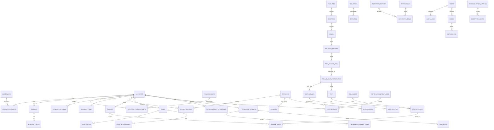

# Tolling Management Domain Pack Plan

Status: Pack source artifacts exist and Phase 1 pack integration is implemented for CLI, MCP, portal API, portal UI, and portal chat as of 2026-05-03. This document still does not approve production toll policy, legal conclusions, real toll rates, or live account/payment automation.

## Implementation Status

| Story group | Status | Implemented surface |
|---|---|---|
| PACK-INTEGRATION-1 | Done | `packages/core/src/domain-packs.js`, `heart packs list`, portal `/domain-packs`. |
| PACK-INTEGRATION-2 | Done | Core, Texas regional, agency example overlays, customer overlay merge, conflict surfacing. |
| PACK-INTEGRATION-3 | Done | `heart packs show/layers/build/validate/conflicts/sync/open/artifacts` with deterministic `--json`. |
| PACK-INTEGRATION-4 | Done | MCP tools `domain_pack_*` for list/get/layers/build options/generate/validate/conflicts/context/benchmarks. |
| PACK-INTEGRATION-5 through PACK-INTEGRATION-8 | Partial | Portal browser/detail/builder/chat/artifact viewer implemented; production polish and full hosted runner flow remain later. |
| PACK-INTEGRATION-9 | Partial | Local `.heart/packs/...` manifests and sync helper exist; hosted-to-local repo sync remains CLI-mediated. |
| PACK-INTEGRATION-10 | Partial | Demo-data, secret/PII guardrails, allowlisted chat, and tests exist; deeper tenant/repo policy coverage remains later. |

Source basis:

- [FHWA Nationwide Electronic Toll Collection Interoperability](https://ops.fhwa.dot.gov/publications/fhwahop21023/fhwahop21023.pdf)
- [TxDOT Toll Roads and Managed Lanes](https://www.txdot.gov/discover/toll-roads-managed-lanes/txdot-toll-roads.html)
- [TxDOT and HCTRA toll operations](https://www.txdot.gov/about/newsroom/statewide/2024/txdot-teams-up-with-hctra-to-enhance-toll-operations.html)
- [HCTRA EZ TAG Agreement](https://www.hctra.org/-/media/BF54E5D5AF9D482DBCD13A2472FDEEA9.ashx)
- [NTTA TollTag](https://www.ntta.org/get-a-tolltag)
- [NTTA Pay Your Bill](https://www.ntta.org/pay-your-bill)
- [405 Express Lanes violations](https://www.405expresslanes.com/en/violations/)
- [FTC unpaid toll scam guidance](https://consumer.ftc.gov/consumer-alerts/2025/01/got-text-about-unpaid-tolls-its-probably-scam)
- [PCI DSS](https://www.pcisecuritystandards.org/standards/pci-dss/)
- [NIST Privacy Framework](https://www.nist.gov/privacy-framework)

This plan extracts domain concepts, workflows, risk areas, and architecture patterns. It does not copy private implementation, set legal policy, define real toll rates, or replace agency counsel.

## 1. Practicality Assessment

Tolling Management is a strong first domain pack because it has high repeated-context cost, clear public source anchors, deep back-office workflows, measurable security risk, and visible ROI scenarios. It is also risky because real toll systems combine public policy, money movement, PII, plate images, operational uptime, interoperability, and angry-customer support.

Scoring: 1 is low, 5 is high. For complexity and risk, a high score means high effort or high risk.

| Dimension | Score | Assessment |
|---|---:|---|
| Business value | 5 | Tolling programs carry high transaction volume, expensive support operations, public scrutiny, and long-lived software contracts. |
| Implementation usefulness | 5 | A pack can prevent repeated rediscovery of accounts, plates, tags, trips, invoices, disputes, payments, image review, and audit rules. |
| AI context value | 5 | Generic AI often misses tolling-specific terms, layer-specific policies, dispute windows, ledger safety, and interagency exceptions. |
| Small-company usefulness | 4 | Startups and integrators can use the pack to build credible prototypes and proposals faster, but must still validate legal and agency rules. |
| Enterprise buyer credibility | 5 | Official sources show tolling has formal back-office, interoperability, reconciliation, and customer service complexity. |
| Technical complexity | 5 | Roadside event ingestion, duplicate detection, dynamic rating, payment ledgers, inventory, OCR, and audit create cross-domain complexity. |
| Data/security risk | 5 | PII, plates, plate images, trip history, payment tokens, staff actions, and enforcement data require strong controls. |
| Benchmark potential | 5 | Many benchmarkable tasks exist: dedupe, audit-safe waivers, dispute workflows, portal payments, layer conflicts, and citations. |
| Customer support value | 5 | Tolling support is policy-heavy and repetitive: account lookup, charge explanation, payment, violations, waivers, disputes, and scam warnings. |
| Back-office automation value | 5 | Agent Account 360, case routing, payment plan support, fulfillment, inventory, and reporting can reduce expensive manual work. |

What makes this practical:

- [Core] Toll systems share a common event-to-money operating backbone: capture, normalize, match, rate, post, invoice, collect, dispute, reconcile, and report.
- [Core] Public sources describe enough concepts to build a useful base pack without private vendor data.
- [Regional] FHWA interoperability material gives a real model for home/away agency, transaction exchange, image review, and settlement.
- [Agency-specific] TxDOT, HCTRA, NTTA, and 405 Express Lanes show how customer experience, payment methods, violations, tags, and managed lane rules vary.
- [Customer-specific] Each implementation can layer its own rules, code graph, decisions, roadmap, data retention, and integrations.

What makes this risky:

- [Core] It touches money movement, account balances, notices, disputes, enforcement, and support decisions.
- [Regional] Laws, retention, consent, language, fee, notice, and collections rules vary by jurisdiction.
- [Agency-specific] Agencies have different tag brands, account types, waiver policies, payment plan rules, and customer portal promises.
- [Customer-specific] Existing systems often contain legacy data, custom CRM integrations, vendor-specific lane formats, and undocumented support scripts.
- [Future / unknown] AI action automation can create financial, legal, and reputation risk if allowed before policy controls and audit are mature.

MVP:

- [Core] Static domain pack docs, glossary, workflow maps, layered model, overlay schema draft, database model draft, security plan, benchmark scenarios, and implementation stories.
- [Regional] US/Texas interoperability notes as examples, not binding legal templates.
- [Agency-specific] Example overlays for Texas-style tolling, express lanes, and private operator scenarios.
- [Customer-specific] Overlay template for accepted customer docs, decisions, code graph, security constraints, and benchmark scenarios.

Later:

- [Core] Context compiler runtime that merges packs and citations.
- [Customer-specific] Portal UI for selecting pack layers.
- [Customer-specific] MCP tools that answer layer-aware questions.
- [Agency-specific] Tested integration adapters for specific payment, notification, CRM, OCR, fulfillment, and reporting vendors.

Do not build yet:

- [Future / unknown] Automated live account changes by AI.
- [Future / unknown] Legal policy engine that claims jurisdictional compliance.
- [Future / unknown] Toll rate calculator for a real agency without signed source authority.
- [Future / unknown] Production OCR/image-review automation.
- [Future / unknown] Hosted marketplace for third-party agency overlays.

Highest ROI slice:

- [Core] Back-office Agent Account 360 plus policy-aware safe actions for account lookup, charge explanation, payment/funds view, dispute creation, case note, transponder replacement request, waiver eligibility, and audit logging.

Biggest delivery risk:

- [Customer-specific] Mixing universal tolling behavior with agency policy or customer-specific decisions silently. The pack must cite rule origin and surface conflicts instead of blending rules into one false "truth."

## 2. Product Outcome

When a tolling software team selects the Tolling Management pack, be-ai-heart should enable AI agents to work with focused domain memory instead of repeated prompting.

AI agents should understand:

- [Core] roadside toll events, including device reads, lane events, plate images, timestamps, vehicle class, and facility metadata
- [Core] gantry, lane, transponder, and license plate capture concepts
- [Core] trip building from one or more normalized toll events
- [Core] toll rating by facility, class, account status, time, and agency policy
- [Core] posting to prepaid accounts, invoices, or violation flows
- [Core] account funding, stored value, replenishment, refunds, chargebacks, and adjustments
- [Core] invoices, invoice lines, aging, notices, and payment status
- [Core] violations, disputes, appeals, cases, evidence, and resolution codes
- [Core] notifications across email, SMS, push, and paper mail with consent and delivery audit
- [Core] transponder inventory, assignment, replacement, fulfillment, returns, and retirement
- [Core] customer self-service for account, vehicles, plates, trips, bills, payments, disputes, cases, and notification preferences
- [Core] call-center agent workflows, Account 360, identity verification, safe action limits, scripts, and escalation
- [Core] reporting for revenue, trips, exceptions, support, inventory, fulfillment, and reconciliation
- [Core] compliance and security constraints for PII, trip history, payment data, plate images, staff access, and audit logs
- [Regional] interoperability rules for tag issuer compatibility, home/away agency exchange, plate jurisdictions, and settlement
- [Agency-specific] pricing, fee, waiver, payment plan, notice, customer experience, brand voice, and operational SLAs
- [Customer-specific] accepted requirements, codebase architecture, current decisions, active roadmap, integrations, test patterns, and known risks

Product success means an AI coding agent can answer: "Is this requirement core tolling, regional interoperability, agency policy, or customer-specific implementation?" before proposing architecture or code.

## 3. Core vs Agency-Specific Tolling Model

The pack must not model Tolling Management as one universal fixed workflow. It should use a layered memory system that separates reusable domain truth from variable policy.

### 3.1 Global/Core Tolling Pack

Shared requirements most tolling systems need:

| Requirement | Layer | Notes |
|---|---|---|
| facilities, roads, road segments, gantries, lanes, and roadside devices | Core | Physical and logical roadside structure. |
| transponders/tags, license plates, and vehicles | Core | Identification methods for account matching and enforcement. |
| customers, accounts, members, account status, and identity verification | Core | Required for customer service and self-service. |
| toll events, raw event intake, normalized events, and event exception queue | Core | Roadside source of truth must remain traceable. |
| plate images, OCR candidates, and manual image review | Core | Needed when transponder match fails or evidence is required. |
| trip construction, duplicate detection, toll rating, and posting | Core | Converts events into financial charges. |
| invoices, payments, refunds, chargebacks, payment plans, and ledger entries | Core | Money movement must be auditable and consistent. |
| violations, disputes, cases, notes, attachments, and SLA | Core | Customer support and enforcement backbone. |
| notifications, templates, preferences, consent, delivery status, and mail workflow | Core | Customer communication must be trackable. |
| inventory, warehouses, fulfillment, shipments, returns, and replacement flow | Core | Transponder lifecycle needs operational control. |
| reporting, reconciliation, audit logs, RBAC, ABAC, and privacy controls | Core | Governance, finance, operations, and security baseline. |

### 3.2 Regional/Interoperability Layer

Rules that vary by region:

| Requirement | Layer | Notes |
|---|---|---|
| transponder interoperability | Regional | Tag protocol and issuer compatibility vary by network. |
| plate jurisdiction and vehicle registration lookups | Regional | State/country authority and data access rules vary. |
| toll authority agreements | Regional | Home/away agency exchange, acknowledgements, and settlement are region-specific. |
| tag issuer compatibility | Regional | Determines whether a tag is accepted, rejected, or handled as image/video tolling. |
| settlement and reconciliation rules | Regional | Clearinghouse, hub, peer-to-peer, and agency-specific settlement differ. |
| tax, fee, notice, and collections rules | Regional | Must be supplied by legal/customer overlay before implementation. |
| privacy and data retention rules | Regional | Plate image, trip history, PII, and audit retention vary. |
| notification consent rules | Regional | SMS, email, paper mail, language, and opt-out rules vary. |
| payment method availability | Regional | Card, bank debit, cash retail, lockbox, wallet, and mobile options vary. |
| language/localization requirements | Regional | Portal, notices, scripts, and support flows may require localization. |

### 3.3 Agency/Operator Custom Overlay

Each tolling agency/operator can define its own business rules and customer experience:

| Requirement | Layer | Notes |
|---|---|---|
| account types and eligibility | Agency-specific | Personal, fleet, rental, government, commuter, or special program accounts. |
| pricing/rating policy | Agency-specific | Static, time-of-day, vehicle class, express lane, occupancy, discount, or dynamic pricing. |
| fee, waiver, adjustment, refund, and payment plan rules | Agency-specific | Requires approval limits and audit. |
| violation escalation and dispute workflow | Agency-specific | Notice sequence, evidence, hearing, collections, and resolution codes differ. |
| customer identity verification rules | Agency-specific | Verification factors and allowed agent actions vary. |
| notification templates and brand voice | Agency-specific | Language, scam warnings, payment guidance, and official links. |
| fulfillment and inventory rules | Agency-specific | Ship by default, pickup, replacement, deposit, serial policy, and vendor handoff. |
| portal capabilities and agent scripts | Agency-specific | Which actions customers and agents can perform. |
| SLA, reporting, and integration requirements | Agency-specific | Operational commitments and downstream systems. |
| data retention policy | Agency-specific | Agency-specific retention layered on regional law and customer policy. |

### 3.4 Customer-Specific Implementation Pack

For a real customer project, be-ai-heart should compile:

| Input | Layer | Outcome |
|---|---|---|
| selected core pack | Core | Default tolling concepts, workflows, database model, risks, and benchmarks. |
| selected regional layer | Regional | Jurisdiction/interoperability constraints and source notes. |
| selected agency overlay | Agency-specific | Operator policy, scripts, UX language, report needs, and integration contracts. |
| customer-specific docs/specs/business rules | Customer-specific | Accepted requirements override generic defaults. |
| current implementation code graph | Customer-specific | AI sees actual modules, contracts, tests, and ownership boundaries. |
| accepted decisions | Customer-specific | ADRs and product decisions prevent repeated debate. |
| current roadmap/stories | Customer-specific | AI aligns suggestions with near-term priorities. |
| security constraints | Customer-specific | Least privilege, data handling, PCI boundary, and retention settings. |
| benchmark scenarios | Customer-specific | ROI proof for the customer stack and workflows. |

Outcome: AI agents should know what is globally true about tolling, what is specific to the agency/operator, and what is specific to this customer's implementation. Unknown policy must stay labeled `Future / unknown` until a customer source resolves it.

## 4. Agency Overlay Examples

These overlays are examples only. They should never imply official implementation, hidden policy, or legal authority.

### Example: TxDOT / HCTRA / NTTA-style Texas Tolling Overlay

| Area | Overlay design |
|---|---|
| Business rules | Support interoperable tag concepts such as TxTag, EZ TAG, and TollTag; separate prepaid tag account from pay-by-mail/video tolling; allow regional handoff of billing/customer service; model payment plans, waiver eligibility, account funding, and violation support as configurable policy. |
| Data model extensions | `tag_brand`, `home_agency_id`, `away_agency_id`, `zipcash_invoice_ref`, `regional_partner_ref`, `account_transition_status`, `mail_notice_batch_id`. |
| UI differences | Texas-style Account 360 should show tag brand, plate/account match confidence, regional invoice source, pay-by-mail status, official payment guidance, and scam warning links. |
| API differences | Interagency transaction import/export, tag validation list import, customer account transition status, invoice source lookup, regional partner reconciliation. |
| Permissions | Agents need restricted views for payment tokens, address changes, waivers, refunds, account merges, and regional partner exceptions. |
| Reports | Billing migration, regional handoff volume, pay-by-mail aging, fee waiver volume, tag vs plate match rate, support volume by source agency. |
| Benchmark scenarios | Customize generic trip posting for Texas-style tag brands; add scam-safe notification; handle account transition support; reconcile tag vs video toll. |
| Integration needs | Agency account system, mail vendor, payment processor, DMV/registration data where lawful, lockbox, CRM, notification provider, reporting warehouse. |

### Example: Express Lane / Managed Lane Overlay

| Area | Overlay design |
|---|---|
| Business rules | Dynamic pricing, time-of-day pricing, occupancy rules, transponder requirement, special account programs, facility-specific rate rules, enforcement events, and violation escalation. |
| Data model extensions | `pricing_zone`, `rate_snapshot_id`, `occupancy_declaration`, `hov_eligibility`, `dynamic_price_version`, `enforcement_evidence_ref`, `managed_lane_trip_id`. |
| UI differences | Customer portal needs rate schedule/calculator, transponder status, violation lookup, dispute flow, and account mismatch messaging. Back office needs rate snapshot visibility and enforcement evidence links. |
| API differences | Rate schedule API, dynamic rate snapshot service, occupancy/enforcement event ingest, violation notice lookup, toll calculator endpoint. |
| Permissions | Pricing configuration restricted to operations/admin; violation disposition restricted to authorized analysts/supervisors. |
| Reports | Dynamic price changes, occupancy exceptions, violation conversion, enforcement events, rate disputes, revenue by time period and facility. |
| Benchmark scenarios | Add dynamic pricing flag; explain charge with rate snapshot; dispute express lane violation; detect missing transponder requirement. |
| Integration needs | Traffic systems, dynamic pricing engine, enforcement vendor, transponder network, portal rate calculator, notification/mail vendor. |

### Example: Private Toll Operator Overlay

| Area | Overlay design |
|---|---|
| Business rules | Concession reporting, revenue share, SLA with government agency, contractor operations, settlement windows, fulfillment vendors, and custom CRM integration. |
| Data model extensions | `concession_contract_id`, `revenue_share_bucket`, `sla_class`, `government_client_ref`, `contractor_org_id`, `vendor_order_ref`, `crm_case_ref`. |
| UI differences | Operator dashboard should separate agency-facing reports from internal operations; case screens need client-visible vs internal-only notes. |
| API differences | Contract reporting export, revenue share calculation, SLA breach events, CRM sync, vendor fulfillment API, finance settlement API. |
| Permissions | Contractor users must have tenant, contract, facility, and note-visibility restrictions. |
| Reports | Contract SLA, revenue share, settlement, exception queue aging, vendor fulfillment performance, agency-facing monthly operations. |
| Benchmark scenarios | Add concession report; restrict contractor note access; generate SLA breach workflow; reconcile revenue share batch. |
| Integration needs | Government reporting portal, ERP, CRM, payment processor, mail/fulfillment vendor, BI warehouse, audit archive. |

## 5. Domain Pack Architecture

Recommended structure:

```text
packs/
  tolling-management/
    core/
      glossary.md
      workflows.md
      data-model.md
      security.md
      benchmark-scenarios.md
    regional/
      us/
      texas/
      eu/
    agencies/
      txdot-example/
      hctra-example/
      ntta-example/
      express-lanes-example/
    customer-overlays/
      README.md
      overlay-template.md
```

Each layer should support:

| Capability | Required in each layer |
|---|---|
| source notes | URL, retrieval date, source type, scope, and usage notes. |
| assumptions | Explicit non-source assumptions and whether they are safe defaults. |
| known variations | List alternate policies or workflows seen in the industry. |
| configurable rules | Machine-readable keys, types, defaults, allowed override layers, and audit impact. |
| data model extensions | Tables/fields added or overridden by the layer. |
| UI/workflow extensions | Screens, task flows, scripts, and state changes affected by the layer. |
| benchmark scenarios | Tasks that prove the layer improves AI coding quality or lowers context cost. |
| risk notes | Security, privacy, legal, performance, cloud cost, and operations risks. |

Pack file intent:

| File | Layer | Purpose |
|---|---|---|
| `core/glossary.md` | Core | Canonical terms and aliases. |
| `core/workflows.md` | Core | Roadside-to-back-office and support workflows. |
| `core/data-model.md` | Core | Postgres-first canonical data model. |
| `core/security.md` | Core | PII, payment, plate image, audit, and AI guardrails. |
| `core/benchmark-scenarios.md` | Core | Reusable ROI scenarios. |
| `regional/*/rules.md` | Regional | Jurisdiction/interoperability variants. |
| `agencies/*/overlay.md` | Agency-specific | Example agency/operator rules and UX. |
| `customer-overlays/overlay-template.md` | Customer-specific | Template for real customer accepted requirements and current implementation context. |

## 6. Overlay Merge Rules

Merge priority:

| Priority | Layer | Rule |
|---:|---|---|
| 1 | Customer-specific | Latest accepted customer docs/specs/ADRs override older pack defaults. |
| 2 | Agency-specific | Agency/operator overlay overrides business policy, workflow, scripts, reports, and UX language. |
| 3 | Regional | Regional layer adds law, interoperability, consent, retention, settlement, localization, and payment constraints. |
| 4 | Core | Core gives default tolling domain model and safe baseline. |
| 5 | Future / unknown | Unknown values must stay unresolved and block unsafe implementation assumptions. |

Conflict detection examples:

| Conflict | Example | Required behavior |
|---|---|---|
| Type conflict | `payment_plan.allowed` is boolean in core but enum in agency overlay. | Mark invalid overlay schema and request correction. |
| Policy conflict | Core says supervisor approval over threshold; agency says no approval needed for refunds. | Surface conflict and require customer decision. |
| Jurisdiction conflict | Regional retention maximum is shorter than agency default. | Regional constraint wins unless customer legal source provides valid exception. |
| UX conflict | Agency template allows SMS payment links; security overlay bans unknown payment links. | Block template until scam-safe official-link rule is resolved. |
| Implementation conflict | Customer code graph shows ledger service owns adjustments, but overlay routes adjustment through account service. | Cite implementation owner and flag architecture mismatch. |

Override examples:

| Rule | Core default | Agency override | Customer override |
|---|---|---|---|
| `toll_rating.dynamic_pricing_enabled` | `false` | `true` for managed lanes | `true` only for selected facilities. |
| `fulfillment.ship_transponder_by_default` | `false` | `true` for online orders | `false` for pickup-only pilot. |
| `waiver.max_agent_amount` | `0` | configurable agent threshold | lower threshold during fraud review. |
| `plate_image.retention_days` | `unknown` | agency default | customer legal-approved retention value. |

Citation format for compiled context:

```yaml
rule_id: waiver.max_agent_amount
value: 25
layer: agency-specific
source:
  pack: tolling-management/agencies/example
  file: business-rules.md
  section: fee-waiver-policy
overridden_by: null
confidence: source-backed-example
```

AI agents must know:

- Core rules are reusable domain defaults.
- Regional rules are jurisdiction/interoperability constraints.
- Agency-specific rules are policy and UX choices for an operator.
- Customer-specific rules are accepted project truth.
- Future / unknown rules must not be invented.
- Any rule that affects money, PII, evidence, notices, retention, or enforcement needs citation and audit awareness.

## 7. Configurable Rule Examples

| Rule name | Layer | Type | Default value | Who can override | Security/audit impact |
|---|---|---|---|---|---|
| `toll_rating.dynamic_pricing_enabled` | Agency-specific | boolean | `false` | Agency, Customer | Changes price logic. Requires rate snapshot audit. |
| `account.auto_replenishment_required` | Agency-specific | boolean | `false` | Agency, Customer | Affects payment consent and failed payment handling. |
| `violation.notice_period_days` | Regional | integer | `unknown` | Regional, Agency, Customer with legal source | Notice timing must be cited and auditable. |
| `payment_plan.allowed` | Agency-specific | boolean | `false` | Agency, Customer | Impacts collections, receivables, and agent permissions. |
| `refund.supervisor_approval_threshold` | Agency-specific | currency | `0` | Agency, Customer | Refund above threshold requires approval and reason. |
| `waiver.max_agent_amount` | Agency-specific | currency | `0` | Agency, Customer | Fee waivers require limit, reason code, and audit. |
| `dispute.evidence_required` | Core | enum list | `plate_image, event_detail, rate_snapshot` | Agency, Customer | Evidence access includes plate images and trip data. |
| `notification.sms_enabled` | Regional | boolean | `false` | Regional, Agency, Customer | Requires consent, opt-out, and scam-safe templates. |
| `fulfillment.ship_transponder_by_default` | Agency-specific | boolean | `false` | Agency, Customer | Shipping exposes address and inventory custody. |
| `inventory.reserve_on_order_create` | Core | boolean | `true` | Agency, Customer | Reservation must be released on cancel/timeout. |
| `plate_image.retention_days` | Regional | integer | `unknown` | Regional, Customer legal owner | High privacy impact; retention jobs must be tested. |
| `audit.payment_actions_require_reason` | Core | boolean | `true` | Security owner only | Must not be disabled for production. |
| `account.identity_verification_required_for_payment_method_update` | Core | boolean | `true` | Security owner only | Protects payment methods and account takeover risk. |
| `case.supervisor_escalation_sla_hours` | Agency-specific | integer | `unknown` | Agency, Customer | SLA reporting and queue escalation. |
| `notification.official_payment_link_only` | Core | boolean | `true` | Security owner only | Scam prevention and customer trust. |

## 8. Personas

| Persona | Goals | Daily workflows | Pain points | Data needed | Actions allowed | Security restrictions |
|---|---|---|---|---|---|---|
| Tolling customer | Pay correctly, avoid violations, manage vehicles/tags. | View trips, pay invoices, add funds, dispute charges, update vehicle/plate. | Confusing charges, scams, missing tags, wrong plate, late notices. | Account, trips, invoices, vehicles, tags, payments, cases. | Self-service profile, payment, dispute, case, preferences. | Own-account only, step-up auth for risky changes, no raw internal notes. |
| Customer service agent | Resolve account and billing calls quickly. | Verify identity, search account, explain charges, take payment, open case. | Fragmented systems, unclear policy, high call volume. | Account 360, recent trips, invoices, cases, scripts, eligible actions. | Policy-limited updates, payments, cases, notes, fulfillment orders. | RBAC/ABAC, masked PII, payment tokenization, audited actions. |
| Back-office supervisor | Control risk, approve exceptions, monitor queues. | Approve refunds/waivers, review escalations, manage SLAs. | Inconsistent agent decisions and missing audit. | Queue metrics, agent actions, policy thresholds, high-risk cases. | Approve, reject, reassign, override within policy. | Strong auth, reason required, immutable audit. |
| Fulfillment/inventory operator | Ship and reconcile transponders. | Pick, pack, ship, receive returns, replace, retire. | Stock mismatch, lost tags, poor vendor tracking. | Orders, SKUs, serials, warehouse, shipment status. | Reserve, ship, receive, mark damaged/lost/retired. | No payment access; limited customer PII. |
| Finance/payment operator | Keep ledger and reconciliation correct. | Reconcile batches, review chargebacks, refunds, aging. | Ledger drift, duplicate payments, processor failures. | Payments, refunds, ledger entries, invoices, reconciliation batches. | Reconcile, investigate, approve finance corrections. | PCI-safe tokens only, dual control for sensitive actions. |
| Roadside operations operator | Keep toll capture reliable. | Monitor gantries/devices, triage exceptions, dispatch maintenance. | Device outages and high image review queues. | Device health, event volume, lane status, exception queue. | Mark device status, create maintenance case, annotate incident. | No customer payment details; access to event and image data restricted. |
| Dispute/case analyst | Resolve disputes fairly and consistently. | Review evidence, rate snapshot, policy, notes, attachments. | Missing evidence and unclear escalation rules. | Plate images, toll events, trip details, invoice/violation history, policy. | Resolve, request evidence, escalate, adjust if permitted. | Evidence access logged; no broad search without case need. |
| System admin | Manage users, roles, integrations, retention. | Provision access, rotate keys, monitor jobs, configure tenants. | Privilege sprawl and weak environment boundaries. | Users, roles, policies, integration health, audit logs. | Admin configuration, break-glass, retention jobs. | Least privilege, MFA, break-glass approval, sensitive audit. |
| Product owner | Ship real workflows and prove ROI. | Prioritize stories, accept rules, manage overlays. | Generic AI output misses domain constraints. | Pack citations, benchmark results, roadmap, support metrics. | Approve scope, accept requirements, define agency overlay. | No access to secrets or raw payment data by default. |
| Engineering team | Build maintainable tolling software faster. | Implement services, tests, UI, integrations, migrations. | Repeated domain onboarding and unclear ownership. | Pack docs, code graph, API contracts, data model, benchmarks. | Code changes, tests, docs, schema proposals. | Secure coding rules, no production data in prompts. |
| AI coding agent | Produce layer-aware, safe implementation plans/code. | Load context pack, cite rules, modify code, create tests. | Confusing core vs agency-specific policy. | Compiled pack, citations, code graph, accepted decisions, tests. | Suggest code/docs, draft stories, flag conflicts. | Cannot invent policy, cannot expose PII, must cite high-risk rules. |

## 9. Back-Office Modules

### CRM / Account Management

Account 360 for call center agents should show:

- [Core] customer profile, account status, identity verification state, allowed actions
- [Core] vehicles, license plates, transponders, active/inactive assignment history
- [Core] funds/balance, payment methods, invoices, payments, refunds, chargebacks, payment plans
- [Core] trips, toll charges, violations, disputes, cases, notifications, fulfillment orders
- [Core] audit history, recent agent actions, risk warnings, and policy citations
- [Agency-specific] scripts, brand language, waiver/payment plan eligibility, SLA rules
- [Customer-specific] current integration links, CRM case references, accepted policy decisions

Required Account 360 actions:

| Action | Layer | Notes |
|---|---|---|
| create account | Core | Requires identity/contact capture and consent. |
| verify customer | Core | Required before risky actions. |
| update contact info | Core | Step-up verification for address/email/phone changes. |
| add/remove vehicle | Core | Audit and effective date required. |
| add/remove plate | Core | Plate validation and duplicate ownership checks. |
| add/replace transponder | Core | Inventory assignment and fulfillment link. |
| add funds | Core | PCI-safe payment flow and idempotency. |
| issue refund | Core | Ledger entry, approval threshold, reason code. |
| adjust balance | Core | Dual-entry ledger and approval when needed. |
| waive fee | Agency-specific | Policy-limited, reason required, audited. |
| create payment plan | Agency-specific | Eligibility and terms must be policy-backed. |
| open case | Core | Case type, SLA, notes, attachments. |
| resolve case | Core | Resolution code and customer notification option. |
| send notification | Core | Template, consent, delivery tracking. |
| order replacement transponder | Core | Inventory reserve, fulfillment order, shipment/pickup. |
| view audit log | Core | Role-gated and immutable. |

### Funds / Wallet / Payment Management

The payment module should include:

- [Core] stored balance account with ledger entries, not mutable balance-only updates
- [Agency-specific] auto-replenishment eligibility, threshold, amount, and failed payment behavior
- [Core] payment methods stored through PCI-safe tokenization; no raw PAN or bank details in be-ai-heart context
- [Core] payment transactions, refunds, chargebacks, payment plans, failed payment handling, and reconciliation
- [Core] idempotent payment operations with processor reference and request fingerprint
- [Core] adjustment approval rules and reason-code audit
- [Regional] payment method availability and consent/notice rules

### Case Management

Case types:

- [Core] complaint
- [Core] dispute
- [Core] violation appeal
- [Core] payment issue
- [Core] transponder issue
- [Core] vehicle/plate mismatch
- [Core] fraud/scam report
- [Core] supervisor escalation

Case fields:

- SLA, owner, queue, status, priority, notes, attachments, evidence links, resolution codes, customer-visible flag, internal-only flag, audit.

### Notification Management

Capabilities:

- [Core] email, SMS, push, and letter/mail channels
- [Core] templates, preferences, opt-in/opt-out, delivery status, retry, bounce/failed delivery
- [Core] scam-warning guidance and official payment guidance
- [Core] audit trail of template, recipient, consent state, and action source
- [Regional] notification consent and language requirements
- [Agency-specific] brand voice, official links, notice content, and escalation templates

### Inventory Management

Transponder inventory should track:

- [Core] inventory SKU, transponder serial, status, warehouse/location, supplier batch
- [Core] statuses: available, reserved, shipped, active, returned, lost, damaged, retired
- [Core] assignment to account/vehicle and assignment effective dates
- [Core] replacement flow and old-tag deactivation
- [Core] stock thresholds, reconciliation, and exception handling
- [Agency-specific] deposit, fee, tag ownership, return, and fulfillment vendor policy

### Fulfillment Management

Capabilities:

- [Core] order creation, pick, pack, ship, tracking, pickup, return, replacement, cancellation
- [Core] exception handling for address issue, stock issue, lost shipment, returned mail, duplicate order
- [Core] SLA tracking and fulfillment throughput reporting
- [Customer-specific] vendor API, warehouse process, pickup locations, and notification wording

### Reporting

Required report families:

- [Core] revenue, toll events, trips posted, invoices, aging receivables, violations, payment failures
- [Core] cases/SLA, notification delivery, inventory stock, fulfillment throughput, agent productivity
- [Core] fraud/scam reports, reconciliation exceptions, duplicate detection rate, image review throughput
- [Agency-specific] facility, concession, managed lane, regional partner, and board-reporting requirements

## 10. Customer Online Website/App

MVP self-service:

- [Core] create account and login
- [Core] manage profile, contact information, vehicles, plates, and transponders
- [Core] view trips, tolls, invoices, payments, and account balance
- [Core] pay bill, add funds, configure auto-replenishment when supported
- [Core] update tokenized payment method through hosted/PCI-safe payment flow
- [Core] dispute toll, upload evidence, open support case, track case
- [Core] order/replacement transponder when inventory/fulfillment supports it
- [Core] notification preferences and official scam warning/payment guidance

Later self-service:

- [Agency-specific] payment plan enrollment
- [Agency-specific] fleet and rental account management
- [Agency-specific] hearing request or advanced appeal workflow
- [Agency-specific] dynamic toll calculator and saved route estimates
- [Customer-specific] chat/call-center AI with safe account actions
- [Customer-specific] real-time fulfillment tracking and pickup scheduling

Risky actions requiring extra verification:

- [Core] payment method update
- [Core] refund request or bank/card change
- [Core] address, email, or phone change
- [Core] add/remove plate when active violations exist
- [Core] account closure
- [Core] dispute withdrawal
- [Agency-specific] payment plan enrollment
- [Agency-specific] high-value waiver request

## 11. Roadside-to-Back-Office Workflow

| Step | Input data | Output data | Responsible module | Failure modes | Security/privacy risks | Audit log needs |
|---:|---|---|---|---|---|---|
| 1. Vehicle passes gantry/lane | Vehicle, lane, timestamp | Physical passage event | Roadside device | Device offline, lane closed, unreadable plate/tag | Trip location data | Device status and capture time. |
| 2. Device captures tag/plate | Transponder read, plate image, class, lane | Raw event payload | Roadside device | Missing tag, blurry image, wrong class | Plate image and location | Device ID, capture metadata, image hash. |
| 3. Event intake validates raw event | Raw payload, source headers | Accepted/rejected raw event | Toll-event-service | Bad schema, duplicate payload, delayed batch | Raw PII in payload | Ingest request ID, validation result. |
| 4. OCR/manual image review | Plate image, OCR candidates | Plate read with confidence | Image-review workflow | Low confidence, multiple plates, review backlog | Plate images, reviewer access | Reviewer ID, decision, evidence link. |
| 5. Trip construction | Normalized events | Trip/trip segment | Trip builder | Missing event, wrong order, cross-facility mismatch | Trip history | Source event IDs, algorithm version. |
| 6. Duplicate detection | Events, trips, idempotency keys | Duplicate/suspect/unique decision | Toll-event-service | False duplicate, duplicate charge | Financial overcharge risk | Dedupe key, reason, decision. |
| 7. Account/vehicle/tag matching | Tag, plate, account lists | Match result | Account-service | Stale plate, transferred tag, rental vehicle | Account PII and travel history | Match candidates and confidence. |
| 8. Toll rating | Trip, vehicle class, rate plan | Toll charge | Rating-service | Wrong rate, missing snapshot, dynamic pricing drift | Financial impact | Rate plan/snapshot version. |
| 9. Posting to account | Toll charge, account/funds | Ledger entry/posting result | Payment/account ledger | Insufficient funds, race condition | Balance/payment data | Ledger transaction ID, idempotency key. |
| 10. Invoice/violation flow | Unmatched/insufficient event | Invoice or violation notice | Invoice/violation-service | Wrong owner, notice delay, duplicate invoice | Address, plate, evidence | Notice batch, source, status. |
| 11. Notification | Invoice, payment, case, violation | Email/SMS/mail/push | Notification-service | Bounce, consent missing, scam-like link | Contact data | Template version, consent, delivery ID. |
| 12. Payment/funds update | Payment request, token, amount | Payment, ledger entries | Payment-service | Processor timeout, duplicate payment, chargeback | PCI/payment metadata | Processor ref, auth result, ledger refs. |
| 13. Dispute/case handling | Customer claim, evidence | Case/dispute resolution | Case-service | Missing evidence, SLA breach, inconsistent policy | Evidence and account history | Notes, decisions, approvals. |
| 14. Reconciliation/reporting | Events, payments, invoices, settlements | Reports and exceptions | Reporting/reconciliation | Out-of-balance batch, partner mismatch | Aggregated sensitive operations data | Batch ID, exception reason, approvals. |

## 12. Database Design

Use Postgres first. The operational database should be relational with explicit transaction boundaries, immutable ledger entries, idempotent event ingestion, and clear PII/payment segregation. Object storage should hold plate images and attachments; Postgres should store references, hashes, retention metadata, and access audit.

Common columns for most tables: `tenant_id`, `id`, `created_at`, `updated_at`, `created_by`, `updated_by`, `version`, `deleted_at` where soft delete is allowed. Finance, audit, raw event, and evidence tables should be append-only where possible.

| Table/entity | Purpose | Key fields | Relationships | Important indexes | Retention/privacy notes | Audit needs | Layer |
|---|---|---|---|---|---|---|---|
| `customers` | Person or organization profile. | name, type, email, phone, address_ref, verification_status | accounts, cases | tenant+email, tenant+phone | PII, encrypt sensitive fields. | Profile changes. | Core |
| `accounts` | Toll account container. | account_number, status, type, balance_snapshot | customers, vehicles, invoices | tenant+account_number, status | Financial/account PII. | Status/balance-impacting actions. | Core |
| `account_members` | Customer-account relationship. | account_id, customer_id, role | customers, accounts | account+customer | PII linkage. | Role changes. | Core |
| `account_status_history` | Account state timeline. | account_id, old_status, new_status, reason | accounts | account+created_at | Retain per policy. | Immutable. | Core |
| `vehicles` | Vehicle record. | vin_last4, make, model, class, status | accounts, plates | account+status | Vehicle PII. | Add/remove/update. | Core |
| `license_plates` | Plate identity and jurisdiction. | plate_number_hash, plate_display_masked, jurisdiction, status | vehicles, events | plate_hash+jurisdiction | Store masked/hash where possible. | Ownership/status changes. | Core/Regional |
| `transponders` | Tag master record. | serial_hash, display_id_masked, brand, status | account_transponders, inventory_items | serial_hash, brand+status | Sensitive identifier. | Status changes. | Core/Agency-specific |
| `account_transponders` | Tag assignment. | account_id, vehicle_id, transponder_id, effective_from/to | accounts, vehicles, tags | account+active, tag+active | Assignment history retained. | Assignment changes. | Core |
| `payment_methods` | Tokenized payment instruments. | account_id, token_ref, type, last4, expiry, status | accounts, payments | account+status | PCI tokens only, no raw PAN. | Create/update/delete. | Core |
| `account_funds` | Stored value summary. | account_id, current_balance, hold_balance | ledger_entries | account unique | Snapshot only, ledger is source. | Changes only via ledger. | Core |
| `ledger_entries` | Immutable financial ledger. | account_id, amount, currency, entry_type, ref_type, ref_id | accounts, payments, tolls | account+created_at, ref_type+ref_id | Financial record retention. | Append-only. | Core |
| `payments` | Payment attempts and captures. | account_id, amount, status, processor_ref, idempotency_key | ledger_entries | idempotency unique, processor_ref | PCI metadata only. | Auth/capture/refund linkage. | Core |
| `refunds` | Refund requests/results. | payment_id, amount, status, approval_id | payments, ledger | payment+status | Financial PII. | Approval and reason. | Core |
| `chargebacks` | Processor disputes. | payment_id, amount, status, reason | payments | payment+status | Financial record. | Status and evidence. | Core |
| `payment_plans` | Installment agreements. | account_id, terms_ref, status, schedule | invoices, payments | account+status | Policy-sensitive. | Enrollment/changes. | Agency-specific |
| `facilities` | Toll road/facility. | name, agency_id, type, status | gantries, toll_rates | agency+name | Public/operational. | Config changes. | Core/Agency-specific |
| `gantries` | Gantry/plaza location. | facility_id, mile_marker, direction, status | lanes | facility+status | Location operational data. | Config changes. | Core |
| `lanes` | Lane under gantry. | gantry_id, lane_no, lane_type, status | devices, events | gantry+lane_no | Operational. | Status/config changes. | Core |
| `roadside_devices` | Cameras/readers/classifiers. | lane_id, device_type, serial_hash, status | raw_events | lane+status | Device identifiers sensitive. | Health/status. | Core |
| `toll_events_raw` | Immutable raw roadside payload metadata. | source_ref, event_time, payload_hash, object_ref, idempotency_key | normalized events | idempotency unique, source+time | Raw PII in object storage with retention. | Ingest validation. | Core |
| `toll_events_normalized` | Parsed canonical event. | raw_id, lane_id, tag_hash, plate_hash, class, confidence | trips, charges | lane+time, tag+time, plate+time | PII/trip history. | Normalization version. | Core |
| `plate_images` | Plate image metadata. | event_id, object_ref, image_hash, retention_until | ocr_reviews | event_id, retention_until | Object storage; strict access. | View and delete actions. | Core |
| `ocr_reviews` | OCR/manual review decisions. | image_id, ocr_text_hash, reviewer_id, confidence, status | plate_images | status+created_at | Evidence access logged. | Decision and reviewer. | Core |
| `trips` | Billable journey. | account_id, facility_id, start/end_time, status, dedupe_key | events, toll_charges | account+time, dedupe_key | Travel history. | Build/post status. | Core |
| `toll_charges` | Rated charge. | trip_id, amount, rate_id, status, posting_ref | trips, invoices, ledger | trip_id, status | Financial/trip data. | Rate/posting. | Core |
| `toll_rates` | Rate table/snapshot. | facility_id, vehicle_class, time_window, amount, version | charges | facility+class+effective | Policy/config. | Versioned immutable snapshots. | Agency-specific |
| `invoices` | Customer bill. | account_id, invoice_number, status, due_date, total | invoice_lines, payments | account+status, number unique | Address/payment state. | Status and notice. | Core |
| `invoice_lines` | Invoice detail. | invoice_id, line_type, ref_id, amount | invoices, charges | invoice+line_type | Financial/trip detail. | Append/change reason. | Core |
| `violations` | Enforcement/violation case. | plate_hash, account_id, notice_no, status, evidence_ref | disputes, invoices | notice unique, plate+status | Sensitive enforcement data. | Notice/status/evidence. | Core/Regional |
| `disputes` | Toll/invoice/violation dispute. | account_id, ref_type, ref_id, reason, status | cases | account+status, ref | Evidence and notes. | Decision and approvals. | Core |
| `cases` | Support/case management. | account_id, case_type, status, priority, sla_due_at | case_notes, attachments | queue+status, account | May contain PII. | Notes and status. | Core |
| `case_notes` | Case notes. | case_id, note_type, body_redacted, visibility | cases | case+created_at | Avoid secrets/raw card data. | Immutable edits. | Core |
| `case_attachments` | Evidence/customer docs metadata. | case_id, object_ref, type, retention_until | cases | case_id | Object storage retention. | Upload/view/delete. | Core |
| `notifications` | Sent/pending messages. | account_id, channel, template_id, status, consent_snapshot | templates | account+created_at, status | Contact data. | Template/delivery. | Core/Regional |
| `notification_templates` | Message templates. | key, channel, locale, version, official_link_policy | notifications | key+locale+version | Review for scam-safe wording. | Approval/versioning. | Agency-specific |
| `notification_preferences` | Consent/preferences. | account_id, channel, opted_in, locale | account | account+channel | Consent data. | Consent changes. | Regional/Core |
| `inventory_items` | Physical transponder stock. | sku, serial_hash, status, warehouse_id, batch_id | transponders, orders | serial unique, status+warehouse | Serial sensitive. | Custody/status. | Core |
| `inventory_batches` | Supplier batch. | supplier_ref, received_at, quantity, status | items | supplier+received_at | Vendor metadata. | Receive/reconcile. | Core |
| `warehouses` | Stock locations. | name, address_ref, status | items, orders | tenant+name | Location data. | Config/status. | Core |
| `fulfillment_orders` | Customer order. | account_id, status, ship_to_ref, sla_due_at | items, shipments | account+status, status+sla | Address PII. | Status/cancel. | Core |
| `fulfillment_order_items` | Items in order. | order_id, sku, inventory_item_id, status | orders, inventory | order+status | Inventory/customer link. | Pick/pack. | Core |
| `shipments` | Shipment tracking. | order_id, carrier, tracking_ref, status | orders | order+status | Address/tracking PII. | Ship/delivery. | Core |
| `reports` | Report definitions/runs. | report_key, params_hash, status, object_ref | users | key+created_at | Aggregate sensitive data. | Run/download. | Core/Agency-specific |
| `users` | Staff users/service principals. | email, status, mfa_state, tenant_scope | roles | email unique | Staff PII. | Access changes. | Core |
| `roles` | Role definitions. | name, description, tenant_scope | permissions | name | Security config. | Change approvals. | Core |
| `permissions` | Permission grants. | role_id, action, resource, constraints | roles | role+action | Security config. | Grant/revoke. | Core |
| `audit_logs` | Immutable security/action log. | actor_id, action, resource, reason, before_hash, after_hash | users/resources | actor+time, resource+time | Sensitive metadata; long retention. | Append-only. | Core |
| `integrations` | External system config metadata. | name, type, status, endpoint_alias, secret_ref | events/jobs | type+status | No raw secrets. | Config changes. | Customer-specific |
| `reconciliation_batches` | Finance/interagency reconciliation. | batch_type, period, status, totals_hash | payments, settlements | type+period | Financial aggregate. | Approval/status. | Core/Regional |
| `exception_queue` | Operational exceptions. | source_type, ref_id, reason, severity, owner, status | all modules | status+severity, owner | May reference PII. | Assignment/resolve. | Core |

ERD:



Key transaction boundaries:

- Event ingest: raw event insert, hash/idempotency record, normalized event creation, exception queue creation.
- Trip posting: dedupe decision, trip creation, toll charge, ledger entry or invoice/violation initiation.
- Payment capture: payment record, processor response, ledger entries, account funds snapshot update.
- Refund/waiver/adjustment: approval, reason code, ledger entry, notification, audit.
- Fulfillment: inventory reservation, order item assignment, shipment creation, inventory status transition.
- Case resolution: case status, dispute resolution, financial action if any, notification, audit.

Idempotency strategy:

- Use client/request idempotency keys for payment, refund, adjustment, fulfillment, and notification sends.
- Use source system, device, event timestamp, lane, tag/plate hash, class, and payload hash to create raw event idempotency keys.
- Store processor references and partner transaction IDs with unique constraints where appropriate.

Event dedupe strategy:

- Separate raw duplicate detection from billable duplicate detection.
- Keep duplicate candidates linked to source events; never delete raw events during dedupe.
- Dedupe by event source key, time window, lane/facility, tag/plate hash, vehicle class, and already-posted trip segment.
- Require manual exception review when duplicate confidence is not high.

Ledger consistency rules:

- Ledger is append-only.
- Account balance snapshot is derived from ledger and updated only in the same transaction as ledger write.
- Every financial action needs `reason_code`, actor, source, idempotency key, and audit record.
- No negative balance behavior should be assumed without agency/customer policy.

Multi-tenant strategy:

- Every operational table includes `tenant_id`.
- Use tenant-scoped unique keys for account numbers, invoices, notices, and staff roles.
- Use row-level security or equivalent enforcement for runtime implementation.
- Agency overlays and customer overlays must compile into separate tenant context artifacts.

PII/payment data handling:

- Store payment tokens, not card numbers or raw bank details.
- Hash or tokenize plate and transponder identifiers for search where possible; show masked display values.
- Store plate images and attachments outside Postgres with object-level encryption, retention tags, and access logs.
- Do not include production PII, plate numbers, payment data, or raw images in be-ai-heart context packs.

## 13. API / Service Design

| Service/module | Responsibilities | Key APIs | Input/output | Auth/permission needs | Failure handling | Events emitted | Layer impact |
|---|---|---|---|---|---|---|---|
| `account-service` | Customers, accounts, vehicles, plates, tags, Account 360 summary. | `lookupAccount`, `verifyIdentity`, `updateProfile`, `manageVehicle`, `assignTransponder` | Inputs account/plate/tag/customer search; outputs account summary and allowed actions. | Agent/customer scoped RBAC/ABAC. | Ambiguous match, identity failure, duplicate plate. | `account.updated`, `vehicle.changed`, `tag.assigned` | Core/Agency-specific |
| `payment-service` | Payment methods, add funds, refunds, chargebacks, ledger. | `loadFunds`, `addFunds`, `refundPayment`, `adjustBalance`, `createPaymentPlan` | Tokenized payment input; ledger/payment outputs. | PCI boundary, finance permissions, approval thresholds. | Processor timeout, duplicate request, failed payment. | `payment.captured`, `refund.issued`, `ledger.posted` | Core/Regional/Agency-specific |
| `toll-event-service` | Raw/normalized event intake, dedupe, exceptions. | `ingestRawEvent`, `normalizeEvent`, `detectDuplicate`, `queueException` | Roadside payloads to normalized events/exceptions. | Service auth, device/partner identity. | Bad schema, duplicate, delayed batch. | `event.accepted`, `event.normalized`, `event.exception` | Core/Regional |
| `rating-service` | Toll rate selection and charge calculation. | `rateTrip`, `getRateSnapshot`, `explainCharge` | Trip and rate context to toll charge. | Read rates, admin rate config. | Missing rate, stale snapshot, policy conflict. | `trip.rated`, `rate.conflict` | Core/Agency-specific |
| `invoice-service` | Invoice generation, invoice lines, aging. | `generateInvoice`, `getInvoice`, `markNoticeSent` | Charges/violations to invoice. | Customer/agent access to invoices. | Duplicate invoice, owner mismatch. | `invoice.created`, `invoice.aged` | Core/Regional |
| `violation-service` | Violation notices, escalation, evidence. | `createViolation`, `lookupViolation`, `escalateViolation` | Unpaid/unmatched charges to violation workflow. | Restricted enforcement permissions. | Wrong owner, missing evidence, expired period. | `violation.created`, `violation.escalated` | Core/Regional/Agency-specific |
| `case-service` | Cases, disputes, notes, attachments, SLA. | `createCase`, `openDispute`, `resolveCase`, `addCaseNote` | Customer issue to managed case. | Agent/analyst permissions and evidence access. | Missing evidence, SLA breach. | `case.opened`, `case.resolved`, `dispute.created` | Core/Agency-specific |
| `notification-service` | Templates, preferences, sends, delivery. | `sendNotification`, `renderTemplate`, `updatePreference` | Template/context to delivery. | Consent, channel permission, template approval. | Bounce, opt-out, unsafe link. | `notification.sent`, `notification.failed` | Core/Regional/Agency-specific |
| `inventory-service` | Transponder stock, serials, reservations. | `reserveInventory`, `releaseReservation`, `receiveBatch`, `retireItem` | SKU/order to reserved item. | Warehouse role, no finance access. | Out of stock, serial mismatch. | `inventory.reserved`, `inventory.reconciled` | Core/Agency-specific |
| `fulfillment-service` | Orders, pick/pack/ship, returns. | `createFulfillmentOrder`, `shipOrder`, `returnItem`, `cancelOrder` | Account/order to shipment/return. | Fulfillment role; limited customer PII. | Address issue, vendor timeout, lost shipment. | `order.created`, `shipment.created`, `return.received` | Core/Customer-specific |
| `reporting-service` | Reports, metrics, analytics, exports. | `runReport`, `scheduleReport`, `exportReport` | Params to report artifact. | Report-level permissions. | Long-running query, stale warehouse. | `report.completed`, `report.failed` | Core/Agency-specific |
| `audit-service` | Immutable action and security logs. | `recordAudit`, `queryAudit`, `exportAudit` | Actor/action/resource to log. | Security/admin only for query/export. | Write failure should fail high-risk action. | `audit.recorded` | Core |
| `customer-portal-api` | Self-service APIs. | Profile, vehicles, trips, invoices, payments, disputes, cases, preferences. | Customer input to own-account actions. | Customer session, MFA/step-up. | Unauthorized access, policy conflict. | Domain events through underlying services. | Core/Agency-specific |
| `agent-desktop-api` | Agent cockpit and safe actions. | `loadCockpit`, `listEligibleActions`, `executeAgentAction` | Verified identity/context to permitted actions. | Agent RBAC/ABAC, policy limits. | Missing verification, approval required. | `agent.action.requested`, `agent.action.completed` | Core/Customer-specific |

## 14. AI and Call-Center Agent Support

Agent cockpit should load:

- [Core] verified customer identity and verification level
- [Core] account summary, status, balance/funds, payment/funds risk flags
- [Core] vehicles, plates, tags, recent trips/tolls, unpaid invoices, violations
- [Core] open cases, disputes, recent notes, recent notifications, fulfillment orders
- [Core] eligible actions, unavailable actions with reason, required confirmations, risk warnings
- [Agency-specific] scripts/guidance, waiver/payment plan policy, official links, brand voice
- [Customer-specific] implementation-specific action limits, integration references, customer accepted requirements

Allowed actions:

- [Core] answer account questions, explain charges, take payment, add funds
- [Core] open dispute, create case note, order transponder, update notification preference
- [Agency-specific] waive fee if policy allows, create payment plan if eligible, escalate case
- [Customer-specific] execute only actions implemented and authorized in the current system

Permission model:

- RBAC defines role capabilities.
- ABAC constrains by tenant, facility, case assignment, queue, verification state, amount, channel, and data sensitivity.
- High-risk actions require explicit confirmation, reason code, and audit.
- Supervisor approval required for refund, waiver, adjustment, account merge, violation override, and evidence suppression above configured thresholds.

AI guardrails:

- AI must not ask for or display raw card numbers, bank numbers, secrets, or full plate images unless an approved review workflow requires evidence access.
- AI must redact PII in generated context and summaries.
- AI must cite pack layer for policy-heavy answers.
- AI must warn on policy conflicts or missing agency/customer overlay.
- AI must use official payment guidance and avoid unknown SMS payment links.

Layer-aware behavior:

| Situation | Agent response |
|---|---|
| Core tolling behavior | "This is core tolling behavior: event capture must be traceable to posting." |
| Agency-specific policy | "This waiver/payment plan rule comes from the agency overlay and may not apply to other agencies." |
| Customer-specific accepted requirement | "This action limit comes from the accepted customer implementation pack." |
| Supervisor approval | "This action exceeds the configured threshold and requires supervisor approval." |
| Funds/payment/PII action | "This changes payment, funds, PII, or evidence and requires audit reason." |
| Unknown/conflict | "This rule is unknown or conflicts with another source; do not implement until resolved." |

Fallback when agency overlay is incomplete:

- Use core workflow only for non-policy planning.
- Mark rating, fee, notice, waiver, retention, payment plan, and consent values as `Future / unknown`.
- Generate questions and required source list instead of inventing policy.

## 15. UI/UX Plan

Back office screens:

| Screen | Primary user | Main task | Data shown | Actions | Empty/loading/error states | Security notes | Customization points |
|---|---|---|---|---|---|---|---|
| Agent Account 360 | Customer service agent | Resolve customer issue. | Profile, verification, account, vehicles, tags, funds, invoices, trips, cases, notifications, audit. | Verify, pay, add funds, dispute, case note, fulfillment order, waive if allowed. | No account found, ambiguous match, locked account, service partial outage. | Mask PII, step-up for risky actions, audit. | Scripts, allowed actions, terminology. |
| Search customer/account/plate/transponder | Agent | Find correct account safely. | Search results with confidence and risk flags. | Select, refine, create case. | No match, too many matches, restricted result. | Do not expose full plate/tag unless authorized. | Search fields and result labels. |
| Case workspace | Agent/analyst | Work disputes/support issues. | Case timeline, evidence, notes, SLA, policy. | Add note, request evidence, resolve, escalate. | Missing evidence, SLA breach, conflict. | Evidence access logged, internal vs customer-visible notes. | Case types, SLAs, resolution codes. |
| Payment/funds workspace | Finance/agent | Take payment and manage ledger-safe actions. | Balance, ledger, payments, refunds, chargebacks, plans. | Add funds, refund, adjustment, plan. | Processor down, duplicate request, approval required. | PCI tokenization, reason required, dual control. | Thresholds, payment providers. |
| Inventory dashboard | Fulfillment operator | Manage tag stock. | Stock by SKU/location/status, thresholds, exceptions. | Receive, reserve, reconcile, retire. | Out of stock, serial mismatch. | No payment access, limited PII. | SKUs, warehouses, status names. |
| Fulfillment queue | Fulfillment operator | Ship/return transponders. | Orders, pick list, shipment status, SLA. | Pick, pack, ship, cancel, return. | Address error, vendor timeout, stock issue. | Address visibility limited and audited. | Carrier/vendor flow, pickup rules. |
| Notification center | Support/ops | Manage templates and sends. | Templates, delivery status, consent, failures. | Send, resend, approve template, update preference. | Opt-out, unsafe link, bounced. | Scam-safe templates and consent audit. | Brand voice, languages, official links. |
| Reports dashboard | Supervisor/product/finance | Monitor operations. | Revenue, trips, invoices, aging, cases, inventory, fulfillment, fraud. | Filter, export, schedule. | Warehouse stale, permission denied. | Aggregation and export controls. | Agency reports, KPIs, facility filters. |
| Audit log viewer | Security/admin | Investigate actions. | Actor, action, resource, before/after hash, reason. | Search, export, annotate. | Restricted, retention boundary. | Immutable, break-glass tracked. | Tenant retention, export format. |

Customer portal screens:

| Screen | Primary user | Main task | Data shown | Actions | Empty/loading/error states | Security notes | Customization points |
|---|---|---|---|---|---|---|---|
| Account home | Customer | Understand account status. | Balance, alerts, recent trips, invoices, cases, tags. | Add funds, pay bill, update profile. | New account, suspended, partial outage. | Own-account only, masked data. | Brand voice, alert policy. |
| Trips/tolls | Customer | Review charges. | Trips, toll events, facility, amount, rate explanation. | Filter, dispute, download. | No trips, pending posting. | Limit evidence exposure. | Facility names, rate explanation. |
| Invoices/payments | Customer | Pay and review billing. | Invoices, payments, payment methods, plans. | Pay, add funds, auto-replenish, receipt. | Failed payment, duplicate prevention. | Hosted payment, step-up. | Payment methods, fees, official links. |
| Vehicles/transponders | Customer | Manage vehicles and tags. | Vehicles, plates, tags, status, orders. | Add/remove vehicle, plate, request replacement. | Duplicate plate, tag inactive. | Extra verification for risky changes. | Tag brand, fulfillment options. |
| Disputes/cases | Customer | Resolve issues. | Open/closed cases, status, evidence requests. | Open dispute, upload evidence, add message. | Deadline unknown, file too large. | Attachment scanning and PII warning. | Case types, SLA messages. |
| Notifications | Customer | Manage communication. | Preferences, delivery history, official guidance. | Opt-in/out, update language/channel. | Consent required, bounced address. | Consent audit, scam guidance. | Channels, languages, templates. |
| Security/scam guidance | Customer | Avoid fraud. | Official payment guidance, warning signs, contact channels. | Navigate to official payment, report scam. | None. | No unknown payment links. | Agency official URLs and phone numbers. |

## 16. Tech Stack Recommendation

### MVP Stack

Good for fast startup implementation:

| Area | Recommendation | Why | Tradeoff | When to use | Cost risk |
|---|---|---|---|---|---|
| Frontend | React/Next.js or existing repo web stack | Fast UI iteration and mature admin/customer portal patterns. | Requires careful state and auth boundaries. | MVP portal, back office, docs UX. | Medium if SSR/hosting overused. |
| Backend | Node.js/TypeScript modular services | Matches be-ai-heart MVP preference and shared schemas. | CPU-heavy OCR/reporting should be async. | API, jobs, pack compiler, agent APIs. | Low/medium. |
| Database | Postgres | Relational integrity for accounts, ledger, trips, cases. | Needs partitioning strategy for events. | MVP transactional system. | Medium at high event volume. |
| Queue/jobs | BullMQ/Redis or managed queue | Async OCR, notifications, posting, fulfillment. | Redis durability needs care. | Early background jobs. | Low/medium. |
| Cache | Redis | Account summaries, rate snapshots, idempotency short cache. | Must not be source of truth. | Hot reads and job queue. | Medium if oversized. |
| Auth | Auth provider plus RBAC/ABAC in app | Avoid custom auth. | Complex staff permissions still app-owned. | MVP customer and agent login. | Medium per MAU/staff. |
| Payments | Hosted payment fields/checkout and tokenization | Minimize PCI scope. | Less UI control. | Add funds/pay invoice. | Medium processing fees. |
| Object storage | S3-compatible storage | Plate images, attachments, reports. | Must enforce retention/access logs. | Evidence and report files. | High if images retained too long. |
| Search | Postgres search first; OpenSearch later | Simple MVP. | Limited fuzzy/large-scale search. | Account/case/report search. | Low initially. |
| OCR | Managed OCR for MVP | Faster image review prototype. | Per-image cost and data sharing review. | Low volume/benchmark. | High at scale. |
| Notifications | Managed email/SMS provider | Delivery and compliance primitives. | Vendor lock-in and SMS cost. | Billing/case notices. | High with SMS volume. |
| Observability | OpenTelemetry plus hosted logs/metrics | Trace jobs and service errors. | Requires PII redaction discipline. | From MVP. | Medium. |
| Deployment | Cloud Run/Fly/Render/Vercel for non-core, or containerized cloud | Faster operations. | Must plan data residency and private networking. | Startup MVP and demos. | Medium. |

### Enterprise Stack

Good for larger tolling/customer environments:

| Area | Recommendation | Why | Tradeoff | When to use | Cost risk |
|---|---|---|---|---|---|
| Event streaming | Kafka/Pub/Sub/Kinesis | High-volume toll events and replay. | More ops complexity. | Production roadside ingestion. | High. |
| Workflow orchestration | Temporal or cloud workflow engine | Long-running disputes, fulfillment, payment plans. | Requires workflow design maturity. | Complex SLA and retry flows. | Medium/high. |
| Service boundary | Modular monolith first, services for event/payment/rating/reporting when scale demands | Reduces premature distributed cost. | Requires clear boundaries. | Enterprise with volume or vendor teams. | Medium. |
| Data warehouse/reporting | BigQuery/Snowflake/Redshift | Operational and board reporting at scale. | Data governance and sync cost. | Enterprise analytics. | High. |
| IAM/RBAC | SSO/SAML/OIDC plus policy engine | Staff governance. | More integration work. | Agency/enterprise procurement. | Medium. |
| Audit logging | Append-only audit store/WORM archive | Strong governance and investigations. | Storage and query design. | Production with enforcement/money actions. | Medium. |
| Secrets management | Cloud KMS/Secret Manager/Vault | No secrets in code/context. | Operational setup. | Any real deployment. | Low/medium. |
| Compliance/security | PCI segmentation, privacy program, vulnerability management | Reduces payment and PII risk. | Process-heavy. | Production payments and PII. | Medium/high. |
| Disaster recovery | Multi-zone DB, backups, tested restore, RPO/RTO | Tolling is public-service critical. | Cost and drills. | Production agencies. | High. |

## 17. Security / Compliance / Privacy

Security requirements:

- [Core] Treat PII, license plates, plate images, trip history, payment metadata, support transcripts, and audit logs as sensitive.
- [Core] Minimize PCI scope by using hosted payment capture/tokenization; never store raw card or bank data.
- [Core] Encrypt sensitive data at rest and in transit; use field-level protection for high-risk identifiers where feasible.
- [Core] Apply RBAC plus ABAC for staff access. Policy attributes include tenant, facility, role, queue, case assignment, verification state, amount, data type, and reason.
- [Core] Require identity verification before account-changing, payment-changing, dispute-withdrawing, or refund/waiver actions.
- [Core] Log all staff and AI-assisted actions affecting funds, PII, payment methods, evidence, notices, enforcement, and retention.
- [Core] Break-glass access must require strong auth, reason, short duration, alerting, and retrospective review.
- [Core] Refunds, waivers, adjustments, account merges, evidence suppression, and violation overrides require thresholds, approvals, and immutable audit.
- [Core] Notification templates must avoid scam-like unknown payment links and should direct customers to official agency channels.
- [Core] Use consent and opt-out tracking for SMS/email/push; regional law can tighten this.
- [Regional] Data retention for plate images, trip history, PII, audit logs, notices, and cases must be jurisdiction-aware.
- [Agency-specific] Agency/customer policy controls official links, wording, notice process, waiver/payment plan, and evidence display.
- [Customer-specific] Tenant isolation must separate overlays, compiled context artifacts, secrets, and source documents.
- [Customer-specific] be-ai-heart context packs must redact secrets, raw payment data, raw production PII, and full plate numbers by default.

Privacy program guidance:

- Use NIST Privacy Framework concepts to identify, govern, control, communicate, and protect privacy risks.
- Keep source notes and policy citations separate from customer data.
- Review OCR and AI vendors for data retention, training use, geography, encryption, breach process, and deletion support.

## 18. MVP Scope

Phase 1 includes:

- [Core] domain pack docs
- [Core] source notes
- [Core] glossary
- [Core] workflow maps
- [Core] layered core/regional/agency/customer model
- [Core] overlay schema draft
- [Core] database schema draft
- [Core] back-office modules spec
- [Core] customer portal spec
- [Core] agent Account 360 spec
- [Core] benchmark scenarios
- [Core] implementation stories

Phase 1 explicitly excludes runtime code unless separately approved.

Phase 1 acceptance:

- `docs/specs/tolling-management-domain-pack-plan.md` exists and covers product, architecture, data, service, UX, security, and benchmark plan.
- Later pack files can be generated from this plan without needing new research.
- Every high-risk policy value is labeled as core, regional, agency-specific, customer-specific, or future/unknown.
- MVP stories can drive a second approved implementation plan.

## 19. Implementation Stories

Epics:

1. Tolling Domain Pack Foundation
2. Core / Regional / Agency / Customer Overlay Model
3. Roadside Event and Trip Model
4. Account and Funds Model
5. Back-Office Agent Account 360
6. Case Management
7. Payment and Ledger
8. Inventory and Fulfillment
9. Notification Management
10. Customer Portal
11. Reporting and Analytics
12. Security and Audit
13. Benchmark Scenarios

| Story ID | Epic | User story / persona | Business value | Technical value | Acceptance criteria and DoD | Functions/APIs affected | DB tables affected | UI screens affected | Security considerations | Tests needed | Docs needed | Priority | Phase |
|---|---|---|---|---|---|---|---|---|---|---|---|---|---|
| TOLL-PACK-LAYER-1 | 1 | As an AI coding agent, I need a core tolling pack structure. | Reduces repeated domain onboarding. | Stable files for compiler/runtime later. | Core files, source notes, glossary, workflows, data model, security, benchmark docs exist. | Overlay loading later. | None runtime. | None. | No PII/secrets. | Markdown link/schema checks. | Core pack docs. | P0 | MVP |
| TOLL-PACK-LAYER-2 | 2 | As a product owner, I need an overlay rule schema. | Makes customization safe and explicit. | Enables deterministic merge and validation. | Rule fields include name, layer, type, default, override owner, source, audit impact. | `validateOverlayRule` planned. | None runtime. | None. | High-risk rules require owner/source. | Schema examples and invalid cases. | Overlay schema draft. | P0 | MVP |
| TOLL-PACK-LAYER-3 | 2 | As an agency analyst, I need an agency overlay template. | Speeds agency-specific discovery. | Separates policy from core model. | Template covers rating, fees, disputes, notifications, fulfillment, reports, integrations. | `generateAgencyTemplate` planned. | None runtime. | None. | Template forbids legal claims without source. | Template completeness check. | Agency overlay template. | P0 | MVP |
| TOLL-PACK-LAYER-4 | 2 | As an AI agent, I need layered context pack compilation. | Prevents wrong assumptions. | Creates merge priority and citations. | Compiler design handles core, regional, agency, customer, conflict surfacing. | `loadOverlay`, `mergeOverlay`, `detectConflict`, `citeRule`. | Context metadata later. | Context selector later. | Conflicts block unsafe actions. | Merge/conflict benchmarks. | Compiler design notes. | P0 | Later |
| TOLL-PACK-LAYER-5 | 13 | As a product owner, I need layer-aware benchmarks. | Proves pack ROI. | Measures citations, conflict detection, and token savings. | Scenarios compare generic vs assisted on layer-specific tasks. | Benchmark runner inputs. | Benchmark datasets. | None. | Security rubrics included. | Benchmark scenarios. | Benchmark docs. | P0 | MVP |
| TOLL-ROAD-1 | 3 | As an engineer, I need roadside event and trip concepts. | Builds credible tolling backbone. | Defines event, image, trip, dedupe, rating contracts. | Workflow and DB model cover raw/normalized events, OCR review, trips, charges. | `ingestRawEvent`, `buildTrip`, `detectDuplicate`. | Event/trip/rate tables. | Roadside ops dashboard later. | Plate image privacy. | Dedupe and idempotency cases. | Roadside workflow docs. | P0 | MVP |
| TOLL-ACCOUNT-1 | 4 | As an agent, I need account/funds model. | Enables Account 360 and payments. | Defines accounts, members, vehicles, plates, tags, funds. | Account model supports search, identity, vehicle/tag changes, funds view. | Account lookup, identity verification, funds loading. | Account, vehicle, plate, tag, funds tables. | Account 360. | PII masking and verification. | Access and identity checks. | Account/funds docs. | P0 | MVP |
| TOLL-ACCOUNT-360-1 | 5 | As a call-center agent, I need Account 360. | Reduces handle time and errors. | Defines cockpit payload and allowed actions. | Spec lists data, actions, states, policy warnings, audit needs. | `loadCockpit`, `listEligibleActions`. | Broad read model. | Agent Account 360. | RBAC/ABAC, audit, PII. | Permission and redaction tests later. | UI spec. | P0 | MVP |
| TOLL-CASE-1 | 6 | As a dispute analyst, I need case/dispute workflow. | Improves fair, consistent resolution. | Defines case state, evidence, SLA, notes. | Case types, fields, transitions, audit, notifications defined. | `createCase`, `openDispute`, `resolveCase`. | cases, disputes, notes, attachments. | Case workspace, portal cases. | Evidence access logged. | State machine tests later. | Case docs. | P1 | MVP |
| TOLL-PAYMENT-1 | 7 | As finance, I need ledger-safe payment and adjustment model. | Prevents balance errors. | Defines append-only ledger and idempotent payments. | Ledger, payment, refund, chargeback, adjustment rules documented. | `addFunds`, `refund`, `adjustBalance`. | payment/ledger tables. | Payment/funds workspace. | PCI scope, approvals. | Ledger consistency tests later. | Payment docs. | P0 | MVP |
| TOLL-INVENTORY-1 | 8 | As fulfillment, I need transponder inventory lifecycle. | Reduces lost stock and delays. | Defines SKU/serial/status/order links. | Inventory statuses, reserve/release, reconciliation, replacement flow documented. | `reserveInventory`, `createFulfillmentOrder`. | inventory, warehouses, orders, shipments. | Inventory dashboard, fulfillment queue. | Address/serial access limits. | Status transition tests later. | Inventory docs. | P1 | MVP |
| TOLL-NOTIFY-1 | 9 | As support, I need safe notification rules. | Reduces scams and bad notices. | Defines templates, consent, delivery, official links. | Email/SMS/push/mail, opt-in/out, delivery and scam guidance documented. | `sendNotification`, `updatePreference`. | notifications, templates, preferences. | Notification center, portal preferences. | Consent, scam-safe links. | Template lint/security checks later. | Notification docs. | P1 | MVP |
| TOLL-PORTAL-1 | 10 | As a customer, I need self-service account and billing. | Lowers support cost. | Defines customer portal MVP screens and risky actions. | Portal capabilities, later scope, extra verification documented. | Portal APIs. | Account/payment/case tables. | Account home, trips, invoices, vehicles, cases. | Own-account access, step-up auth. | Portal auth tests later. | Portal spec. | P1 | MVP |
| TOLL-REPORT-1 | 11 | As a supervisor, I need operational reports. | Improves governance and ROI. | Defines report families and source tables. | Revenue, events, invoices, aging, violations, cases, inventory, fulfillment reports listed. | `runReport`. | reports and source tables. | Reports dashboard. | Export controls. | Report permission tests later. | Reporting docs. | P2 | Later |
| TOLL-SECURITY-1 | 12 | As a security owner, I need tolling privacy/security controls. | Protects trust and compliance. | Defines PII/payment/evidence/audit model. | Security section covers PII, PCI, plate images, RBAC, ABAC, break-glass, retention. | `recordAudit`, permission checks. | users, roles, permissions, audit_logs. | Audit viewer. | Mandatory. | Security checklist and redaction tests later. | Security docs. | P0 | MVP |
| TOLL-BENCH-1 | 13 | As be-ai-heart, I need ROI benchmarks. | Shows measurable value. | Standardizes baseline vs assisted tasks. | Benchmark scenarios include quality rubric, token hypothesis, security checks. | Benchmark framework later. | Benchmark datasets. | None. | Rubrics include audit/PII. | Scenario validation. | Benchmark docs. | P0 | MVP |

## 20. Function/API Inventory

| Area | Function/API/Workflow | Exists? | Purpose | Inputs | Outputs | Module | Layer | Story IDs |
|---|---|---|---|---|---|---|---|---|
| Account | account lookup | No runtime | Find account by account/customer/plate/tag. | search terms, tenant, actor | candidate accounts | account-service | Core | TOLL-ACCOUNT-1 |
| Account | identity verification | No runtime | Verify customer before risky actions. | account, factors, channel | verification state | account-service | Core/Agency-specific | TOLL-ACCOUNT-1 |
| Account | account summary loading | No runtime | Load Account 360. | account_id, actor | cockpit payload | agent-desktop-api | Core/Customer-specific | TOLL-ACCOUNT-360-1 |
| Payments | payment/funds loading | No runtime | Show balance, ledger, methods. | account_id | funds summary | payment-service | Core | TOLL-PAYMENT-1 |
| Payments | add funds | No runtime | Capture payment and post ledger. | account, token, amount, idempotency key | payment and ledger refs | payment-service | Core/Regional | TOLL-PAYMENT-1 |
| Payments | refund | No runtime | Refund eligible payment. | payment, amount, reason, approval | refund result | payment-service | Core/Agency-specific | TOLL-PAYMENT-1 |
| Payments | adjustment | No runtime | Ledger-safe balance correction. | account, amount, reason, approval | ledger entry | payment-service | Core/Agency-specific | TOLL-PAYMENT-1 |
| Payments | payment plan | No runtime | Create/manage installment plan. | account/invoice, terms | plan | payment-service | Agency-specific | TOLL-PAYMENT-1 |
| Account | vehicle management | No runtime | Add/remove/update vehicle. | vehicle fields | vehicle record | account-service | Core | TOLL-ACCOUNT-1 |
| Account | plate management | No runtime | Add/remove/update plate. | plate, jurisdiction | plate record | account-service | Core/Regional | TOLL-ACCOUNT-1 |
| Account | transponder assignment | No runtime | Assign/replace tag. | account, vehicle, tag | assignment | account/inventory | Core/Agency-specific | TOLL-ACCOUNT-1, TOLL-INVENTORY-1 |
| Roadside | toll event intake | No runtime | Ingest raw lane events. | device payload | raw event | toll-event-service | Core | TOLL-ROAD-1 |
| Roadside | trip building | No runtime | Convert events into trips. | normalized events | trip | toll-event-service | Core | TOLL-ROAD-1 |
| Rating | toll rating | No runtime | Calculate toll charge. | trip, class, rate plan | charge | rating-service | Core/Agency-specific | TOLL-ROAD-1 |
| Billing | invoice generation | No runtime | Create invoice from charges. | charges/account | invoice | invoice-service | Core/Regional | TOLL-ROAD-1 |
| Violations | violation handling | No runtime | Create and escalate notices. | unmatched/unpaid charge | violation | violation-service | Core/Regional/Agency-specific | TOLL-CASE-1 |
| Disputes | dispute creation | No runtime | Open dispute against toll/invoice/violation. | ref, reason, evidence | dispute/case | case-service | Core | TOLL-CASE-1 |
| Cases | case creation | No runtime | Track support issue. | account, type, notes | case | case-service | Core | TOLL-CASE-1 |
| Cases | case resolution | No runtime | Resolve case/dispute. | case, resolution, approval | closed case, actions | case-service | Core/Agency-specific | TOLL-CASE-1 |
| Notifications | notification sending | No runtime | Send email/SMS/push/mail. | template, recipient, context | delivery record | notification-service | Core/Regional | TOLL-NOTIFY-1 |
| Inventory | inventory reserve | No runtime | Reserve tag for order. | sku, account/order | reserved item | inventory-service | Core | TOLL-INVENTORY-1 |
| Fulfillment | fulfillment create/ship/return | No runtime | Manage transponder order lifecycle. | order/item/shipment | order status | fulfillment-service | Core/Customer-specific | TOLL-INVENTORY-1 |
| Reporting | report generation | No runtime | Produce operational/finance report. | report key, params | report artifact | reporting-service | Core/Agency-specific | TOLL-REPORT-1 |
| Audit | audit logging | No runtime | Record high-risk actions. | actor, action, resource, reason | audit event | audit-service | Core | TOLL-SECURITY-1 |
| Portal | customer portal actions | No runtime | Customer self-service. | customer session/action | action result | customer-portal-api | Core/Agency-specific | TOLL-PORTAL-1 |
| Agent | agent permitted actions | No runtime | Execute safe actions with policy. | agent, account, action | result/approval required | agent-desktop-api | Core/Customer-specific | TOLL-ACCOUNT-360-1 |
| Pack | overlay loading | Pack docs partial | Load core/regional/agency/customer overlays. | selected layers | overlay graph | context compiler | Core | TOLL-PACK-LAYER-4 |
| Pack | overlay merge | Pack docs partial | Merge layers by priority. | overlays | compiled context | context compiler | Core | TOLL-PACK-LAYER-4 |
| Pack | conflict detection | Pack docs partial | Surface incompatible rules. | overlays/rules | conflict report | context compiler | Core | TOLL-PACK-LAYER-4 |
| Pack | context pack citation by layer | Pack docs partial | Cite source layer for each rule. | compiled rule | citation metadata | context compiler/MCP | Core | TOLL-PACK-LAYER-4 |
| Pack | agency template generation | Pack docs partial | Create operator overlay starter. | agency type | overlay template | pack tooling | Agency-specific | TOLL-PACK-LAYER-3 |

## 21. Benchmark Scenarios

| Scenario | Baseline expectation | Assisted expectation | Required context | Quality rubric | Token/cost savings hypothesis | Security checks |
|---|---|---|---|---|---|---|
| Build account balance adjustment safely | Generic model mutates balance or misses approval/audit. | Uses ledger entry, reason, approval threshold, idempotency, audit. | Payment/ledger model, rules, security. | No direct balance mutation; tests approval and audit. | 40-60 percent fewer prompt tokens after pack load. | No raw payment data; reason required. |
| Implement dispute workflow without missing audit logs | Generic model creates simple CRUD. | Includes evidence, SLA, notes, resolution, notification, audit. | Case model, dispute rules, notification. | State transitions and audit on every decision. | 35-55 percent fewer correction cycles. | Evidence access logged and PII redacted. |
| Add transponder replacement flow | Generic model ignores inventory/fulfillment old-tag status. | Reserves inventory, creates order, deactivates/replaces tag, audits. | Inventory, fulfillment, Account 360. | Correct statuses and rollback on failure. | 30-50 percent less design time. | Address/serial visibility limited. |
| Add customer portal payment page | Generic model risks PCI scope. | Uses hosted/tokenized payment, idempotency, receipt, official links. | Portal, PCI, payment rules. | No raw card storage, duplicate prevention. | 30-50 percent fewer security review comments. | PCI-safe tokenization and step-up auth. |
| Add notification template with scam-safe guidance | Generic model may use arbitrary payment link. | Uses official agency channel, consent, opt-out, template audit. | FTC guidance, notification rules. | No unknown links, consent checked, delivery tracked. | 25-45 percent faster template implementation. | Scam-safe wording and official URLs only. |
| Design trip posting dedupe logic | Generic model charges duplicates. | Separates raw dedupe and billable dedupe, keeps traceability. | Roadside workflow, data model, dedupe strategy. | Idempotent ingest, duplicate candidates, no raw deletion. | 40-65 percent fewer architecture corrections. | No plate image leakage. |
| Create report for aging invoices | Generic model misses permissions and finance definitions. | Defines aging buckets, filters, export permissions, reconciliation. | Invoice/reporting/security model. | Correct source tables and access control. | 25-40 percent less prompt detail. | Export restricted and audited. |
| Customize generic tolling workflow for an agency overlay | Generic model treats all agencies same. | Overrides tag brand, fee, dispute, notification, fulfillment policies. | Core/regional/agency overlay. | Cites layer and flags unknown legal values. | 45-70 percent better first draft. | Unknown policy not invented. |
| Detect conflict between core rule and agency-specific rule | Generic model silently chooses one. | Emits conflict report and asks for customer decision. | Merge rules and schema. | Conflict includes rule, layers, values, severity. | 50-75 percent fewer hidden-policy bugs. | High-risk conflicts block action. |
| Generate context pack with citations by layer | Generic model gives uncited blended answer. | Produces compiled context with rule origins. | Source notes, overlay metadata, accepted docs. | Every high-risk rule has citation and layer. | 40-60 percent lower repeated context spend. | No secrets/PII in compiled context. |

## 22. Final Recommendation

Tolling Management is a good first domain pack. It is complex enough to prove be-ai-heart value, common enough to have reusable patterns, and risky enough that layer-aware governance matters.

Build first:

- [Core] Tolling domain pack foundation with source notes, glossary, workflows, layered model, configurable rules, DB/API/UI/security specs, benchmark scenarios, and stories.
- [Core] Account 360, trip posting/dedupe, payment ledger safety, case/dispute flow, notification scam safety, inventory/fulfillment model.
- [Agency-specific] Example overlays for Texas-style tolling, express/managed lanes, and private operators.
- [Customer-specific] Overlay template that accepts customer docs, code graph, decisions, roadmap, security constraints, and benchmark scenarios.

Defer:

- Runtime compiler implementation.
- Live AI action execution.
- Real toll rating for a real agency.
- Production OCR/image review.
- Vendor adapters and hosted marketplace.

Highest ROI slice:

- Back-office Agent Account 360 plus safe action rules. This touches the most expensive repeated support workflows and creates concrete benchmark proof for lower prompt cost, fewer defects, and safer operations.

Biggest risk:

- Silent policy blending. Core tolling, regional constraints, agency policy, and customer implementation must remain separate, cited, and conflict-aware.

Core vs agency-specific customization:

- Core defines reusable tolling concepts and safe defaults.
- Regional adds interoperability, jurisdiction, consent, retention, payment, and settlement constraints.
- Agency overlay controls business policy, customer experience, scripts, reports, integration contracts, and brand voice.
- Customer overlay overrides with accepted requirements, code graph, architecture decisions, current roadmap, security constraints, and implementation-specific limits.

Docs/files to create next:

- `packs/tolling-management/core/glossary.md`
- `packs/tolling-management/core/workflows.md`
- `packs/tolling-management/core/data-model.md`
- `packs/tolling-management/core/security.md`
- `packs/tolling-management/core/benchmark-scenarios.md`
- `packs/tolling-management/regional/us/README.md`
- `packs/tolling-management/regional/texas/README.md`
- `packs/tolling-management/agencies/txdot-example/overlay.md`
- `packs/tolling-management/agencies/hctra-example/overlay.md`
- `packs/tolling-management/agencies/ntta-example/overlay.md`
- `packs/tolling-management/agencies/express-lanes-example/overlay.md`
- `packs/tolling-management/customer-overlays/overlay-template.md`

Implementation plan after approval:

1. Normalize existing `packs/tolling-management/` v1 files into the layered directory structure.
2. Add machine-readable overlay schema and examples.
3. Add static validation for required source notes, rule fields, layers, and conflict examples.
4. Add benchmark scenarios for Account 360, trip dedupe, dispute audit, notification scam safety, and layer conflict detection.
5. Only after static pack validation, design the context compiler/runtime changes.
