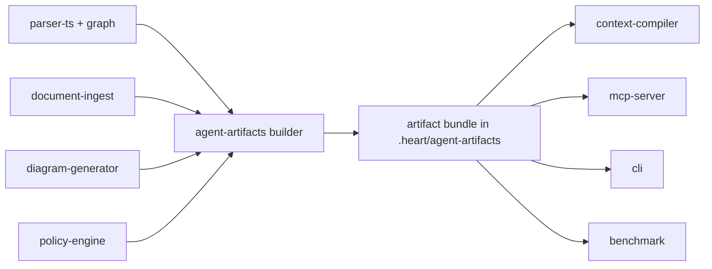

# Agent Artifacts Hybrid Token Savings Design

## Goal

Ship a contract-first token-savings layer that improves both:

- benchmark-visible token reduction
- day-to-day agent UX

The first release should reduce repeated context loading without mutating human-authored source memory files. The system should build compact, reusable agent artifacts during `heart scan`, then serve those artifacts consistently through CLI, MCP, and benchmark flows.

## Product Outcome

`be-ai-heart` should stop relying only on live ranking at request time. Instead, it should build a durable agent-facing artifact bundle that gives agents:

- a minimal first-hop context object
- compact task-specific context packs
- compressed memory and document summaries
- diagram-derived structural summaries without Mermaid overhead
- stable provenance so benchmark claims can be traced to specific artifact inputs

This moves the product closer to its core promise: durable project memory that lowers token spend while preserving trust and architecture alignment.

## Agreed Decisions

- Use a contract-first design centered on a new `packages/agent-artifacts` boundary.
- Build agent artifacts during `heart scan`, not only during `heart pack`.
- Keep CLI and MCP on the same artifact contracts.
- Keep diagrams human-facing by default, but generate a compact agent-safe derivative from diagram and graph data.
- Generate separate compressed artifacts for agent consumption and leave source files untouched.
- Exclude RTK-style shell-output filtering from `v1`.
- Include terse response behavior only as response shaping, not as source-file mutation.

## Scope

In scope:

- new `packages/agent-artifacts` package
- scan-time generation of agent artifact bundle under `.heart/agent-artifacts/`
- normalized manifest contract for agent artifacts
- compact graph snapshot contract for retrieval
- compact memory and document artifact contract
- diagram-derived compact agent summary contract
- repo and domain summary artifact contract
- new MCP tool `minimal_context`
- additive `context_pack` contract update to schema version `3`
- additive `detail_level` handling for agent-facing retrieval surfaces
- benchmark measurement for artifact-level token contribution
- docs updates for architecture, CLI/MCP, benchmark framework, and implementation blueprint

Out of scope:

- RTK-style command rewriting or shell-output filtering
- mutation of `AGENTS.md`, project docs, or any human-authored memory source
- Mermaid as a primary agent ingestion format
- broad multi-language artifact compression policies beyond current TypeScript-first MVP path
- hosted-only artifact generation
- autonomous artifact self-editing

## Design Principles

### Artifact-First Retrieval

Agent retrieval should prefer scan-time artifacts over recomputing rich context from raw graph and document state on every request.

### Local-First Truth

The local repository remains the source of truth. Artifact generation happens locally and can later mirror to hosted surfaces, but hosted services should not become the primary artifact author in `v1`.

### Shared Contracts

CLI and MCP must read the same artifact bundle and return the same schema shapes where the logical operation is the same.

### No Source Mutation

Compression applies only to generated artifacts. Human-maintained files remain readable and canonical.

### Explicit Provenance

Every artifact and every agent-facing response should state whether it is artifact-backed, stale, or falling back to live computation.

### Secure By Default

Restricted content stays redacted in generated artifacts. No secret-like or sensitive raw content should leak into compressed outputs or benchmark evidence by default.

## Package Ownership

### `packages/agent-artifacts`

Owns:

- artifact schemas
- schema versioning
- scan-time artifact build orchestration
- artifact manifest loading and validation
- freshness and provenance metadata
- token metadata per artifact
- deterministic compression and validation metadata

Must not own:

- AST parsing
- graph construction
- Mermaid rendering
- MCP transport
- hosted persistence

### Existing package boundaries

`packages/parser-ts` still owns source extraction.

`packages/graph` still owns typed graph construction and graph query primitives.

`packages/document-ingest` still owns document discovery, classification, summaries, and sensitivity metadata.

`packages/diagram-generator` still owns human-facing diagram artifacts and repository profile diagram outputs.

`packages/context-compiler` still owns task-specific ranking and final context-pack assembly, but should increasingly consume artifact bundle inputs instead of rebuilding every signal live.

`packages/mcp-server` still owns stdio MCP transport and tool contracts.

`packages/benchmark` still owns scenario execution and report generation, but must start recording artifact-level token contribution.

## Artifact Bundle Layout

`heart scan` writes:

```text
.heart/agent-artifacts/
  manifest.json
  graph-snapshot.json
  diagram-manifest.json
  diagram-agent-summary.json
  memory-artifacts.json
  agent-summaries.json
```

The bundle is scan-scoped, deterministic, and versioned.

## Common Artifact Envelope

Each artifact uses a shared envelope:

```json
{
  "schema_version": 1,
  "artifact_type": "graph_snapshot",
  "repo_name": "be-ai-heart",
  "repo_root": "/abs/path/to/repo",
  "build_id": "scan_2026-05-01T23:55:12.111Z",
  "generated_at": "2026-05-01T23:55:12.111Z",
  "source": {
    "commit_ref": "32b6da5",
    "parser_engine": "typescript-ast",
    "graph_hash": "sha256:...",
    "document_hash": "sha256:...",
    "diagram_hash": "sha256:...",
    "policy_hash": "sha256:..."
  },
  "freshness": {
    "stale": false,
    "reasons": []
  },
  "token_stats": {
    "estimated_tokens": 420,
    "item_count": 12
  },
  "payload": {}
}
```

Contract notes:

- `schema_version` is per artifact schema, not global repo schema.
- `build_id` is the scan/build identity used across the bundle.
- `freshness` exists so consumers can fail safely without guessing.
- `token_stats` provides benchmark-friendly artifact cost metadata.

Unless otherwise noted, the examples below show the `payload` body for each artifact. The common envelope still wraps each file on disk.

## Exact Artifact Schemas

### `manifest.json`

Purpose:

- single loader entrypoint
- artifact inventory
- schema and freshness gate

Payload shape:

```json
{
  "schema_version": 1,
  "artifact_type": "manifest",
  "repo_name": "be-ai-heart",
  "repo_root": "/abs/path/to/repo",
  "build_id": "scan_2026-05-01T23:55:12.111Z",
  "generated_at": "2026-05-01T23:55:12.111Z",
  "artifacts": {
    "graph_snapshot": {
      "path": ".heart/agent-artifacts/graph-snapshot.json",
      "schema_version": 1,
      "estimated_tokens": 900
    },
    "diagram_manifest": {
      "path": ".heart/agent-artifacts/diagram-manifest.json",
      "schema_version": 1,
      "estimated_tokens": 240
    },
    "diagram_agent_summary": {
      "path": ".heart/agent-artifacts/diagram-agent-summary.json",
      "schema_version": 1,
      "estimated_tokens": 180
    },
    "memory_artifacts": {
      "path": ".heart/agent-artifacts/memory-artifacts.json",
      "schema_version": 1,
      "estimated_tokens": 700
    },
    "agent_summaries": {
      "path": ".heart/agent-artifacts/agent-summaries.json",
      "schema_version": 1,
      "estimated_tokens": 500
    }
  },
  "freshness": {
    "stale": false,
    "reasons": [],
    "source_scan_id": "scan_2026-05-01T23:55:12.111Z"
  }
}
```

### `graph-snapshot.json`

Purpose:

- compact typed retrieval substrate
- graph-backed reuse, impact, and policy hints
- no raw source blobs

Payload shape:

```json
{
  "summary": {
    "node_count": 148,
    "edge_count": 284,
    "typed_graph_ready": true,
    "node_types": {
      "Repository": 1,
      "File": 22,
      "Class": 6,
      "Interface": 4,
      "Function": 47,
      "Method": 12,
      "Test": 9,
      "Document": 14,
      "Policy": 3
    },
    "edge_types": {
      "IMPORTS": 91,
      "CALLS": 76,
      "EXTENDS": 4,
      "IMPLEMENTS": 5,
      "TESTED_BY": 18,
      "VIOLATES_POLICY": 2
    }
  },
  "nodes": [
    {
      "id": "sym:function:packages/context-compiler/src/index.js:compileContextPack:1",
      "type": "Function",
      "name": "compileContextPack",
      "path": "packages/context-compiler/src/index.js",
      "signature": "compileContextPack(input): ContextPack",
      "exported": true,
      "tags": ["context", "agent-memory"],
      "owners": [],
      "score_hints": {
        "reuse_weight": 0.9,
        "policy_weight": 0.2,
        "test_weight": 0.7
      }
    }
  ],
  "edges": [
    {
      "id": "edge:calls:...",
      "from": "sym:function:...",
      "to": "sym:function:...",
      "type": "CALLS"
    }
  ],
  "entrypoints": [
    {
      "kind": "route",
      "path": "services/api/src/http.js",
      "symbol_id": "sym:function:services/api/src/http.js:createHttpServer:12",
      "reason": "route handler root"
    }
  ],
  "policy_hotspots": [
    {
      "path": "packages/mcp-server/src/tools.js",
      "violation_count": 1,
      "rules": ["mcp-output-must-stay-compact"]
    }
  ],
  "reuse_index": [
    {
      "symbol_id": "sym:function:packages/context-compiler/src/index.js:compileContextPack:1",
      "name": "compileContextPack",
      "path": "packages/context-compiler/src/index.js",
      "reuse_reason": "existing task-pack compiler",
      "reuse_score": 0.94
    }
  ]
}
```

### `diagram-manifest.json`

Purpose:

- stable human-review diagram inventory
- normalization of current diagram lane

Payload shape:

```json
{
  "diagrams": [
    {
      "type": "component",
      "title": "Context Compiler Components",
      "format": "mermaid",
      "artifact_file": "component.mmd",
      "inference_mode": "typed-graph-assisted",
      "confidence": "high",
      "trust": {
        "label": "trusted",
        "reason": "derived from typed graph and route metadata"
      },
      "scope": {
        "focus": "packages/context-compiler",
        "paths": [
          "packages/context-compiler/src/index.js",
          "packages/mcp-server/src/tools.js"
        ]
      },
      "validation": {
        "warning_count": 0
      },
      "summary": "Context compiler consumes graph, docs, policy, outputs compact task packs."
    }
  ]
}
```

### `diagram-agent-summary.json`

Purpose:

- compact agent-safe structural view
- no Mermaid in normal context packs
- diagram plus graph evidence distilled into short relationships

Payload shape:

```json
{
  "repo_summary": "Project memory pipeline centers on parser, graph, context compiler, MCP, benchmark.",
  "component_relationships": [
    {
      "from": "parser-ts",
      "to": "graph",
      "relationship": "builds typed graph",
      "confidence": 0.92,
      "evidence": ["diagram:component", "graph:IMPORTS"]
    },
    {
      "from": "context-compiler",
      "to": "mcp-server",
      "relationship": "provides task-specific agent context",
      "confidence": 0.95,
      "evidence": ["diagram:component", "graph:CALLS"]
    }
  ],
  "agent_hints": [
    "Prefer context_pack before broad file inspection.",
    "Policy and document memory both affect retrieval quality.",
    "Diagram evidence is structural, not source-of-truth for line-level edits."
  ],
  "review_warnings": [
    "High-level diagrams are safe for orientation, not line-accurate implementation."
  ],
  "topology": {
    "primary_domains": ["graph", "context", "mcp", "benchmark"],
    "integration_edges": 8,
    "cross_domain_hotspots": [
      "packages/mcp-server/src/tools.js",
      "packages/context-compiler/src/index.js"
    ]
  }
}
```

### `memory-artifacts.json`

Purpose:

- compressed agent-safe copies of repo rules, project docs, and policy memory
- source files untouched
- section-level retrieval with validation metadata

Payload shape:

```json
{
  "artifacts": [
    {
      "artifact_id": "memory:AGENTS.md",
      "source_path": "AGENTS.md",
      "source_type": "agent_rules",
      "category": "policy",
      "title": "Repository Agent Rules",
      "source_hash": "sha256:...",
      "sensitivity": {
        "level": "repo-internal",
        "summary_redacted": false
      },
      "compression": {
        "mode": "extractive_v1",
        "source_char_count": 5420,
        "compressed_char_count": 2140,
        "compression_ratio": 0.395,
        "validation": {
          "preserved_headings": true,
          "preserved_code_blocks": true,
          "preserved_urls": true,
          "preserved_paths": true,
          "status": "pass"
        }
      },
      "sections": [
        {
          "section_id": "memory:AGENTS.md#architecture-rules",
          "heading": "Architecture Rules",
          "line_start": 33,
          "line_end": 41,
          "keywords": ["packages", "services", "apps", "boundaries"],
          "compressed_text": "packages own reusable domain logic. services may use packages, not apps. apps keep UI logic local. keep CLI, MCP, graph, compiler, policy decoupled.",
          "estimated_tokens": 38
        }
      ]
    }
  ]
}
```

`v1` compression rules:

- deterministic, rule-based or extractive first
- preserve heading/path/URL/code-block integrity metadata
- do not overwrite source file content
- do not emit restricted summaries for restricted inputs

### `agent-summaries.json`

Purpose:

- fast repo and domain summaries
- compact reuse, test, policy, and related-memory hints

Payload shape:

```json
{
  "repo_summary": {
    "summary": "BeHeart builds durable project memory through typed graph, docs, compact context packs, MCP, benchmark proof.",
    "primary_paths": [
      "packages/context-compiler",
      "packages/mcp-server",
      "packages/graph",
      "packages/document-ingest"
    ],
    "top_reuse_targets": [
      {
        "name": "compileContextPack",
        "path": "packages/context-compiler/src/index.js",
        "score": 0.94
      }
    ]
  },
  "domains": [
    {
      "domain": "context",
      "summary": "Ranks files, symbols, docs, policy, graph neighbors into compact agent packs.",
      "paths": [
        "packages/context-compiler/src/index.js"
      ],
      "top_symbols": [
        "compileContextPack",
        "buildGraphContext",
        "buildCitations"
      ],
      "reuse_candidates": [
        {
          "name": "compileContextPack",
          "path": "packages/context-compiler/src/index.js",
          "reason": "main task-pack compiler"
        }
      ],
      "policy_warnings": [],
      "related_documents": [
        "docs/03-technical-architecture.md",
        "docs/04-mcp-cli-spec.md"
      ],
      "related_memory_sections": [
        "memory:AGENTS.md#architecture-rules"
      ],
      "related_diagrams": [
        "component",
        "sequence"
      ],
      "tests": [
        "tests/context-pack.test.js",
        "tests/mcp-server.test.js"
      ]
    }
  ],
  "path_summaries": [
    {
      "path": "packages/mcp-server/src/tools.js",
      "summary": "MCP tool registry and tool-call shaping layer.",
      "domain": "mcp",
      "risk_level": "medium",
      "related_tests": ["tests/mcp-server.test.js"]
    }
  ]
}
```

## Producer Flow



Build rule:

- `heart scan` produces the bundle
- consumers prefer fresh bundle
- consumers may fall back to live graph and docs, but must say so explicitly

## MCP and CLI Contract Changes

### New MCP tool: `minimal_context`

Purpose:

- ultra-cheap first hop
- artifact-first starter object before full task pack retrieval

Input:

```json
{
  "task": "improve login audit flow",
  "token_budget": 300
}
```

Output:

```json
{
  "schema_version": 1,
  "task": "improve login audit flow",
  "detail_level": "minimal",
  "summary": "Auth/context work touches context compiler, MCP shaping, and requirements memory.",
  "risk_level": "medium",
  "primary_domains": ["context", "mcp"],
  "top_paths": [
    "packages/context-compiler/src/index.js",
    "packages/mcp-server/src/tools.js"
  ],
  "reuse_targets": [
    {
      "name": "compileContextPack",
      "path": "packages/context-compiler/src/index.js",
      "reason": "existing task-pack compiler"
    }
  ],
  "memory_hits": [
    {
      "section_id": "memory:AGENTS.md#architecture-rules",
      "source_path": "AGENTS.md",
      "category": "policy"
    }
  ],
  "diagram_hints": [
    "context-compiler -> mcp-server is primary delivery edge"
  ],
  "next_tools": [
    "context_pack",
    "dependency_explain",
    "policy_check"
  ],
  "freshness": {
    "stale": false,
    "reasons": []
  },
  "evidence_summary": {
    "estimated_tokens": 180,
    "artifact_backed": true
  }
}
```

Rules:

- no raw graph dump
- no Mermaid
- no long document summaries
- always artifact-backed when fresh bundle exists
- explicit stale or fallback signal when not artifact-backed

### `context_pack` update

Keep tool name.

Increase payload `schema_version` from `2` to `3`.

Add input:

```json
{
  "task": "improve login audit flow",
  "token_budget": 1200,
  "detail_level": "standard"
}
```

`detail_level` values:

- `minimal`
- `standard`

Additive output changes:

```json
{
  "schema_version": 3,
  "task": "improve login audit flow",
  "detail_level": "standard",
  "artifact_provenance": {
    "artifact_backed": true,
    "build_id": "scan_2026-05-01T23:55:12.111Z",
    "artifacts_used": [
      "graph_snapshot",
      "diagram_agent_summary",
      "memory_artifacts",
      "agent_summaries"
    ]
  },
  "diagram_context": {
    "summary": "Context compiler feeds MCP compact outputs; cross-domain hotspot in tool shaping.",
    "relationships": [
      {
        "from": "context-compiler",
        "to": "mcp-server",
        "relationship": "provides task-specific agent context",
        "confidence": 0.95
      }
    ],
    "warnings": []
  },
  "memory_context": {
    "artifact_hits": [
      {
        "section_id": "memory:AGENTS.md#architecture-rules",
        "source_path": "AGENTS.md",
        "compressed_text": "packages own reusable domain logic. services may use packages, not apps. ..."
      }
    ]
  },
  "evidence_summary": {
    "citation_count": 6,
    "matched_task_token_pct": 78,
    "overall_evidence_score": 0.81,
    "compactness_score": 0.88,
    "artifact_backed_pct": 100
  }
}
```

Existing fields remain.

The `minimal` variant keeps the same top-level schema shape but shortens text and trims arrays. It must not introduce a separate response shape.

### CLI changes

Keep CLI sparse.

Add support:

- `heart pack --detail-level minimal "task"`
- `heart pack --detail-level standard "task"`
- `heart pack --json` returns the same logical `context_pack` contract as MCP

Do not add a separate `heart memory compress` user-facing command in `v1`.

Artifact generation happens during `heart scan`.

## Benchmark Changes

Benchmark needs to measure artifact contribution directly, not only final pack deltas.

Add artifact impact block:

```json
{
  "artifact_token_impact": {
    "graph_snapshot": { "available": true, "estimated_tokens": 900, "used": true },
    "diagram_agent_summary": { "available": true, "estimated_tokens": 180, "used": true },
    "memory_artifacts": { "available": true, "estimated_tokens": 700, "used": true },
    "agent_summaries": { "available": true, "estimated_tokens": 500, "used": true }
  }
}
```

Benchmark should answer:

- did artifact-backed retrieval reduce first-hop context cost
- which artifact types actually contributed value
- did token reduction preserve or improve task coverage and review quality

## Rollout Order

### Phase 1: Package and manifest contracts

- add `packages/agent-artifacts`
- add schema validators and manifest load/write helpers
- add freshness, provenance, and token metadata

### Phase 2: Scan-time artifact producers

- build `graph-snapshot.json`
- build `memory-artifacts.json`
- build `agent-summaries.json`
- build `diagram-agent-summary.json`
- normalize existing diagram output into `diagram-manifest.json`

### Phase 3: Consumer integration

- `context-compiler` reads artifact bundle first
- `mcp-server` adds `minimal_context`
- `context_pack` moves to schema version `3`
- CLI and MCP consume same artifact-backed contracts

### Phase 4: Benchmark integration

- record artifact-level token impact
- record artifact-backed versus live-fallback behavior
- measure `minimal_context` first-hop savings

### Phase 5: Terse response behavior

- add opt-in response shaping for compact guidance
- keep this separate from source compression and artifact generation logic

## Acceptance Criteria

### Core artifact bundle

- `heart scan` writes a stable artifact bundle under `.heart/agent-artifacts/`
- rerunning scan with unchanged repo produces the same semantic artifact content apart from timestamps and build id
- source docs and `AGENTS.md` remain unchanged
- restricted content remains redacted in generated artifacts

### Retrieval

- new `minimal_context` returns a useful first-hop object within a target of `<= 300` estimated tokens
- `context_pack` returns `schema_version = 3`
- `context_pack detail_level=minimal` and CLI JSON match MCP schema shape
- `artifact_provenance.artifact_backed = true` when bundle is fresh
- stale or missing bundle triggers explicit fallback warning instead of silent degradation

### Diagram lane

- diagrams remain human-facing trust artifacts
- normal packs consume `diagram-agent-summary`, not Mermaid content
- diagram-derived relationships include structural evidence metadata

### Memory lane

- compressed memory artifacts include validation metadata for headings, paths, URLs, and code blocks
- compression is deterministic in `v1`
- source files stay untouched

### Benchmark

- reports expose per-artifact token contribution
- reports distinguish `artifact_backed` from `live_fallback`
- benchmark story can show both lower tokens and preserved task coverage

### Validation

- add schema contract tests for all artifact files plus manifest
- add CLI/MCP parity tests for `minimal_context` and `context_pack v3`
- add stale bundle fallback tests
- add compression validation tests
- add redaction tests

## Security Notes

- never write raw secret-like content into compressed artifacts
- propagate existing document sensitivity metadata into memory artifacts
- keep artifact previews redacted where the source document is restricted
- avoid absolute-path leakage in public-facing mirrored artifacts
- do not let artifact generation bypass ignore and redaction policy

## Risks

- artifact build complexity may slow `heart scan` if producers are not carefully bounded
- diagram-derived summaries can overstate precision if they are not clearly marked as structural evidence
- compression quality can drift if the first deterministic rules are too aggressive
- dual-path retrieval during migration can create subtle inconsistencies if live and artifact-backed ranking disagree

## Docs To Update Before Implementation

Must update:

- `docs/03-technical-architecture.md`
- `docs/04-mcp-cli-spec.md`
- `docs/06-benchmark-framework.md`
- `docs/11-implementation-blueprint-v2.md`

Should update if needed:

- `docs/10-user-stories.md`
- `docs/20-v2-execution-backlog.md`

## Non-Goals For This Slice

- shell-output filtering
- prompt rewriting hooks
- source-file compression in place
- Mermaid-heavy agent ingestion
- cloud-first artifact generation
