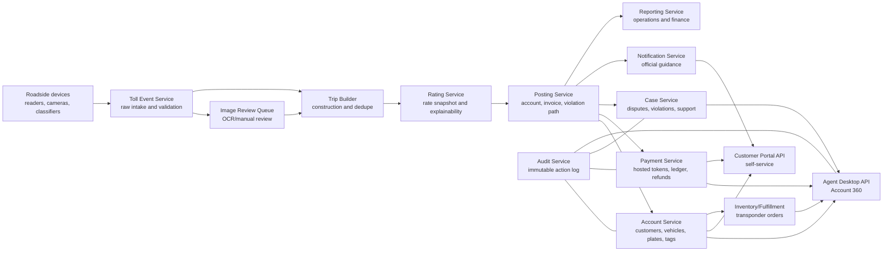

# Architecture Demo

This architecture is a sales/demo reference, not a production deployment design.

## System Architecture

## Roadside-To-Back-Office Workflow

1. Vehicle passes a demo gantry.
2. Roadside system captures tag read, plate image reference, timestamp, lane, and vehicle class.
3. Event intake validates payload and stores raw event metadata.
4. OCR/manual review resolves low-confidence plate reads.
5. Trip builder groups events and checks duplicate candidates.
6. Rating service selects a demo rate snapshot placeholder.
7. Posting routes charge to account, invoice, or violation flow.
8. Customer receives notification through approved channel.
9. Payment/funds action uses hosted token placeholder and ledger entries.
10. Dispute/case flow stores notes, evidence reference, decision, and audit.
11. Reporting aggregates demo-only metrics for operations and sales discussion.

## Service Map

| Service | Responsibility | Demo state | Runtime needed |
|---|---|---|---|
| Account service | Customers, accounts, vehicles, plates, tags. | Static model and UI. | APIs, auth, search, masking. |
| Toll event service | Raw/normalized events, dedupe queue. | Workflow diagram. | Event ingest, idempotency, storage. |
| Rating service | Rate snapshot and charge explanation. | Placeholder. | Agency rates and policy engine. |
| Payment service | Funds, payment tokens, ledger. | Static panel. | Hosted payment integration and ledger writes. |
| Invoice/violation service | Invoices, notices, escalation. | Static flow. | Notice generation and agency policy. |
| Case service | Disputes, cases, evidence, SLA. | Prototype queue. | Case APIs, attachment storage. |
| Inventory service | Transponder stock and assignment. | Prototype queue. | Warehouse/fulfillment integration. |
| Notification service | Templates, consent, delivery. | Static template preview. | Providers, consent store, delivery logs. |
| Reporting service | KPI and operational dashboards. | Demo-only metrics. | Warehouse/jobs/export controls. |
| Audit service | Staff and AI-assisted action log. | Boundary and UI references. | Append-only persistence and query controls. |

## API Map

| Area | API/workflow | Demo input | Demo output |
|---|---|---|---|
| Account | `lookupAccount` | `DEMO-ACCT-1001`, `DEMO123`, `TAG-DEMO-0001` | Account 360 payload. |
| Account | `verifyIdentity` | fake verification state | allowed actions list. |
| Payment | `loadFunds` | account ID | balance, token placeholder, ledger rows. |
| Payment | `requestRefund` | amount, reason | approval-needed state. |
| Roadside | `ingestRawEvent` | fake event metadata | accepted event reference. |
| Trip | `buildTrip` | normalized event IDs | trip and duplicate status. |
| Rating | `explainCharge` | trip ID | rate snapshot placeholder. |
| Case | `createDispute` | invoice/trip reason | case ID and SLA. |
| Inventory | `reserveTransponder` | order request | reserved fake tag. |
| Notification | `sendOfficialGuidance` | template and channel | delivery state. |
| Reporting | `runOpsReport` | date range | demo KPI cards. |
| Audit | `recordAction` | actor/action/reason | audit reference. |

## Audit And Security Boundaries

- Payment capture is hosted/tokenized outside the demo app.
- Plate images and evidence are object references, not embedded files.
- Staff actions that change money, disputes, evidence, account status, or notices require reason and audit in runtime.
- Agency overlays and customer overlays must not leak across tenants in future hosted use.
- Demo artifacts must not contain production PII, actual plates, payment account data, or credential material.

## MVP vs Later

| Area | Phase 1 demo | Later runtime |
|---|---|---|
| Website | Static route | Generated/customizable site |
| UI prototype | Static fake data | Authenticated app |
| Roadside events | Diagram and fake rows | Ingest pipeline |
| Payments | Token placeholder | Processor integration |
| OCR/image review | Queue concept | OCR/manual review workflow |
| Rating | Snapshot placeholder | Agency rate engine |
| Reporting | Demo cards | Warehouse and scheduled reports |

