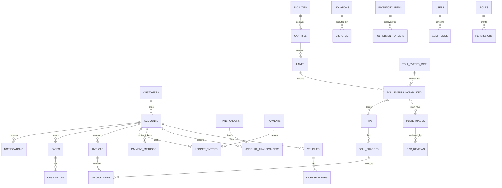

# DB Demo Model

This is a Postgres-first draft for sales and technical discussion. It is not a migration file.

## Core Tables

| Table | Purpose | Demo key fields |
|---|---|---|
| `customers` | Customer profile. | `id`, `tenant_id`, `display_name`, `type`, `verification_state`. |
| `accounts` | Toll account container. | `id`, `account_no`, `status`, `account_type`, `balance_snapshot`. |
| `vehicles` | Vehicle linked to account. | `id`, `account_id`, `vehicle_label`, `vehicle_class`, `status`. |
| `license_plates` | Plate identity. | `id`, `vehicle_id`, `plate_masked`, `jurisdiction`, `status`. |
| `transponders` | Tag master record. | `id`, `tag_ref`, `brand_label`, `status`. |
| `account_transponders` | Tag assignment history. | `account_id`, `vehicle_id`, `transponder_id`, `effective_from`, `effective_to`. |
| `payment_methods` | Tokenized payment method metadata. | `account_id`, `token_ref`, `method_label`, `status`. |
| `ledger_entries` | Append-only financial entries. | `account_id`, `amount`, `entry_type`, `reason_code`, `ref_id`. |
| `payments` | Payment attempts. | `account_id`, `amount`, `status`, `processor_ref`, `idempotency_key`. |
| `facilities` | Toll road or managed lane facility. | `id`, `name`, `operator_label`, `facility_type`. |
| `gantries` | Roadside collection point. | `id`, `facility_id`, `direction`, `status`. |
| `lanes` | Lane under gantry. | `id`, `gantry_id`, `lane_label`, `lane_type`. |
| `toll_events_raw` | Raw event metadata. | `id`, `source_ref`, `payload_hash`, `event_time`, `object_ref`. |
| `toll_events_normalized` | Parsed event. | `id`, `raw_id`, `lane_id`, `tag_ref`, `plate_ref`, `confidence`. |
| `plate_images` | Plate image metadata. | `event_id`, `object_ref`, `image_hash`, `retention_until`. |
| `ocr_reviews` | OCR/manual decisions. | `image_id`, `reviewer_id`, `confidence`, `decision`. |
| `trips` | Billable journey. | `id`, `account_id`, `facility_id`, `dedupe_key`, `status`. |
| `toll_charges` | Rated toll charge. | `trip_id`, `amount`, `rate_snapshot_ref`, `status`. |
| `invoices` | Bill. | `id`, `account_id`, `invoice_no`, `status`, `total_amount`. |
| `invoice_lines` | Bill detail. | `invoice_id`, `line_type`, `ref_id`, `amount`. |
| `violations` | Violation/notice flow. | `notice_no`, `plate_ref`, `status`, `evidence_ref`. |
| `disputes` | Challenge to trip/invoice/violation. | `account_id`, `ref_type`, `ref_id`, `reason`, `status`. |
| `cases` | Support case. | `account_id`, `case_type`, `status`, `priority`, `sla_due_at`. |
| `case_notes` | Case timeline note. | `case_id`, `note_type`, `visibility`, `body_redacted`. |
| `notifications` | Message delivery record. | `account_id`, `channel`, `template_key`, `status`, `consent_snapshot`. |
| `inventory_items` | Transponder inventory. | `sku`, `tag_ref`, `status`, `warehouse_label`. |
| `fulfillment_orders` | Tag order/replacement. | `account_id`, `order_type`, `status`, `shipment_ref`. |
| `reports` | Report runs. | `report_key`, `params_hash`, `status`, `artifact_ref`. |
| `users` | Staff/service users. | `id`, `email_label`, `role_state`, `tenant_scope`. |
| `roles` | Role definitions. | `id`, `name`, `description`. |
| `permissions` | Role permissions. | `role_id`, `action`, `resource`, `constraints`. |
| `audit_logs` | Immutable action log. | `actor_id`, `action`, `resource_ref`, `reason_code`, `created_at`. |

## ERD

## Index And Consistency Notes

- Unique index on `tenant_id, account_no`.
- Search indexes on masked/fake plate reference, tag reference, invoice number, and case ID.
- Unique idempotency keys for payment and event ingestion in runtime.
- Ledger is append-only; balance snapshots are derived.
- Plate image and evidence files should be object references with retention metadata.
- Audit logs are append-only and queryable by actor, resource, action, and time.

